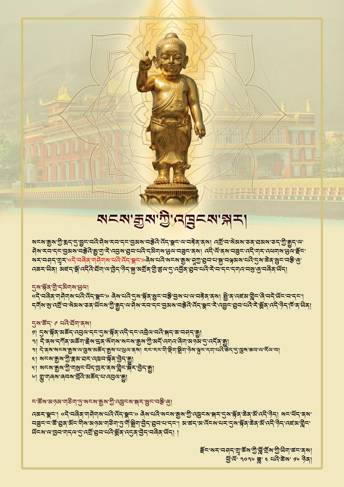

སེམས་ཅན་ཐམས་ཅད་ཀྱི་རྒྱུད་ལ་ཤེས་རབ་དང་སྙིང་རྗེའི་ས་བོན་འདེབས་པའི་སྨོན་འདུན་གྱིས། སངས་རྒྱས་ཀྱི་ཡེ་ཤེས་དང་བྱམས་བརྩེའི་འོད་ཟེར་ངོ་མཚར་ཅན་ལ་བརྟེན་ནས། ལོ་འདི་ནས་བཟུང་སྟེ་སངས་རྒྱས་ཤཱཀྱ་ཐུབ་པའི་འཁྲུངས་སྐར་ཐེངས་དང་པོ་ **"དེ་བཞིན་གཤེགས་པའི་འོད་ཟེར་"** ཞེས་པའི་མཛད་སྒོ་རྫོང་སར་བཤད་གྲྭར་འཚོགས་རྒྱུ་ཡིན། མཛད་སྒོ་འདིར་སྐུ་མགྲོན་གཙོ་བོ་ལྟ་བུར་གདན་འདྲེན་ཞུ་བཞིན་པ་ལགས།

## དམིགས་ཡུལ་གཙོ་བོ།

"དེ་བཞིན་གཤེགས་པའི་འོད་ཟེར་" ཞེས་པའི་མཛད་སྒོ་འདི་འཚོགས་པའི་དམིགས་ཡུལ་གཙོ་བོ་ནི། འཛམ་གླིང་ཡོངས་ལ་ཞི་བདེ་འབྱུང་བ་དང་། སེམས་ཅན་ཐམས་ཅད་ཀྱི་སེམས་ལ་ཤེས་རབ་དང་སྙིང་རྗེའི་འོད་ཟེར་ཤར་བར་འགྱུར་བ་ཁོ་ན་ཡིན།

## ལས་རིམ། (ཞོགས་པའི་ཆུ་ཚོད་ ༩ པ་ནས)

1. མཛད་སྒོའི་མཆོད་འབུལ་དང་སྐབས་དོན་དང་འབྲེལ་བའི་གཏམ་བཤད།
2. དཀོན་མཆོག་གསུམ་གྱི་སྐྱབས་འགྲོ་དང་སངས་རྒྱས་ཀྱིས་གསུངས་པའི་མདོ་སྡེའི་ནང་ནས་འདེམས་པའི་མདོ་ཁག་མཉམ་འདོན།
3. སངས་རྒྱས་ལ་ཁྲུས་གསོལ་རྒྱས་པ་འབུལ་རྒྱུ་དང་། དེའི་རྗེས་སུ་མི་སོ་སོ་རང་གི་སྡིག་ལྟུང་སྦྱང་བའི་ཆེད་དུ་བྱིན་རླབས་ཀྱི་ཆུ་ལ་ཁྲུས་གསོལ།
4. སངས་རྒྱས་ཀྱི་མཛད་པའི་རྣམ་ཐར་ལ་སྦྱར་བའི་ཟློས་གར་འཁྲབ་སྟོན།
5. སངས་རྒྱས་ཀྱི་བཀའ་པོད་འཁུར་བཞིན་སྐོར་ར།
6. གར་དང་གླུ་གཞས་འབུལ་བ།

སངས་རྒྱས་ཀྱི་འཁྲུངས་སྐར་མཉམ་དུ་སྲུང་བརྩི་ཞུ་གལ།

## དམིགས་འདུན།

སངས་རྒྱས་ཀྱི་འཁྲུངས་སྐར་མཛད་སྒོ་ཆེན་པོ་ "དེ་བཞིན་གཤེགས་པའི་འོད་ཟེར་" ཞེས་པ་འདི། ཕྱིན་ཆད་མི་རིང་བར་མཉམ་འབྲེལ་གྱིས་འཚོགས་ཐུབ་པ་དང་། མ་འོངས་པར་མཛད་སྒོ་ཆེན་པོ་འདི་འཛམ་གླིང་ཡོངས་ལ་ཁྱབ་པར་འགྱུར་བའི་རེ་སྨོན་ཞུ།

*རྫོང་སར་མཁྱེན་བརྩེ་ཆོས་ཀྱི་བློ་གྲོས་བཤད་གྲྭའི་ལས་ཁུངས་ནས། སྤྱི་ལོ་ ༢༠༢༦ ཟླ་ ༤ ཚེས་ ༡༦*
