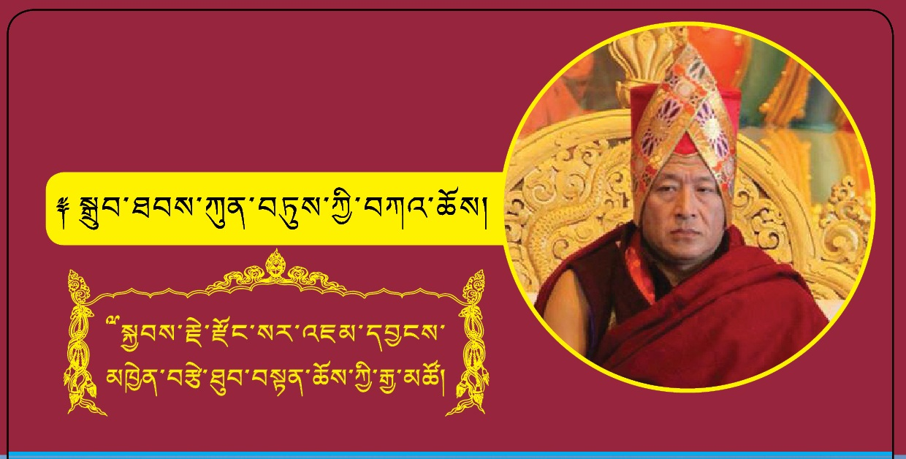

འདི་ལོའི་ཕྱི་ཟླ་ ༡༠ ཚེས་ ༡ ཉིན་ནས་དབུ་འཛུགས་ཀྱིས་དུས་ཡུན་ཟླ་བ་གཉིས་ཙམ་རིང་༸རིས་མེད་བསྟན་པ་རྒྱ་མཚོའི་མངའ་བདག་༸སྐྱབས་རྗེ་རྫོང་སར་འཇམ་དབྱངས་མཁྱེན་བརྩེ་ཐུབ་བསྟན་ཆོས་ཀྱི་རྒྱ་མཚོ་མཆོག་གི་ཞལ་སྔ་ནས་ཀྱིས་སྒྲུབ་ཐབས་རིན་པོ་ཆེ་ཀུན་ལས་བཏུས་པའི་གསུང་ཆོས་བཀའ་དྲིན་ཆེ་རྒྱུ་ཡིན་པའི་སྐོར་གསལ་བསྒྲགས་སྔོན་སོང་ལྟར་དང་། གསུང་ཆོས་སྐབས་འདི་ག་རྫོང་སར་བཤད་གྲྭའི་ངོས་ནས་ཆོས་ཞུ་བ་གྲྭ་བཙུན་རྣམས་ལ་གང་ཐུབ་ཀྱིས་བཤད་གྲྭའི་ནང་དུ་བཞུགས་གནས་དང་ཞལ་ལག དེ་བཞིན་ཆོས་ཞུ་བ་ཡོངས་ལ་ཞོགས་ཇ་དང་གུང་ཚིགས་བཅས་གོ་སྒྲིག་ཞུ་འཆར་ལ་སོང་། གལ་སྲིད་སྐུ་ཉིད་ཀྱང་སྒྲུབ་ཐབས་ཀུན་བཏུས་ཀྱི་གསུང་ཆོས་ལ་བཅར་རྒྱུ་གཏན་འཁེལ་ཡིན་ན། གོ་སྒྲིག་ཞུ་བདེའི་སླད་ཕྱི་ཟླ་ ༩ ཚེས་ ༡༥ སྔོན་ལ་ངེས་པར་དུ་འགེངས་ཤོག་འདི་ཉིད་བཀང་སྟེ་ཐོ་འགོད་གནང་རོགས་ཞུ་རྒྱུ་ཡིན། ཐོ་འགོད་འགེངས་ཤོག་ཆེད་དུ་ [འདིར་གནན་རོགས།](https://docs.google.com/forms/d/e/1FAIpQLSc_RyEuRRU2RxDnybOeMAimTerb75JbqR7OhEfT5Sg9IHkV4g/viewform?usp=pp_url)

We have already notified you that Kyabje Dzongsar Jamyang Khyentse Rinpoche will bestow Drubthab Kuntue teaching starting from the 1st of October 2022, for the duration of about two months. Dzongsar Khyentse Chokyi Lodro Institute will strive her best to arrange food and accommodation within the Institute for those nuns and monks attending the teaching. DKCLI will also provide breakfast and lunch for all the teaching attendees. If you have decided to attend the forthcoming teaching, please kindly fill out this registration form and do submit it latest by the 15th of September 2022 so that DKCLI will plan and make arrangements accordingly. [Click here](https://docs.google.com/forms/d/e/1FAIpQLSc_RyEuRRU2RxDnybOeMAimTerb75JbqR7OhEfT5Sg9IHkV4g/viewform?usp=pp_url) for the form.

如之前公告，今年十月一日開始， 宗薩蔣揚欽哲仁波切將於北印度宗薩佛學院傳授《成就法總集》，為期二個月。屆時，佛學院將盡力為前來參加教授的僧、尼二眾安排住處和膳食；為所有參會的在家眾提供早、午餐。如果您已確定要參與此次教授，為了方便佛學院統計、安排，請務必於9月15日之前，完成您的報名申請。報名網址：[點擊這裡](https://docs.google.com/forms/d/e/1FAIpQLSc_RyEuRRU2RxDnybOeMAimTerb75JbqR7OhEfT5Sg9IHkV4g/viewform?usp=pp_url)
