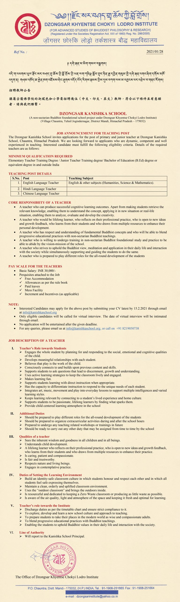

འདི་ག་འཕགས་ཡུལ་རྫོང་སར་བཤད་གྲྭ་ཆོས་ཀྱི་བློ་གྲོས་ཀྱི་ཡན་ལག་ཀཎིཥྐ་སློབ་གྲྭར་ཧིན་རྒྱ་དབྱིན་གསུམ་གྱི་དགེ་རྒན་འགའ་ཞིག་དགོས་མཁོ་འདུག་ན། གཤམ་འཁོད་ཆ་རྐྱེན་ཁག་འཛོམས་ཤིང་ཞུགས་འདོད་ཡོད་རིགས་རྣམས་ཀྱིས་དུས་བཀག་ལས་མ་འགྱངས་པར་འབྲེལ་བ་གནང་རོགས།

招聘教師公告  
隸屬宗薩佛學院的迦膩色伽小學需招聘幾位（中文、印文、英文）教師，符合以下條件並有意願者，請與我們聯繫。

JOB ANNOUNCEMENT FOR TEACHING POST

The Dzongsar Kanishka School invites applications for the post of primary and junior teacher at Dzongar Kanishka School, Chauntra, Himachal Pradesh. We are looking forward to applicants who are dynamic, competent and well experienced in teaching. Interested candidate must fulfil the following eligibility criteria. Details of the required teachers are as follows.

ཀནིཥྐའི་ཧིན་རྒྱ་དབྱིན་གསུམ་གྱི་དགེ་རྒན་ས་མིག་གསལ་བསྒྲགས།
