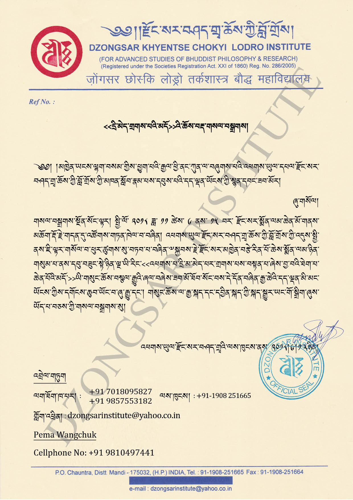

མཁྱེན་ཡངས་ལྷག་བསམ་གྱིས་ཕྱུག་པའི་རྒྱལ་ཕྱི་ནང་ཀུན་ལ་བཞུགས་པའི་འཕགས་ཡུལ་དཔལ་རྫོང་སར་བཤད་གྲྭ་ཆོས་ཀྱི་བློ་གྲོས་ཀྱི་མཁན་སློབ་རྣམ་པས་དབུས་པའི་དད་ལྡན་ཡོངས་ཀྱི་སྙན་དབང་ཟབ་མོར།

ཞུ་གསོལ།

[གསལ་བསྒྲགས་སྔོན་སོང་](/bo/news/rdzong-sr-smon-lm-gsl-bsgrgs-2018/)ལྟར། སྤྱི་ལོ་ ༢༠༡༨ ཟླ་ ༡༡ ཚེས་ ༦ ནས་ ༡༥ བར་ རྫོང་སར་སྨོན་ལམ་ཆེན་མོ་གནས་མཆོག་རྡོ་རྗེ་གདན་དུ་འཚོགས་གཏན་ཁེལ་བ་བཞིན། འཕགས་ཡུལ་རྫོང་སར་བཤད་གྲྭ་ཆོས་ཀྱི་བློ་གྲོས་ཀྱི་འདུས་སྤྱི་ནས་ཇི་ལྟར་གསོལ་བ་ཕུར་ཚུགས་སུ་བཏབ་པ་བཞིན་༸སྐྱབས་རྗེ་རྫོང་སར་མཁྱེན་བརྩེ་རིན་པོ་ཆེས་སྨོན་ལམ་ཉིན་གསུམ་པ་ནས་དབུ་བཟུང་སྟེ་ཉིན་ལྔ་ཡི་རིང་<<འཕགས་པ་དྲི་མ་མེད་པར་གྲགས་པ་ཞེས་བྱ་བའི་བསྟན་པའི་མདོ་>>ཡི་གསུང་ཆོས་བསྩལ་རྒྱུའི་ཞལ་བཞེས་ཟབ་མོ་ཐོོབ་སོང་བས་དེ་དོན་བཞིན་རྒྱ་ཆེའི་དད་ལྡན་མི་མང་ཡོངས་ཀྱིས་དགོངས་ཆུབ་ཡོང་བ་ཞུ་རྒྱུ་དང། གསུང་ཆོས་ལ་རྒྱ་སྐད་དང་དབྱིན་སྐད་ཀྱི་སྐད་སྒྱུར་ཡང་གོ་སྒྲིག་ཞུས་ཡོད་པ་བཅས་ཀྱི་གསལ་བསྒྲགས་སུ།

<<[དྲི་མེད་གྲགས་པའི་མདོ་](https://www.tbrc.org/?locale=bo#library_work_ViewByOutline-O1GS129804CZ209613%7CW22084)>>འདི་ནས་ཕབ་ལེན་བྱེད་ཐུབ།

འཕགས་ཡུལ་རྫོང་སར་བཤད་གྲྭའི་ལས་ཁུངས་ནས་ ༢༠༡༨།༦།༡༣ཉིན།

འབྲེལ་གཏུག

ལག་ཐོགས་ཁ་པར། : +91 7018095827/9857553182

ལས་ཁུངས། : +91-1908 251665

གློག་འཕྲིན། : dzongsarinstitute@yahoo.co.in

པདྨ་དབང་ཕྱུག

ལག་ཐོགས་ཁ་པར། : +91 9810497441

གློག་འཕྲིན། : sidswish@vsnl.com

དྲི་མེད་གྲགས་པའི་མདོ་ཡི་གསུང་ཆོས་གསལ་བསྒྲགས།
