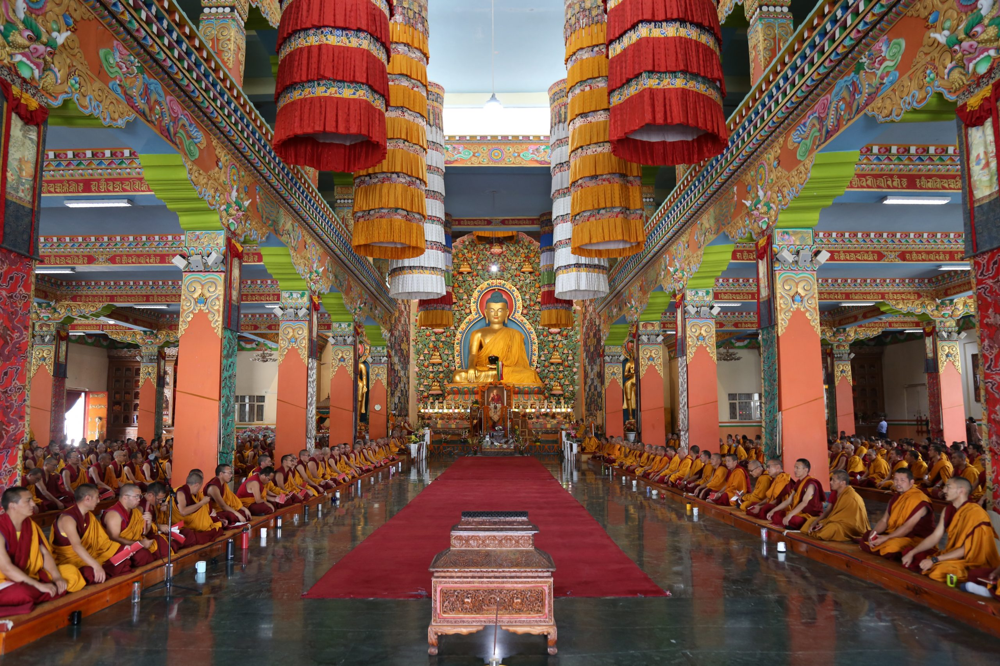
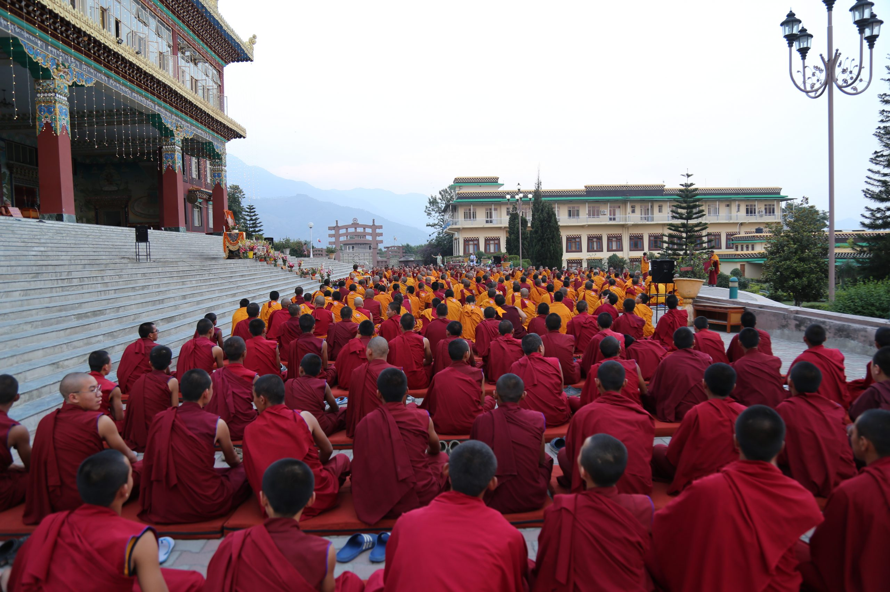

བདེ་བར་གཤེགས་པ་མཁན་ཆེན་ངག་དབང་ཀུན་དགའ་དབང་ཕྱུག་བཀྲ་ཤིས་གྲགས་པའི་རྒྱལ་མཚན་དཔལ་བཟང་པོ་ལ་ན་མོ།

དེ་རིང་སྟེ་སྤྱི་ལོ་ ༢༠༢༢ ཟླ་བ་ ༥ ཚེས་ ༢༠ བོད་ཟླ་ ༣ ཚེས་ ༢༠ ཉིན་མོ་ནི་ཡོངས་ཀྱི་དགེ་བའི་བཤེས་གཉེན་མཁན་ཆེན་ངག་དབང་ཀུན་དགའ་དབང་ཕྱུག་བཀྲ་ཤིས་གྲགས་པའི་རྒྱལ་མཚན་དཔལ་བཟང་པོ་མཆོག་གཟུགས་སྐུའི་བཀོད་པ་ཆོས་དབྱིངས་སུ་བསྡུས་ནས་བགྲང་བྱ་ཧྲིལ་པོ་བཅུ་བཞི་འཁོར་བའི་དུས་ཚིགས་ཁྱད་པར་ཅན་ཡིན་པ་བཞིན། འདི་ག་འཕགས་ཡུལ་རྫོང་སར་བཤད་གྲྭ་ཆོས་ཀྱི་བློ་གྲོས་སུ་མཁན་ཆེན་དགོངས་རྫོགས་མཆོད་འབུལ་འཚོགས།

༸སྐྱབས་རྗེ་གདུང་སྲས་རིན་པོ་ཆེས་སྐྱབས་འགྲོའི་སྡོམ་པ་དང་གང་བློ་མའི་ལྗགས་ལུང་གནང་རྗེས་ལྷན་སྒྲོན་འདྲ་པར་བླངས་པ།

དེ་ཡང་སྔ་དྲོའི་ཆུ་ཚོད་དགུ་པ་ཙམ་ལ་༸དཔལ་ས་སྐྱའི་གདུང་སྲས་ཤཱཀྱའི་དགེ་སློང་འཇམ་དབྱངས་ཀུན་དགའ་ཐུབ་བསྟན་འཇིགས་མེད་རིན་པོ་ཆེ་མཆོག་ལ་ཇི་ལྟར་གསོལ་བ་བཏབ་པ་བཞིན། མཁན་ཆེན་དགོངས་རྫོགས་ཉིན་མོ་དང་སྟབས་བསྟུན་རྫོང་སར་གཞི་རིམ་སློབ་གྲྭ་ཀནིཥྐའི་སློབ་མ་གསར་པ་ཁག་ཅིག་ལ་སྐྱབས་འགྲོའི་སྡོམ་པ་གནང་བ་དང། སློབ་གྲྭའི་དགེ་སློབ་ཡོངས་ལ་འཇམ་དབྱངས་བསྟོད་པ་གང་བློ་མའི་ལྗགས་ལུང་བསྩལ།

འདུས་མང་ཡོངས་ཀྱིས་བླ་མ་མཆོད་པའི་ཆོ་ག་གསུང་བཞིན་པ།

ཉིན་རྒྱབ་ཆུ་ཚོད་དང་པོར་༸དཔལ་ས་སྐྱའི་གདུང་སྲས་ཤཱཀྱའི་དགེ་སློང་འཇམ་དབྱངས་ཀུན་དགའ་ཐུབ་བསྟན་འཇིགས་མེད་རིན་པོ་ཆེ་མཆོག་དང། ༸སྐྱབས་རྗེ་ངོར་ཁང་གསར་ཞབས་དྲུང་ངག་དབང་མཁྱེན་བརྩེ་བསྟན་འཛིན་ཕྲིན་ལས་མཆོག་རྣམ་གཉིས་དབུ་བཞུགས་ཀྱིས། འཕགས་ཡུལ་རྫོང་སར་བཤད་གྲྭའི་མཁན་ཆེན་རྣམ་པ་དང་ལས་ཐོག་མཁན་པོ། དཔལ་གསང་ཆེན་རྒྱུད་གྲྭའི་མཁན་ཆེན་རྣམ་པ་གཉིས། དེ་བཞིན་བཤད་གྲྭའི་མཁན་པོ་དང་དགེ་རྒན། མཆོག་གི་སྤྲུལ་སྐུ་རྣམ་པ། སྐྱོར་དཔོན་རྣམ་པ། དགེ་འདུན་འདུས་མང་ཡོངས་བཅས་གཙུག་ལག་ཁང་སྐལ་བཟང་ཆོས་ཀྱི་འབྱུང་གནས་སུ་འདུས་ཏེ་ས་པཎ་བླ་མ་མཆོད་པའི་ཆོ་ག་ཡི་སྒོ་ནས་མཆོད་སྤྲིན་རྒྱས་སྤྲོས་དང་བཅས་དགོངས་རྫོགས་མཆོད་འབུལ་ཟབ་རྒྱས་འཚོགས་ཤིང། ཐེ་ཝན་དང་། ཧྥ་རན་སི། སུད་སི་བཅས་སུ་གནས་བཞུགས་རྫོང་སར་བཤད་གྲྭའི་མཁན་དགེ་དང་སློབ་ཟུར་བ་ཁག་ཅིག་ནས་ཀྱང་འདུས་ཚོགས་སུ་བསྙེན་བཀུར་ཞུས།

ཆོས་ཀྱི་བློ་གྲོས་དེབ་ཕྲེང་གཉིས་པ་དང། བཞི་པ། ལྔ་པ་བཅས་དབུ་འབྱེད་མཛད་པ།

དེ་བཞིན་དགོངས་རྫོགས་དུས་དྲན་གྱི་ཉིན་མོ་འདིར་མཁན་ཆེན་བདེ་བར་གཤེགས་པ་གང་གི་ཟག་མེད་ཐུགས་དགོངས་རྫོགས་པའི་ཆ་ཤས་སུ་དམིགས་ཏེ། བཤད་གྲྭའི་དཔེ་མཛོད་ཁང་གི་མཚན་ཐོག་ནས་དཔེ་སྐྲུན་ཞུ་བཞིན་པའི་ཆོས་ཀྱི་བློ་གྲོས་དེབ་ཕྲེང་ལས་དེབ་ཕྲེང་གཉིས་པ་དང། བཞི་པ། ལྔ་པ་བཅས་དེབ་ཕྲེང་གསུམ་གསར་དུ་དབུ་འབྱེད་དང། དེབ་ཕྲེང་གསུམ་པ་༸སྐྱབས་རྗེ་མཁྱེན་བརྩེ་རིན་པོ་ཆེའི་རང་རྣམ་བོད་འགྱུར་མ་<<མཁན་པ་སྐྱེས>>ཀྱི་དཔར་ཐེངས་གཉིས་པ་འགྲེམས་སྤེལ་ཞུས། དེ་ཡང་༸སྐྱབས་རྗེ་གདུང་སྲས་རིན་པོ་ཆེ་མཆོག་ནས་ཆོས་ཀྱི་བློ་གྲོས་དེབ་ཕྲེང་གཉིས་པ་མཁན་ཆེན་ཆོས་དབྱིངས་རྡོ་རྗེ་མཆོག་གིས་བརྩམས་གནང་བ་<<རྗེ་འཇམ་དབྱངས་མཁྱེན་བརྩེའི་དབང་པོའི་སློབ་ཆེན་འགའི་རྣམ་ཐར་སྙིང་བསྡུས་ཕྱོགས་བསྒྲིགས་བྱས་པ་བཞུགས་སོ། །>>ཞེས་པ་དང། ཆོས་ཀྱི་བློ་གྲོས་དེབ་ཕྲེང་བཞི་པ་༸སྐྱབས་རྗེ་རྫོང་སར་མཁྱེན་བརྩེ་རིན་པོ་ཆེས་འབྲུག་ཤར་ཕྱོགས་སྟག་སྐེད་ལར་རིན་ཆེན་གཏེར་མཛོད་ཆེན་མོ་གནང་སྐབས་བསྩལ་པའི་བཀའ་སློབ་སྙིང་བསྡུས། འབྲུག་བདེ་བ་ཐང་བཤད་གྲྭའི་སློབ་དཔོན་པདྨ་ཀློང་གྲོལ་ལགས་ཀྱིས་སྒྲ་ཕབ་ཞུས་པ་<<གདམས་པའི་ཉིང་ཁུ་གསེར་ཐེམ་སྐས།>>ཞེས་པ་གཉིས་དབུ་འབྱེད་བཀའ་དྲིན་བསྐྱངས་པ་དང། ༸སྐྱབས་རྗེ་ངོར་ཁང་གསར་ཞབས་དྲུང་རིན་པོ་ཆེ་མཆོག་ནས་ཆོས་ཀྱི་བློ་གྲོས་དེབ་ཕྲེང་ལྔ་པ་༸སྐྱབས་རྗེ་རྫོང་སར་མཁྱེན་བརྩེ་རིན་པོ་ཆེ་མཆོག་གིས་ལྗགས་རྩོམ་མཛད་པ་<<སྤྲུལ་སྐུའི་གཏམ་ཚོགས།>>ཞེས་པ་དབུ་འབྱེད་བཀའ་དྲིན་བསྐྱངས།

འཆད་རྩོད་རྩོམ་གསུམ་གྱི་མཆོད་སྤྲིན་ཕུལ་བ།

དགོང་མོར་གཙུག་ལག་ཁང་སྐལ་བཟང་ཆོས་ཀྱི་འབྱུང་གནས་ཀྱི་མདུན་ཐང་དུ་མཁན་ཆེན་བདེ་བར་གཤེགས་པའི་སྐུ་པར་མཐོང་གྲོལ་རིན་པོ་ཆེ་གདན་དྲངས་པའི་སྔུན་དུ་༸སྐྱབས་རྗེ་ངོར་ཁང་གསར་ཞབས་དྲུང་རིན་པོ་ཆེ་མཆོག་དང་མཁན་ཆེན་རྣམ་པས་དབུས་དགེ་འདུན་འདུས་མང་ཡོངས་གདན་འཛོམས་ཏེ། བཤད་གྲྭའི་འཛིན་གྲྭ་གོང་འོག་གི་སློབ་གཉེར་བ་རྣམས་ཀྱིས་འཆད་རྩོད་རྩོམ་གསུམ་གྱི་མཆོད་སྤྲིན་ཕུལ་བ་དང། མཇུག་ཏུ་འདུས་མང་ཡོངས་ནས་འགྲོ་བདེ་མ་དབྱངས་བཅས་གསུངས་ཏེ་དགོངས་རྫོགས་མཆོད་འབུལ་གྱི་མཛད་རིམ་ལེགས་པར་གྲུབ་བོ། །

ཆོས་ཀྱི་བློ་གྲོས་རྩོམ་སྒྲིག་ཁང།
