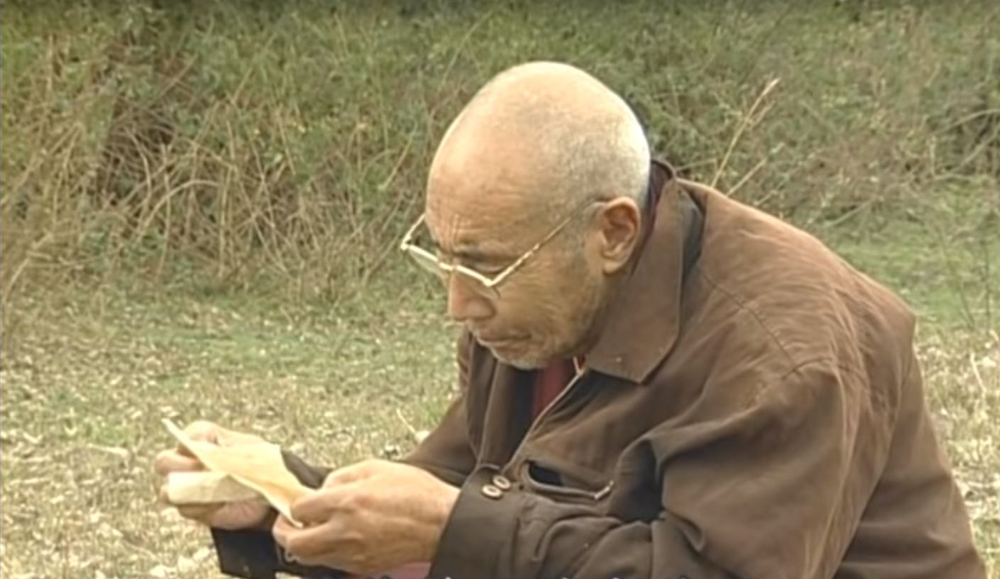
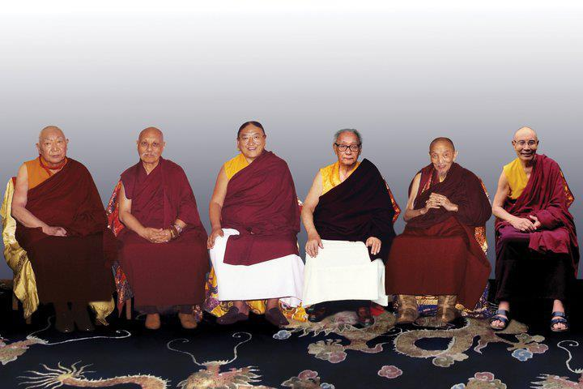
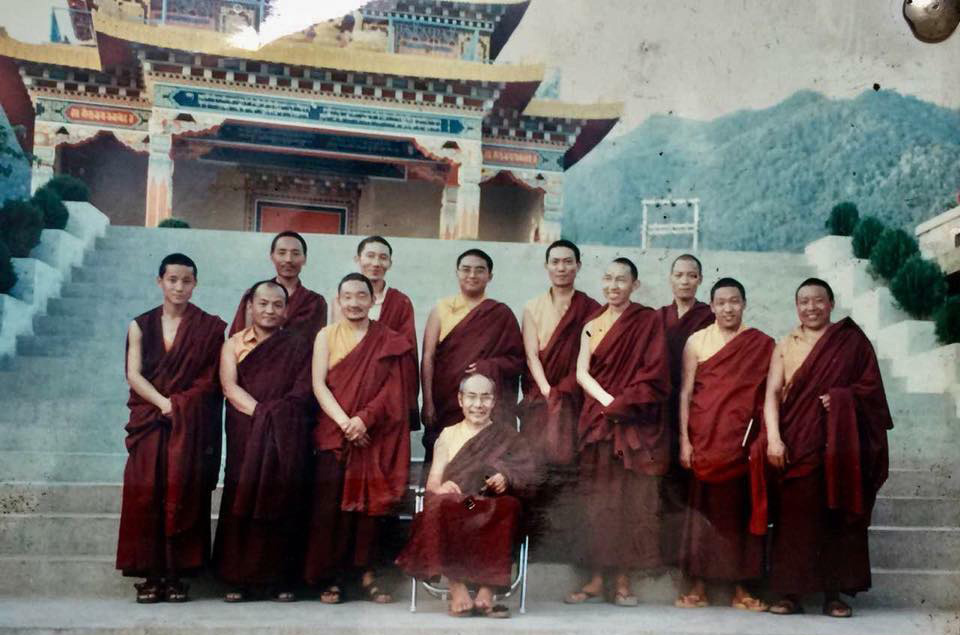
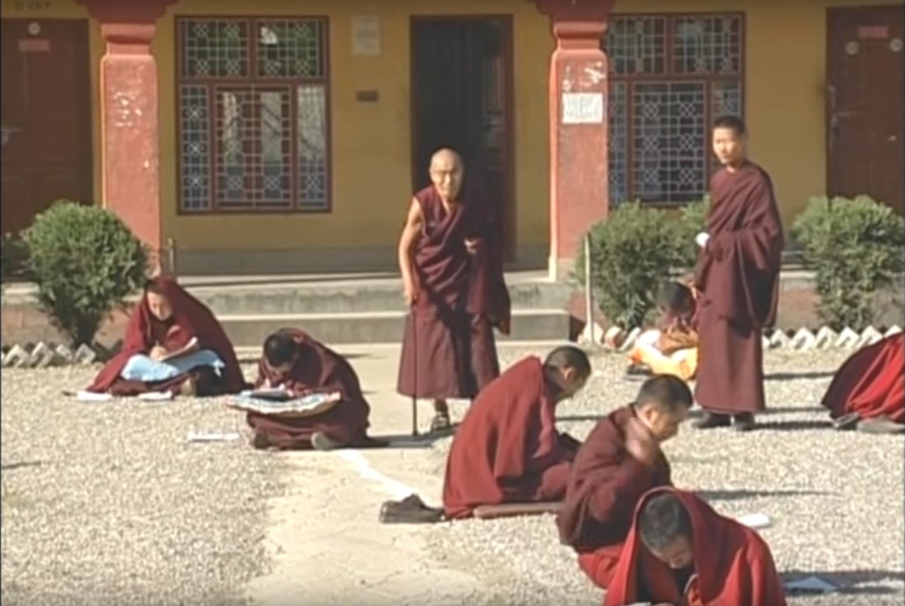

མཁན་ཆེན་ཐམས་ཅད་མཁྱེན་པ་ངག་དབང་ཀུན་དགའ་དབང་ཕྱུག་བཀྲ་ཤིས་གྲགས་པའི་རྒྱལ་མཚན་དཔལ་བཟང་པོ་ལ་ན་མོ།

མཁན་ཆེན་ཐམས་ཅད་མཁྱེན་པ་ངག་དབང་ཀུན་དགའ་དབང་ཕྱུག་མཆོག་ནི། སྤྱི་ལོ་ ༡༩༢༡ རབ་བྱུང་བཅོ་ལྔའི་རབ་གནས་ལྕགས་བྱ་ལོར། བསིལ་ལྡན་གངས་རིའི་ར་བས་སྐོར་བའི་ཞིང་བོད་ཆེན་པོའི་ལྗོངས། སྨར་ཁམས་ཀེ་རེ་སྒང་གི་སྟོད་ཀྱི་ཕྱོགས། འབྲི་ཀླུང་གསེར་ལྡན་གྱི་ནུབ་ཀྱི་ཆར། མདོ་ཆུའི་རྒྱུད་རི་མདའ་སྟོད་ཀྲམ་མདའ་ལ་ཡབ་འུ་ཡུག་བསོད་བསྟན་དང་། ཡུམ་ཡོར་གཟའ་ཨ་ཡག་གཉིས་ཀྱི་སྲས་སུ་སྐུ་བལྟམས།

སྤྱི་ལོ་ ༡༩༣༩ རབ་བྱུང་བཅུ་དྲུག་ས་ཡོས་ལོར། མཁན་པོ་བཟོད་པ་ལེགས་བཤད་ཀྱི་ཞལ་སྔ་ནས་དགེ་ཚུལ་གྱི་སྡོམ་པ་དང་། སྤྱི་ལོ་ ༡༩༤༠ ལོར་ངོར་ཨེ་ཝཾ་ཆོས་ལྡན་དུ་ཐར་རྩེ་མཁན་རིན་པོ་ཆེ་བྱམས་པ་ནམ་མཁའ་ཀུན་བཟང་བསྟན་པའི་རྒྱལ་མཚན་གྱི་ཞལ་སྔ་ནས་བསྙེན་པར་རྫོགས་པ་དང་ལམ་འབྲས་བུ་དང་བཅས་པའི་གདམས་ངག་ཟབ་མོ་མནོས། སྤྱི་ལོ་ ༡༩༤༣ ལོར་ཁམས་བྱེའི་རྫོང་སར་བཤད་གྲྭར་མཁན་རིན་པོ་ཆེ་མདོ་སྲིབ་ཐུབ་བསྟན་རྒྱལ་མཚན་གྱི་ཉེ་གནས་དང་། གསན་སྦྱོང་ཆེད་དུ་ཕེབས། རིགས་ཀུན་ཁྱབ་བདག་རྡོ་རྗེ་འཆང་འཇམ་དབྱངས་མཁྱེན་བརྩེ་ཆོས་ཀྱི་བློ་གྲོས་མཇལ་ཞིང་རྡོ་རྗེ་རྣལ་འབྱོར་མའི་ཆོས་བཀའ་ཡོངས་རྫོགས་དང་། མགོན་པོའི་ཆོས་སྐོར་གྱིས་མཚོན། སྒྲུབ་བརྒྱུད་ཤིང་རྟ་ཆེ་བརྒྱད་ཀྱི་གདམས་ཟབ་མ་ལུས་པ་ཞུས།   སྤྱི་ལོ་ ༡༩༤༢ ནས་ ༡༩༥༠ ཐམ་པའི་བར་མཁན་རིན་པོ་ཆེ་ཐུབ་བསྟན་རྒྱལ་མཚན་དང་ལུས་དང་གྲིབ་མ་བཞིན་འགྲོགས་ཤིང་། གྲགས་ཆེན་བཅོ་བརྒྱད་ཆ་ལག་དང་བཅས་པས་མཚོན་འཆད་ཉན་ཉམས་ལེན་གྱི་རྒྱུན་གཟུགས་སོ་ཅོག་གསན་སྦྱོང་མཛད། སྤྱི་ལོ་ ༡༩༤༥ ལ་རྫོང་སར་བཤད་གྲྭའི་སྐྱོར་དཔོན་དུ་གདེམས་བསྐོས་བྱུང་ནས་སྐྱོར་དཔོན་ལོ་ལྔ་ལ་གནང་། མཁན་པ་ཆེན་པོ་དབོན་སྟོན་མཁྱེན་རབ་དང་། སྐྱེ་དགོན་མཁན་པོ་ཕྲིན་ལས་ཆོས་འཕེལ། བདེ་གཞུང་ཨ་འཇམ་རིན་པོ་ཆེ་སོགས་དམ་པ་དུ་མའི་ཞབས་ལ་བསྟེན་ནས་རིགས་གཏེར་རང་འགྲེལ་དང་། ཚད་མ་རྣམ་འགྲེལ་དང་། ཀུན་བཏུས་ཀྱིས་གཙོས་ཆོས་འབྲེལ་ཅི་རིགས་གསན།

སྤྱི་ལོ་ ༡༩༥༠ མཁན་རིན་པོ་ཆེ་ཐུབ་བསྟན་རྒྱལ་མཚན་གྱི་བཀའ་བཞིན་མདོ་སྲིབ་དགོན་གྱི་འགན་འཛིན་དང་མཁན་པོ་ལོ་བཞི་དང་། སྤྱི་ལོ་ ༡༩༥༥ ལོར་རྡོ་རྗེ་འཆང་ཆོས་ཀྱི་བློ་གྲོས་ཀྱི་བཀའ་བཞིན་ཝ་རྭ་དགོན་གྱི་བཤད་གྲྭའི་མཁན་པོ་ལོ་གསུམ་མཛད། སྤྱི་ལོ་ ༡༩༥༩ ལོ་ནས་ ༡༩༨༠ ཐམ་པའི་བར་དུས་འགྱུར་གྱི་དབང་གིས་བཙོན་ཁང་དུ་བཞུགས་དགོས་བྱུང་།

སྤྱི་ལོ་ ༡༩༨༠ ལོ་སྨད་ནས་ཀློད་བཀྲོལ་ཐོབ་ཅིང་རྡོ་རྗེ་འཆང་མཁྱེན་བརྩེ་ཆོས་ཀྱི་བློ་གྲོས་ཀྱི་ཡང་སྲིད། འཇམ་དབྱངས་མཁྱེན་བརྩེ་ཐུབ་བསྟན་ཆོས་ཀྱི་རྒྱ་མཚོས་འཕགས་ཡུལ་དུ་ཕེབས་དགོས་པའི་བཀའ་འཕྲིན་སྔ་རྗེས་འབྱོར་བ་ལྟར། སྤྱི་ལོ་ ༡༩༨༢ དགུང་ལོ་ ༦༡ ཐོག་གསང་བའི་སྒོ་ནས་གོམ་བགྲོད་ཀྱིས་རྒྱ་གར་ཤར་ཕྱོགས་འབྲས་ལྗོངས་སུ་ཕེབས་ནས། སྐྱབས་རྗེ་རྫོང་སར་མཁྱེན་བརྩེ་ཐུབ་བསྟན་ཆོས་ཀྱི་རྒྱ་མཚོ་མཇལ། རིན་པོ་ཆེའི་དགོངས་བཞེད་ལྟར། སྤྱི་ལོ་ ༡༩༨༣ རབ་བྱུང་བཅུ་དྲུག་ཆུ་ཕག་ལོའི་ཆོ་འཕྲུལ་ཟླ་བའི་ཚེས་བཅོ་ལྔ་ཉིན་འབྲས་ལྗོངས་གནས་ནང་དུ་འཕགས་ཡུལ་རྫོང་སར་བཤད་གྲྭའི་དབུ་དངོས་སུ་བཙུགས།

སྤྱི་ལོ་ ༡༩༨༥ རྒྱ་གར་ནུབ་བྱང་ཧི་མ་ཅལ་མངའ་སྡེའི་ཁོངས་སྦིར་ས་སྐྱ་དགོན་དུ་རྫོང་སར་བཤད་གྲྭ་སྤོས་ཤིང་མཁྱེན་བརྩེ་རིན་པོ་ཆེའི་བཀའ་དགོངས་བཞིན་བཤད་གྲྭའི་འགན་ཁུར་དང་མཁན་པོ་གཅིག་ཆོག་མཛད་ནས། སྤྱི་ལོ་ ༡༩༩༥ བར་གཙོ་བོ་ཆོས་ཁྲིད་ཁོ་ནས་འདའ་བ་མཛད། སྤྱི་ལོ་ ༡༩༩༥ ལོ་ནས་ཐེ་ཝན་སོགས་ཤར་ཕྱོགས་ཀྱི་རྒྱལ་ཁབ་ཁ་ཤས་སུ་ཕེབས་ཤིང་བསྟན་འགྲོའི་དོན་རྒྱ་ཆེར་མཛད། སྤྱི་ལོ་ ༡༩༩༩ ལོ་ནས་ཅོན་ཏ་རའི་རྫོང་སར་བཤད་གྲྭ་ཆོས་ཀྱི་བློ་གྲོས་གསར་བཞེངས་ཀྱིི་དབུ་བཙུགས་ཤིང་། སྤྱི་ལོ་ ༢༠༠༤ ལོར་༸གོང་ས་སྐྱབས་མགོན་ཆེན་པོ་མཆོག་དང་ས་གནས་མངའ་སྡེའི་བློན་ཆེན་གཉིས་གདན་དྲངས་ནས་ཕྱི་ལུགས་ལྟར་བཤད་གྲྭ་གསར་པའི་དབུ་འབྱེད་གནང་།

སྤྱི་ལོ་ ༢༠༠༨ ལོར་བཤད་གྲྭའི་རྟེན་བརྟེན་པ་བཅས་ལེགས་པར་གྲུབ་ཅིང་། རིགས་ཀྱི་བདག་པོ་༸སྐྱབས་མགོན་གོང་མ་བདག་ཁྲི་རྡོ་རྗེ་འཆང་གདན་ཞུས་ཀྱིས་ཞལ་སྔ་ནས་རབ་གནས་དང་། གསུང་ངག་རིན་པོ་ཆེ་སློབ་བཤད་བསྩལ་གནང་མཛད་ཅིང་གྲུབ་ལ་ཉེ་བའི་སྐབས་ཏེ། སྤྱི་ལོ་ ༢༠༠༨ སྤྱི་ཟླ་ ༥ ཚེས་ ༢༥ ལ་ཐུགས་དགོངས་ཡོངས་སུ་རྫོགས་པའི་དབུགས་དབྱུངས་དང་བཅས་དགུང་གྲངས་གྱ་བརྒྱད་ཐོག་སྐུ་ཞི་བར་གཤེགས་སོ། །

འཕགས་ཡུལ་དུ་ཕེབས་རྗེས་༸གོང་ས་སྐྱབས་མགོན་ཆེན་པོ་དང་། ༸སྐྱབས་མགོན་གོང་མ་བདག་ཁྲི་རིན་པོ་ཆེ། རྡོ་རྗེ་འཆང་ངོར་ཀླུ་ལྡིང་མཁན་རིན་པོ་ཆེ་འཇམ་དབྱངས་བསྟན་པའི་ཉི་མ། རིས་མེད་བསྟན་པ་རྒྱ་མཚོའི་མངའ་བདག་འཇམ་དབྱངས་མཁྱེན་བརྩེ་ཐུབ་བསྟན་ཆོས་ཀྱི་རྒྱ་མཚོ་མཆོག་བཞིའི་སྐུ་མདུན་ནས་དུས་འཁོར་དབང་ཆེན་དང་རྒྱུད་སྡེ་ཀུན་བཏུས་སོགས་མདོ་རྒྱུད་མན་ངག་ཅི་རིགས་གསན་པ་མ་ཟད། ༸གོང་ས་སྐྱབས་མགོན་ཆེན་པོ་དང་། ༸སྐྱབས་མགོན་གོང་མ་བདག་ཁྲི་རིན་པོ་ཆེ་གཉིས་ཀྱི་དབུས་བདག་ཉིད་ཆེན་པོ་དེ་དག་ལ་ཆོས་བཀའ་མང་པོ་ཕུལ་ཞིང་། ཡོངས་ཀྱི་དགེ་བའི་བཤེས་གཉེན་ཆེན་པོར་གྱུར།

གཞན་ཡང་བསྟན་པ་འཛིན་ནུས་ངེས་ཀྱི་སློབ་ཚོགས་མང་དུ་བསྐྲུན་ཅིང་རྒྱ་བལ་འབྲུག་གསུམ་གཙོས་མདོར་ན་འཛམ་གླིང་རིལ་པོར་གྲགས་ཆེན་བཅོ་བརྒྱད་འཆད་ཁྲིད་ཀྱི་རྒྱུན་ཆ་ཚང་བ་ད་ལྟ་བཞུགས་ཐུབ་པའང་མཁན་རིན་པོ་ཆེ་ཉག་གཅིག་གི་བཀའ་དྲིན་དུ་ངེས། གསུང་རྩོམ་ལ་ཀུན་དབང་གསུང་འབུམ་ཞུ་སྒྲིག་ཁང་དང་ཆོས་ཀྱི་བློ་གྲོས་རྩོམ་སྒྲིག་ཁང་གིས་རྩོམ་སྒྲིག་བགྱིས་པ་གསུང་འབུམ་པོད་བཅུ་བཞི་དང། དཔར་དུ་སྐྲུན་མ་ཟིན་པ་གཞུང་ཆེན་བཅུ་གསུམ་གྱི་མཆན་འགྲེལ་སོགས་མང་དུ་བཞུགས་པ་བཅས་སོ། །

རྫོང་སར་བཤད་གྲྭ་ཆོས་ཀྱི་བློ་གྲོས་ཀྱིི་མཁན་པོ་ཆོས་དབྱིངས་རྡོ་རྗེའམ་གཟི་བརྗིད་མཐའ་ཡས་ཀྱིས་མཁན་རིན་པོ་ཆེའི་གསུང་འབུམ་སྔོན་གླེང་དུ་བཀོད་པ་ལས་དྲངས།

འབྲེལ་ཡོད་སྐུ་པར།

མཁྱེན་བརྩེ་རིན་པོ་ཆེས་རྒྱ་གར་དུ་ཡོང་དགོས་པའི་བཀའ་ཡིག་འབྱོར་བ།

༸དཔལ་ས་སྐྱའི་བླ་ཆེན་ཁག་དང་ལྷན་བཞུགས།

བལ་ཡུལ་ཐར་ལམ་དགོན་དུ་༸གོང་མ་རིན་པོ་ཆེས་སྒྲུབ་ཐབས་ཀུན་བཏུས་གནང་སྐབས། 1994

སློབ་མ་ཡོངས་དགེ་མི་འགྱུར་རིན་པོ་ཆེ་སོགས་ཀྱིས་བསྐོར་བ།

བཤད་གྲྭ་རྙིང་པར་ཡིག་རྒྱུགས་ལ་གཟིགས་བཞིན་པ།

ཆོས་སྡེ་ཆེན་པོ་དཔལ་རྫོང་སར་བཤད་གྲྭ་ཆོས་ཀྱི་བློ་གྲོས།

བཤད་གྲྭ་གསར་པའི་དབུ་འབྱེད་མཛད་སྒོའི་སྐབས་སུ།

བཤད་གྲྭ་གསར་པའི་དབུ་འབྱེད་མཛད་སྒོའི་སྐབས་སུ།

མཁན་ཆེན་གྱི་རིང་བསྲེལ།
