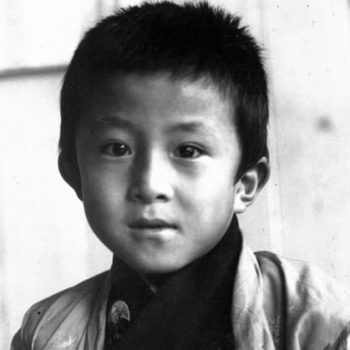
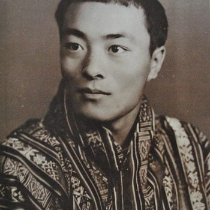
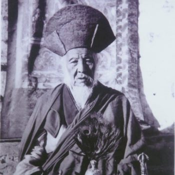
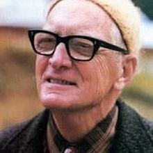

རིན་པོ་ཆེ་སྐུ་ན་ཆུང་དུས།

ངའི་མི་ཚེ་འདི་སྣང་བ་ཞིག་གམ། འཕྲུལ་སྣང་ཞིག ཡང་ན་མཇུག་རྫོགས་རྒྱུ་མེད་པའི་འཆར་སྣང་ཞིག་ཡིན། ཡང་ན་སྣང་བ་ཞིག་སྟེ་དུས་ཀྱིས་ཟིན་ཅིང་རྟོག་འཆར་གྱིས་གཏན་ཚིགས་བཀོད་དུ་ཡོད་པ་འདྲ་ལ། མདོར་ན་ངའི་འཆར་སྣང་འདི་དག་གི་མཐའ་མཇུག་ནི། ལ་ཁའི་ཉི་མ་དང་མཚུངས་པར་བག་ལ་ཞ་ངེས་པ་ཞིག་ཀྱང་ཅི་ལ་མིན། སེམས་སྣང་གི་འཕོ་འགྱུར་དང་བསྟུན་ཏེ། ངའི་མི་ཚེ་འདི་སྐབས་རེར་ཡུན་རིང་པོའམ། མཚམས་རེ་ནི་ཡུན་ཐུང་བའི་ཚོད་ཙམ་ཞིག་ལས་མིན། འདས་ཟིན་པའི་ལོ་ཟླའི་ཁྲོད་ན། མགོ་བརྩམས་པའི་འཆར་གཞི་མང་ལ། མཐའ་མ་འཁྱོལ་བའི་ལས་འཆར་ཡང་མང་།

རེད་ཡ། ང་ཁོ་ན་ག་ལ་ཡིན། དངོས་སུ་འབྲེལ་འདྲིས་བྱུང་ཡང་རུང་མ་བྱུང་ཡང་རུང་། སྐྱེ་བོ་ཐམས་ཅད་ལ་རང་རང་གི་མི་ཚེ་ལ། རང་རང་གི་འཆར་སྣང་མི་འདྲ་བ་རེ་ཡོད། འཕྲུལ་སྣང་འདི་ཡི་ཁྲོད་དུ་དངོས་སུ་ཐུག་འཕྲད་མ་བྱུང་ཡང་། ངའི་མི་ཚེ་ལ་ཤན་ཤུགས་ཆེན་པོ་ཐེབས་མྱོང་བའི་དབྱིན་ཇིའི་གླུ་གཞས་རྩོམ་པ་

པོ་དང་གླུ་པ་ཇོན་ལེ་ནོན་  (John Lennon)  ལྟ་བུའི་སྐྱེས་བུ་ཡང་ཡོད། གལ་ཏེ་ངའི་སྐྱེ་བ་འདི་ཕྱེ་མ་ལེབ་ཅིག་ཡིན་ན། མི་དེའི་སྐོར་ནམ་ཡང་ཤེས་རྟོགས་བྱུང་མི་སྲིད། ཡང་འཕྲུལ་སྣང་འདི་ཡི་གསེབ་ཏུ་ངེད་གཉིས་བར་འབྲེལ་འདྲིས་ཀྱིས་སྟོང་ཞིང་། ཁོ་བོའི་མི་ཚེ་ལ་ཤན་ཤུགས་ཅི་ཡང་མེད་པའི་ཨུ་རུ་སུའི་

ཡི་གེའི་སྒྱུ་སྤྲུལ་པ་ཆེན་པོ། (John Lennon)

གསར་བརྗེ་བ་རྗོ་སིཕཱ་སི་ཏ་ལིན་  (Joseph Stalin)  ལྟ་བུའང་ཡོད། ངས་སྣང་མེད་དུ་དོར་བའི་དྲན་པའི་ཀློང་ནས་ཁོ་དེ་ལྟར་འཇོག་ཐུབ་མ་སོང། ཕན་ཚུན་ཐུག་འཕྲད་བྱུང་བའི་ལོ་ཟླ་དེ་དག་ཏུ། འགའ་ཞིག་ནི་ཚེ་གང་བོར་ངོ་ཤེས་ཀྱི་ཚུལ་དུ་གྱུར་ཅིང། ལ་ལ་ཞིག་ནི་ཡུན་ཐུང་བའི་ཁ་བརྡའི་ཤུལ་དུ་རྗེས་མེད་དུ་ཡལ་སོང། ཁག་ཅིག་ནི་ཕྱི་མའི་ལྔ་ལམ་དུ་ཕྱིན་ཟིན་པ་དང། རེ་ཟུང་ནི་ད་ལྟ་ཡང་དབུགས་ཀྱི་རྒྱུ་བ་མ་ཆད་པར་གསོན་པོར་གནས་ཡོད།

ང་ལ་མཚོན་ན་འགའ་རེ་ནི་དོན་སྙིང་ལྡན་ལ། འགའ་རེ་ནི་ངའི་འཆར་སྣང་འདིར་ཡོད་མེད་ལ་ཁྱད་མེད་པའི་ཚད་དུ་ལུས་པའང་མང།

མེ་འཁོར་ནང་གི་འགྲུལ་བཞུད་ཀྱི་ཁྲོད་ནས། བདག་གིས་རྒྱ་གར་བ་མང་པོ་ཞིག་དང་ཁ་ཟས་མཉམ་ཟ་བྱས་ཤིང། ཁ་བརྡ་གྲངས་མེད་ཅིག་བྱས། ཨ་རིའི་བྷོ་སེ་ཊོན་ས་ཁུལ་དུ་འཚིག་ཇར་རོལ་བའི་སྐབས་ཤིག་ཨ་ལེན་ཇིན་སི་བྷག (Allen Ginsberg)  དང་ནང་ཆོས་ཀྱི་སྐོར་གླེང་སློང་མང་ཙམ་བྱས་མོད། ངས་མི་དེ་སྙན་ངག་པ་གྲགས་ཅན་ཞིག་ཡིན་པ་མ་ཤེས་པའི་རྐྱེན་གྱིས། ཡིག་འཕྲུལ་གྱིས་བསྐྲུན་པའི་སྙན་ངག་གི་འཇིག་རྟེན་སྐོར་གླེང་མོལ་བྱེད་རྒྱུའི་གོ་སྐབས་ཤིག་དེ་ལྟར་ཤོར་སོང། ང་བིཊ་ནེ་བཊ (Whitney Ward)  ལྟ་བུ་སྐྱེས་པར་དབང་སྒྱུར་བྱེད་མཁན་ཏེ་སྒེག་ཉམས་ཀྱིས་ཀུན་ནས་ཕྱུག་པའི་རྒྱལ་མོ་དང་ཐུག་སྟེ། མུན་དོང་<<དོན་དུ། Dominatrix Dungeon ཞེས་པ་འཁྲིད་སྲེད་ཀྱི་བྱ་སྤྱོད་ཐད་ལ་བུད་མེད་ཀྱིས་སྐྱེས་པར་དབང་སྒྱུར་བྱེད་པ་དག་གིས་ས་འོག་ན་བཟོས་པའི་ཁང་ཁྱིམ་ལ་གོ །>>ལ་ཡང་བལྟ་རྒྱུ་བྱུང་ལ། ཕྱིས་སུ་ཁོ་བོའི་སྦྱིན་སྲེག་གི་ཆོ་ག་བྱེད་པའི་དུས་སྐབས་ཤིག་ལ་མོ་རང་ཡང་མཉམ་ཞུགས་བྱས་མྱོང།

འབྲུག་གི་ཆོས་རྒྱལ་གསུམ་པ་འཇིགས་མེད་རྡོ་རྗེ་དབང་ཕྱུག་མཆོག

བདག་གིས་འབྲུག་ཆོས་ལྡན་རྒྱལ་ཁབ་ཀྱི་ཆོས་རྒྱལ་རིམ་བྱོན་ལས་ཆོས་རྒྱལ་སྐུ་ཐོག་གསུམ་པ་འཇིགས་མེད་རྡོ་རྗེ་དབང་ཕྱུག་ཀྱང་མཇལ་རྒྱུ་བྱུང་ལ། དེ་དུས་ལོ་ན་ཧ་ཅང་ཕྲ་བའི་དབང་གིས། ཆོས་རྒྱལ་ཆེན་པོས་དཔུང་པར་འཁྱེར་བའི་ཚེ་ཁོང་གི་དབུ་སྐྲའི་གསེབ་ནས་ཐུལ་བའི་དུ་བའི་དྲི་མ་ཚོར་མྱོང་བ་ད་ལྟའང་ཡིད་ངོས་སུ་ལྷང་ལྷང་འཆར་འོང། འཕོ་འགྱུར་རབ་ཏུ་མྱུར་བའི་འཕྲུལ་སྣང་དེ་དག་གི་ཁྲོད་དུ། སྐྱེ་བ་མང་ལ། འཆི་བའང་མང། གཉེན་སྒྲིག་པའི་གཏམ་རྒྱུད་མང་ལ། ཁ་གྱེས་པའང་མང་། ལོས་ཡིན། ཚེ་འདི་དང་སྐྱེ་བ་གཞན་དག་ཏུའང། འཆར་སྣང་གི་འགྱུར་ལྡོག་ཀློང་ནས་ངས་ཀྱང་འཕོ་འགྱུར་གྱི་རྗེས་ལམ་འདེད་བཞིན། ནམ་མཁའི་བྱ་དང། ས་འོག་གི་འབུ། དེ་བཞིན་མགོ་ནག་མིའི་སྣང་བ་སོགས་སྣང་བ་གྲངས་མེད་ཅིག་ཀྱང་ཤར་ཡོད་ངེས་ཡིན།

འཆར་སྣང་འདིའི་ཁྲོད་ནས་སྟོན་པ་བདེ་བར་གཤེགས་པའི་མཚན་ཐོས་ཤིང། ལོ་ཆུང་བྱིས་པའི་བསྟོད་པ་དང་མཚུངས་པའི། སྟོན་པའི་གསུང་རབ་ལ་བསྟོད་ཚིག་གི་བསྔགས་བརྗོད་ཐན་ཐུན་རེ་འཐོར་ཤེས་པས། འཆར་སྣང་འདི་གཞན་དང་བསྡུར་ན་དོན་སྙིང་ཅུང་ཙམ་ལྡན་པ་ཞིག་ཡིན་ངེས། ད་དུང་རང་གི་བགོ་སྐལ་དུ་བྱོན་དཀའ་བའི་ཁྱད་འཕགས་ཀྱི་སྐྱེས་ཆེན་མཇལ་རྒྱུ་བྱུང་ཞིང། མཐར་ཁོང་ནི་ངའི་ཚེ་གང་པོའི་ཕྱོགས་སྟོན་གྱི་འཁོར་ལོར་གྱུར། ང་ལོ་ལྔར་སོན་དུས་གཏན་འཇགས་སློབ་གྲྭར་སོང། དེ་ནི་ངའི་མི་ཚེའི་ནང་ཁེར་རྐྱང་དུ་རྒྱུས་མེད་མི་དང་དུས་ཚོད་མཉམ་བསྐྱལ་བྱས་པ་ཐོག་མ་དེ་ཡིན།

ང་འབྲུག་ཤར་ཕྱོགས་<<ཡོངས་ལ་>>ཞེས་པའི་ལུང་པར་ཁྱིམ་བརྒྱུད་ཆེ་གྲས་ཤིག་ཏུ་འཚར་ལོངས་བྱུང་ཞིང་གནས་དེར་དུས་རྟག་ཏུ་ཞབས་ཞུ་བ་དང་མགྲོན་པོ། རལ་པ་ཅན་གྱི་རྣལ་འབྱོར་བ་དང་བུད་མེད་<<ཐར་པ་གླིང་>>གི་མགོ་དཔོན་དུ་འོས་འདེམས་དྲག་ཤོས་ཀྱི་གདེངས་དང་ལྡན་པའི་རྣལ་འབྱོར་མ་ཀུན་ཏུ་རྒྱུ་མ་སོགས་ཀྱིས་མཐར་བསྐོར་བ་དང་ད་དུང་གཞན་གྱིས་ས་རྐོ་བ་དང་ཀ་བ་སློང་བ། ཁང་ཐོག་འགེབས་པའི་དོན་དུ་དཀའ་ཚེགས་བྱེད་པ་ལ་ཆ་རྒྱུས་མེད་མཁན་བྲག་ཕུག་ནང་གི་ཆོག་ཤེས་ཅན་དང་ཧིན་སྒོར་བཅུ་ལས་མང་བར་ལག་པས་རེག་མ་མྱོང་བའི་སྡོམ་ལྡན་གྱི་དགེ་འདུན་པ། སྒོམ་ཆེན་ཆགས་པས་བཟི་བ་དག་གིས་ངའི་ན་ཚོད་ཅན་དག་ལ་འདོད་ཚོར་རྒྱས་བྱེད་ཀྱི་འཁྲིག་གཏམ་དང་བུད་མེད་ལ་བསྟན་པའི་གཡོ་འཕྲུལ། ཀུ་རེ་སོགས་ཀྱང་གནས་དེ་ན་ཡོད་དོ། །

གྲུབ་དབང་བསོད་ནམས་བཟང་པོ།

བདག་གི་ཨ་མྱེའི་ཁང་མིག་རེ་རེའི་ནང་དུ་མཆོད་པའི་སྐུ་རྟེན་རེ་ཡོད་ལ། གལ་སྲིད་ཁྱེད་རང་ལ་རྟུག་དྲི་འཆོར་གྲབས་བྱེད་ན་སྒོའི་ཕྱི་རོལ་དུ་འབུད་དགོས་པའི་ཚད་དུ་ཡོད། ནམ་རྒྱུན་རིམ་གྲོ་ཆད་མེད་དུ་བྱེད་ལ། ཞོགས་པ་སྔ་མོར་ཡར་ལངས་པའི་ཚེ་བསངས་ཀྱི་དྲི་ངད་ལྡང་བ་དང་རྔ་དང་དྲིལ་བུ། སིལ་སྙན་གྱི་སྒྲ་རྣམས། འབུ་དང་ཕུག་རོན། ཁྭ་ཏའི་སྐད་དང་འདྲེས་ཏེ་ཐོས་རྒྱུ་ཡོད།

ང་རང་ (Ozu)  ཨོ་ཛོའི་གློག་བརྙན་ལ་ཧ་ཅང་དུང་བའི་རྒྱུ་མཚན་ཡང་ཏན་ཏན་སྒྲ་དབྱངས་དེ་དག་གློག་བརྙན་གྱི་ནང་དུ་ཡང་ཡང་བཀོལ་སྤྱོད་བྱས་པས་ཡིན་སྲིད། བདག་གི་ཨ་མྱེ་རིག་གསར་བསྐྱར་དར་གྱི་མྱི་ཞིག་ཡིན་ལ། ཁོང་ནི་རྣལ་འབྱོར་པ་ཚད་ལྡན་ཞིག་དང་ཟས་གཡོ་བར་མཁས་ཤིང་སྨན་དང་སྤོས། འཇིམ་བཟོ་བ། ཁང་བཟོའི་འཆར་འགོད་པ་ཞིག་ཡིན། དུས་རྒྱུན་མཆོད་རྟེན་ཞིག་གསོ་དང་གསར་བཞེངས་ལ་བྲེལ་བ་ཞིག་ཡིན་པས། ང་སྒོ་ཕྱིར་ནམ་བུད་ལ་མགར་བས་མཆོད་རྫས་སྣ་ཚོགས་ཤིག་བརྡུང་བ་དང་བ་ཕྱུགས་ཀྱི་ཀོ་ལྤགས་ལས་བཟོས་པའི་ཚོན་རྩིའི་དྲི་བསུང་བསིལ་རླུང་དང་ལྷན་དུ་རྒྱུ་བའི་ཚོར་སྣང་ཞིག་སྐྱེས་འོང། དེང་སང་ཡང་ཚོན་གསར་གྱིས་བཀླུབས་པའི་འབྲུག་པའི་ལྷ་ཁང་ནང་མཆོད་མཇལ་ལ་བཅར་དུས། བྱིས་དུས་ཀྱི་ཚོར་སྣང་དྲོན་མོ་དེ་དག་དྲན་ལྷང་ལྷང་བྱེད་བཞིན་འདུག

Father Willian Joseph Mackey

དེང་རབས་ཀྱི་རི་མོའི་སྒྱུ་སྩལ་ལྡན་པའི་དུས་སྐབས་སུའང་འབྲུག་པའི་སྲོལ་རྒྱུན་གྱི་སྒྱུ་རྩལ་ཉམས་མེད་དུ་འཛིན་པའི་ལྟེ་གནས་ <<བཟོ་རིག་བཅུ་གསུམ་>> ཞེས་འབྲུག་གཞུང་གི་བཀའ་དྲིན་ལ་བརྟེན། ཁོང་ཚོས་ད་ལྟ་ཡང་སྲོལ་རྒྱུན་གྱི་དྲི་བསུང་རྒྱུན་འཛིན་གྱི་སྒོ་ནས་ཚོན་བརྩི་བཀོལ་སྤྱོད་བྱེད་བཞིིན་ཡོད། ང་ཁྱིམ་དང་གྱེས་ལ་ཉེ་བའི་ཉིན་དེ་དག་ལ། བདག་གི་ཨ་མྱེས་མི་དམངས་སློབ་གྲྭའི་ཤེས་ཡོན་སྲིད་བྱུས་ནི་དུས་ཚོད་ཆུད་ཟོས་གཏོང་ཐབས་ཡིན་པར་བརྗོད། ཁོང་བདེན་ཡང་སྲིད། ལྷག་པར་ཏུ་ངའི་ཨ་ཕྱིས་ང་འགྲོ་སའི་སློབ་གྲྭ་དེ་ཡེ་ཤུའི་སློབ་གྲྭ་ཞིག་ཡིན་པར་གོ་ཐོས་བྱུང་བ་ནས་བཟུང་ང་སྟོན་པ་སངས་རྒྱས་དང་དམ་པའི་ཆོས་ལ་དད་པ་དང་ཡིད་ཆེས་བརླག་ཁར། སེམས་ཅན་དུད་འགྲོའི་རིགས་ལ་ཁ་ཟས་ཀྱི་འདུ་ཤེས་ཁོ་ནར་སྐྱེ་ངེས་པའི་ཐུགས་འཚབ་བྱེད་པའི་སྐད་ཆའང་ཐོས་རྒྱུ་ཡོད། ཨ་མྱེ་རྒན་རྒོན་གཉིས་ཀྱིས་སྐད་ཆ་དེ་དག་བཤད་དུས་གུས་བརྩི་དང་ལྡན་པའི་སྒོ་ནས་གུས་ཞབས་དང་ཁ་ཁུ་སིམ་པོ། ཚིག་འཇམ་གྱིས་བཤད་བཞིན་ཡོད།

ང་དབྱིན་ཇིའི་གཏན་སློབ་ཏུ་འགྲོ་བར་གོ་སྒྲིག་བྱེད་མཁན་ནི་བདག་གི་ཨ་ཕ་ཡིན། དེ་ཡང་ང་ཚོ་དངོས་སུ་ཐུག་ནས་གོ་སྒྲིག་བྱས་པ་ཞིག་མིན། ང་ཨ་ཕ་དང་འབྲེལ་འདྲིས་དེ་ཙམ་ཆེན་པོ་མེད། བདག་གི་ཡབ་ཡུམ་གཉིས་རྒྱ་གར་རྡོ་རྗེ་གླིང་གི་ཁར་ཤང་ས་གནས་སུ་གཏན་སྡོད་བྱེད་ཀྱིན་ཡོད་ཅིང་ཡབ་ཡུམ་གཉིས་པོ་ལས་བྲེལ་གྱི་རྐྱེན་གྱིས་ང་ལ་བལྟ་སྐྱོང་ཆེད་དུས་ཚོད་གཏོང་ཐབས་བྲལ། ཁོང་གཉིས་ཀྱིས་རྒྱ་གར་ཀུན་ཁྱབ་རླུང་འཕྲིན་ལས་ཁང་དུ་ལས་དོན་གཉེར་བཞིན་མཆིས། འདི་ལྟར་བསམ་ཚེ་ང་ཕ་མ་གཉིས་ལས་ཀྱང་ཨ་མྱེ་དང་ཨ་ཕྱི་གཉིས་ལ་འབྲེལ་འདྲིས་ཧ་ཅང་ཆེ། ཡིན་ནའང་ལོ་ན་ཆུང་བའི་སྐབས་དེར་བདག་གི་སེམས་ཀྱི་གཏིང་དུ་རང་ལ་བྱམས་བརྩེས་གཅེས་སྐྱོང་གནང་མཁན་ནི་སོ་སོའི་ཕ་མ་གཉིས་ཡིན་པ་དྲན་གྱིན་ཡོད། བདག་གིས་དྲན་སོས་པ་ཞིག་ལ་ཁར་ཤང་ནས་ཁྱིམ་དུ་མགྲོན་པོ་འབྱོར་བའི་ཚེ། ང་ནི་དགའ་སྣང་གིས་བཟི་ནས། ཕ་མ་གཉིས་ཀྱིས་བཏང་བའི་འཕྲིན་ཡིག་དང་བརྡ་ལན་འདྲ་ཐོས་པར་དུས་ཡུན་རིང་བོར་ངང་སྒུག་བྱས་ནས་སྡོད་བཞིིན་ཡོད།

ཡིན་ནའང་འཕྲིན་ཡིག་ནི་ངའི་ཨ་མྱེ་དང་ཨ་ཕྱི་གཉིས་ལ་མ་གཏོགས་བདག་ལ་གཅིག་ཀྱང་བསྐུར་མྱོང་མེད། ཉིན་གཅིག་ཁར་ཤང་ནས་བདག་གི་ཨ་ཕའི་ཞབས་ཕྱི་བ་ཞིག་ང་དབྱིན་སྐད་ཆེད་སྦྱོང་གི་སློབ་གྲྭར་བརྫང་དགོས་པའི་འཕྲིན་ཡིག་སྐྱེལ་བ་ལ་སླེབས་བྱུང། ང་དབྱིན་སྐད་ཆེད་སྦྱོང་སློབ་གྲྭར་འགྲོ་དགོས་པའི་སྐད་ཆ་དེས་ངའི་ཨ་མྱེ་དང་ཨ་ཕྱི་གཉིས་ལ་སྟབས་མི་བདེ་བ་ཞིག་བཟོས་ཡོད། འོན་ཀྱང་གནད་དོན་དེའི་སྐོར་ངའི་ཨ་མྱེ་དང་ཨ་ཕྱི་གཉིས་ཀྱིས་ངའི་ཕ་མ་གཉིས་ལ་སེམས་ནས་ཞུ་དྲན་རུང་བཤད་ཐབས་མེད། ཕྱིར་ཁར་ཤང་དུ་ཡིག་ལན་འཕྲོད་པར་གཟའ་འཁོར་ཁ་ཤས་འགོར་གྱིན་ཡོད་པ་དང་བདག་གི་ཨ་ཕས་ཀྱང་ཨ་མྱེ་དང་ཨ་ཕྱི་གཉིས་ཀྱི་བསམ་ཚུལ་ལ་དོ་སྣང་བྱེད་མི་སྲིད། ཁོ་བོའི་ཡབ་ལ་མཚོན་ན་ང་ལ་བཀོད་སྒྲིག་ཇི་ལྟར་བྱེད་མིན་དབང་ཆ་ཡོད་ཚད་ཁོང་རང་ཉིད་ལ་ཡོད། ད་དུང་ངའི་ཡབ་ནི་ཕྲན་གྱི་ཨ་མྱེ་དང་ཨ་ཕྱི་གཉིས་ཀྱི་བླ་མ་སྐྱབས་རྗེ་བདུད་འཇོམས་རིན་པོ་ཆེ་མཆོག་གི་སྲས་ཡིན་པས། ཨ་མྱེ་དང་ཨ་ཕྱི་གཉིས་ཀྱིས་བདག་སློབ་གྲྭར་གཏོང་མིན་གྱི་ཐད་ལ་མི་འཐད་པའི་ཚུལ་གཏན་ནས་བཤད་མི་ཕོད་པ་ལྟ་བུ་ཡིན།

དང་ཐོག་ང་དུས་ཡུན་ཐུང་ངུའི་རིང་འབྲུག་ཤར་ཕྱོགས་<<ཁྱི་དུང་ངམ་པདྨ་དགའ་ཚལ་>>ས་གནས་ཀྱི་<<ཡོངས་ལ་>>དང་ཉེ་བའི་གྲོང་གསེབ་སློབ་གྲྭར་བརྫངས། དེ་རྗེས་སྔར་ལས་རྒྱང་ཐག་རིང་བའི་འབྲུག་བྱང་ཕྱོགས་ཀྱི་བཀྲ་ཤིས་སྒང་སློབ་གྲྭར་གནས་སྤོས། མཐའ་མར་ཁེ་ནེ་ཌའི་ཡེ་ཤུའི་ཆོས་དཔོན་ཕ་རྡར་ཝི་ལིན་ཇོ་སིཕ་མེ་ཀེ་ (Father Willian Joseph Mackey)  ཡིས་གསར་དུ་བཙུགས་པའི་བཀའ་ལུང་སློབ་གྲྭར་ཞུགས། བཀའ་ལུང་སློབ་གྲྭ་དེ་ཉིད་ཐོག་མ་སྒེར་གྱི་སློབ་གྲྭ་ཆུང་ཆུང་ཞིག་ལས་མེད་མོད། རྗེས་སུ་ཤེས་རབ་རྩེ་མཐོ་སློབ་ཀྱི་ངོ་བོར་བསྒྱུར་ཏེ་འབྲུག་གི་ཆེས་ཐོག་མའི་མཐོ་སློབ་ཏུ་གྱུར། དེ་དུས་ཞེད་སྣང་ཆེན་པོ་ཞིག་སྐྱེས་པ་ད་དུང་དྲན་ངོགས་ན་ཡོད་པ་ནི། ཉལ་ཁང་གི་འགན་འཛིན་ཧ་ཅང་བཙན་པས། ཉིན་རེ་བཞིན་ང་ཚོའི་ཉལ་གདན་དུ་ཉལ་གཅིན་བཏང་ཡོད་མེད་ཞིབ་བཤེར་ནན་པོར་བྱས་རྐྱེན། ཁོ་བོ་ནི་ཤིན་ཏུ་དངངས་འཚབ་ཀྱིས་མནར་བའི་ཚུལ་ཡང་དྲན་འོང་གི་འདུག

ངའི་ཉལ་ཁྲི་དང་ཉེ་བར་ཡོད་པའི་བུ་དེ་ཉལ་གཅིན་གཏོང་བར་གོམས་ཟིན། བདག་ནི་ཉལ་ཆས་ནང་གཅིན་པ་ཤོར་དོགས་ཀྱིས་ངོ་ཚ་བའི་ཞེད་སྣང་དང་སེམས་ཁྲལ་གྱིས་བླ་འདར་ཏེ། མཚན་གང་བོར་མ་གཉིད་པར་ལུས་པའང་མང་དུ་བྱུང། འཛིན་གྲོགས་དེ་དག་ཡོད་ཚད་ཀྱིས་ད་ལྟ་ཅི་ཞིག་བྱེད་ཀྱིན་ཡོད་མེད་མི་ཤེས་རུང་འགའ་རེ་ནི་མཉམ་སྦྲེལ་རྒྱལ་ཚོགས་ཀྱི་འོག་ཏུ་ལས་ཀ་བྱེད་བཞིན་ཡོད་ལ། ལ་ལ་ནི་ཉེན་རྟོག་པའི་རུ་དཔོན་དུ་གྱུར་འདུག ཕ་རྡར་མེ་ཀེས་ (Father Mackey) ཡི་སློབ་གྲྭར་ཟླ་ངོ་ཁ་ཤས་བསྡད་རྗེས། ཆར་ཞོད་ཀྱི་གྲང་ངར་ཧ་ཅང་ཆེ་བའི་ཞོགས་པ་ཞིག་ལ། སློབ་གྲྭའི་ཐད་དུ་དོས་སྐྱེལ་རླངས་འཁོར་ཞིག་སླེབས་བྱུང། དེ་དུས་འབྲུག་ནང་རླངས་འཁོར་གྱི་རིགས་ཉུང་ཉུང་ཡིན་ཙང་སློབ་ཕྲུག་ཡོངས་རྫོགས་ཀྱང་ཆར་ཞོད་དེའི་ཁྲོད་ནས་རི་མགོར་སུ་མགྱོགས་ཀྱིས་འཚང་ཁའི་ངང་འཛོམས་ཏེ་རླངས་འཁོར་བལྟ་བར་ཆས། ནམ་རྒྱུན་སློབ་མ་ཚོའི་སེམས་སུ་རང་རང་གི་ཁྱིམ་ནས་བསྐུར་བའི་རྔན་པ་འདྲ་བསྐུར་ཡོད་པ་ལ་རེ་སྒུག་བྱེད་པ་དང་སྐབས་དེར་འབྲུག་ནང་དུ་ཕྱུ་ར་སྐམ་པོ་དང་འབྲུག་པའི་མ་རྨོས་ལོ་ཏོག་གི་ཡོས། སི་པན་སྐམ་པོ་སོགས་ཐུམ་བརྒྱབས་ཏེ་བསྐུར་སྲོལ་ཡོད་ཅིང་ལུགས་སྲོལ་དེ་དེང་སང་ཡང་ཡོད། དུས་རྒྱུན་རླངས་འཁོར་སླེབས་པ་ནི་ང་ཚོ་ལ་མཚོན་ན་རྔན་པའི་མཚོན་དོན་ལྟ་བུ་ལས་གཞན་ཅི་ཡང་མེད།

ཡིན་ནའང་ཉིན་དེར་རྒྱུན་ལྡན་གྱི་དོས་སྐྱེལ་རླངས་འཁོར་དེ་མིན་པ་དང་རླངས་འཁོར་གྱི་རྒྱབ་ལོགས་ནས། བདག་གི་ཡབ་ཀྱི་ཞབས་ཕྱི་བསོད་ནམས་ཆོས་འཕེལ། གདོང་དམར་ཞིང་ཨག་ཚོམ་དམིགས་བསལ་ཅན་ཞིག་ཐོན་བྱུང་། ལོ་མང་པོ་ཞིག་གི་རྗེས་སུའང་བསོད་ནམས་ཆོས་འཕེལ་གྱི་ཨག་ཚོམ་དག་དཀར་པོར་གྱུར་ཀྱང་གདོང་གི་པགས་པ་རྣམས་ལ་རྒས་པའི་ཟོལ་ཙམ་ཡང་མེད་ཅིང་བཞིན་ལ་སྔར་བཞིན་དམར་མདངས་རྒྱས་འདུག

ངས་འཕྲལ་དུ་ཅ་དངོས་བླུགས་སྣོད་ན་ཧ་ལམ་རྔན་པ་ཡིན་ཚོད་ཀྱི་དངོས་པོ་ཞིག་ཡོད་པ་ཤེས་བྱུང། འོན་ཀྱང་དེ་སྔོན་གཏན་ནས་མཐོང་མྱོང་མེད་པའི་མི་ཁྱད་མཚར་ཞིག་བུད་བྱུང། ཁོའི་ཆ་ལུགས་ནི་གཞན་དང་མི་འདྲ་པར། གྱོན་ཆས་ཀྱང་འབྲུག་པའི་སྲོལ་རྒྱུན་གྱི་ཆས་མིན། བསོད་ནམས་ཆོས་འཕེལ་དང་མི་དེས་ང་ལ་ཚིག་གཅིག་ཀྱང་མ་བཤད་པར་ཐད་ཀར་སློབ་སྤྱིའི་ལས་ཁུངས་ཀྱི་ཕྱོགས་སུ་གོམ་པ་བརྒྱབས་སོང། ང་ཚོ་ཁ་ཤས་ཀྱིས་སྒེའུ་ཁུང་ནས་འཇབ་བལྟ་བྱས་ཏེ། ཁོང་ཚོས་ཕ་རྡར་མེ་ཀེས་ (Father Mackey)  ལ་ཅི་ཞིག་བཤད་མིན་ཞིབ་ཀྱིས་ལྐོག་ཉན་བྱས། གླེང་མོལ་ཡུན་རིང་བྱས་མཐར། ཕ་རྡར་མེ་ཀེས་ (Father Mackey)  ཁོ་བོའི་རྩར་ཡོང་ནས། “ཁྱེད་ད་ནས་བཟུང་སློབ་གྲྭ་འདིའི་སློབ་མ་མིན་པས་ཁྱེད་ངེས་པར་དུ་འགྲོ་དགོས་” ཞེས་གསུངས་བྱུང། འདིའི་སྐོར་ཕ་རྡར་མེ་ཀེས་  (Father Mackey)  ཀྱི་སྐུ་ཚེའི་ལོ་རྒྱུས་ནང་དུའང་འཁོད་ཡོད་པར་སྙམ།

དེ་དུས་ང་ཕྱིར་ཁྱིམ་དུ་ལོག་རྒྱུ་བྱུང་བས་དགའ་བའམ། ཡང་ན་ཡུན་ཐུང་བའི་ནམ་ཟླ་དེ་དག་ཏུ་འཕྲད་པའི་ཆུང་འདྲིས་ཀྱི་གྲོགས་དང་གྱེས་དགོས་པས་ཡིད་སྐྱོ་འོས་པ་ཅི་ཞིག་བྱས་མིན་མི་དྲན་ཡང་སྐབས་དེར་གཏམ་འཁྱར་ཞིག་བཤད་འགོ་ཚུགས་ཙམ་ནས། མཛའ་གྲོགས་ལ་ལས་ང་ལ་རྩེད་འཇོ་དང་འདྲེས་པའི་བརྙད་བརྐོ་བར་བྲེལ། འགའ་རེ་ནི་སྔར་བཞིན་ཁ་བརྡ་བྱེད་པར་འཚེར་སྣང་གིས་བཟི་བ་ལྟ་བུར་གྱུར། རེ་ཟུང་གིས་མགོ་བོ་གུག་གུག་བྱས་ཏེ་བྱིན་རླབས་ཞུ་བའི་ཁུལ་བྱེད། བདག་ལ་མཚོན་ན་དེ་དུས་ཅི་ཞིག་བྱུང་མིན་ནི་བཤད་ཚོད་དཀའ་ཞིང་དེའི་སྐོར་བསམ་གཞིགས་ལྷོད་ཀྱིས་བྱེད་པར་དུས་ཚོད་ཀྱང་མ་བྱུང།

ཆར་ཞོད་ཀྱི་གྲང་ངར་ཆེ་བའི་ཉིན་མོ་དེར་རླངས་འཁོར་དེར་བསྡད་དེ་བཀའ་ལུང་གི་ཕྱོགས་ནས་ཐོན། སྣུམ་ཞག་གི་སྨུག་པའི་ཁྲོད་ནས་རླངས་འཁོར་རྗེས་མེད་དུ་མ་ཡལ་བའི་བར། འཛིན་གྲོགས་ཚོས་གཅིག་རྗེས་གཅིག་མཐུད་ཀྱིས་རྗེས་འདེད་བྱས། དེ་ནི་ངའི་མི་ཚེ་འདིར་ཐོབ་པའི་<<བག་ཡངས་རིང་ལུགས་>>ཀྱི་སློབ་གཉེར་གྱི་དུས་ཡུན་ཡིན། འབྲུག་པ་མིན་པའི་མི་ཆེན་པོ་དེ་དང་བསོད་ནམས་ཆོས་འཕེལ་དང་ང་ཚོ་འབྲུག་ལྷོ་ཕྱོགས་ཡོངས་ལ་ས་ཆའི་ཕྱོགས་སུ་འགྲུལ་བཞུད་བྱས། རྗེས་སུ་ངས་ཁམས་པ་གཟུགས་སྟོབས་ཆེན་པོ་དེའི་མིང་ལ་ཨ་ཆོས་ཟེར་བ་དང་ཁོང་བོད་ཤར་ཕྱོགས་ཁམས་བྱེ་རྫོང་སར་དུ་གྲྭ་པ་བྱས་ཤིང་ཕྱིས་སུ་སྐྱ་སར་བབས་ཏེ་སྒང་ཏོག་ཏུ་ཟ་ཁང་ཆེན་པོ་ཞིག་གི་སྦྱིན་བདག་ཏུ་གྱུར་པ་གོ་ཐོས་བྱུང།

ཨ་ཆོས། ༢༠༠༩ ལོར་འབྲང་ལྗོངས།

ནམ་རྒྱུན་བདག་གིས་བསམ་བློ་ཡང་ཡང་འཁོར་བ་ཞིག་ནི། གལ་ཏེ་ཁོ་བོ་སྤྲུལ་སྐུའི་ལམ་ལུགས་ཀྱི་འཇིག་རྟེན་དུ་འདྲུད་དེ། སྤྲུལ་སྐུ་ཞིག་ཏུ་ངོས་འཛིན་བྱས་པའི་ཉིན་དེ་ཤར་མེད་ཚེ། ཁོ་བོ་གང་འདྲ་ཞིག་ཆགས་ཡོད་མིན་གྱི་སྐོར་དེ་ཡིན། གཅིག་བྱས་ན་ཨ་རིི་ནེའུ་ཇེར་སི་ནས་ངའི་ནུ་བོ་ལྟར་གློག་ཀླད་མཁས་པར་གྱུར་པ་དང་། ཡང་ན་རྗིའུ་ཤི་ (Jewish) བུད་མེད་ཅིག་དང་གཉེན་སྒྲིག་གི་འཚོ་བར་རོལ་བཞིན་ཡོད་སྲིད། ཡང་མིན་ན་ངའི་ཨ་ཕས་ཚེ་མཇུག་གི་ཉིན་ཞག་བསྐྱལ་ས་ཨ་རི་ནེའུ་ཡོག་ནས་ལྷག་བསམ་ཟོལ་མེད་ཀྱིས་ཆོས་ཉམས་ལེན་ལ་འབད་འབུང་བྱེད་བཞིན་ཡོད་ཀྱང་སྲིད་ལ། གཅིག་བྱས་ན་རྡོ་རྗེ་གླིང་གི་བྱང་ཕྱོགས་ (North Point)  ནས་སློབ་གྲྭར་སོང་ཞིང་རྒྱ་གར་ནས་མཐོ་སློབ་ཐོན་ཏེ། རྒྱ་གར་གྱི་སྐད་གདངས་གཞིར་བཟུང་གིས་དབྱིན་སྐད་སྦྱངས་ཏེ་འབྲུག་ཡུལ་དུ་ཕྱིར་ལོག་ནས། རྒྱ་གར་གྱི་འཆར་འགོད་ལྟར་སྒྲུབ་པའི་འབྲུག་གཞུང་གི་ལས་ཁུངས་ཤིག་ཏུ་དྲུང་ཡིག་གི་ལས་དོན་གཉེར་བཞིན་པའང་ཡོད་སྲིད། ཡིན་ནའང་བདག་ཨ་མྱེ་ཨ་ཕྱི་གཉིས་ལ་ཞེ་འཁྲེང་ཚུལ་ལ་གཞིགས་ན། ཕལ་ཆེར་ཕལ་ཆེར། སྒོམ་ཆེན་པ་དོར་མའང་མི་གྱོན་པར་རྟག་ཏུ་ཆང་རག་གིས་བཟི་སྟེ་འཁྱར་འཁྱོར་དུ་ཆས་བཞིན། འབྲུག་ཤར་ཕྱོགས་སུ་མཚན་མོར་བུད་མེད་བཙལ་ཏེ་གཡས་གཡོན་ན་བྱིས་པ་རེ་འགའ་བཏོན་ནས། ང་འདྲ་བའི་བུ་ཕྲུག་རེ་ཟུང་སྲང་ལམ་དུ་འཁྱམས་ཉུལ་བྱེད་བཞིན་ཡོད་སྲིད།

**༸སྐྱབས་རྗེ་རྫོང་སར་མཁྱེན་བརྩེ་རིན་པོ་ཆེའི་རང་རྣམ།**

**སྒྱུར་བ་པོ། མཁན་པོ་འཇམ་དབྱངས་བསྟན་པ།(སྒྲོལ་མ་དར་རྒྱས།)**
