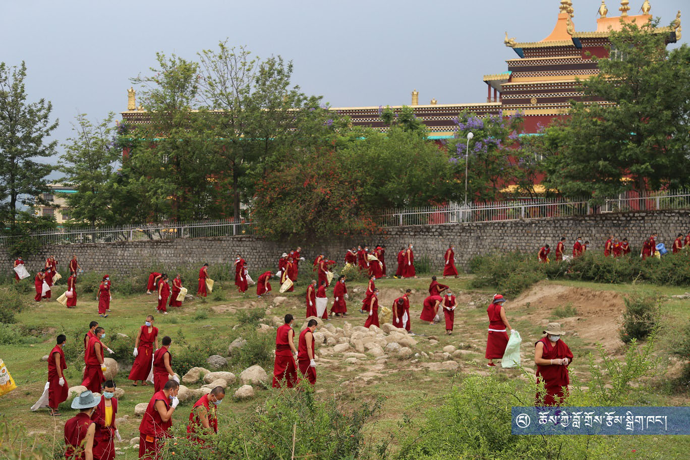
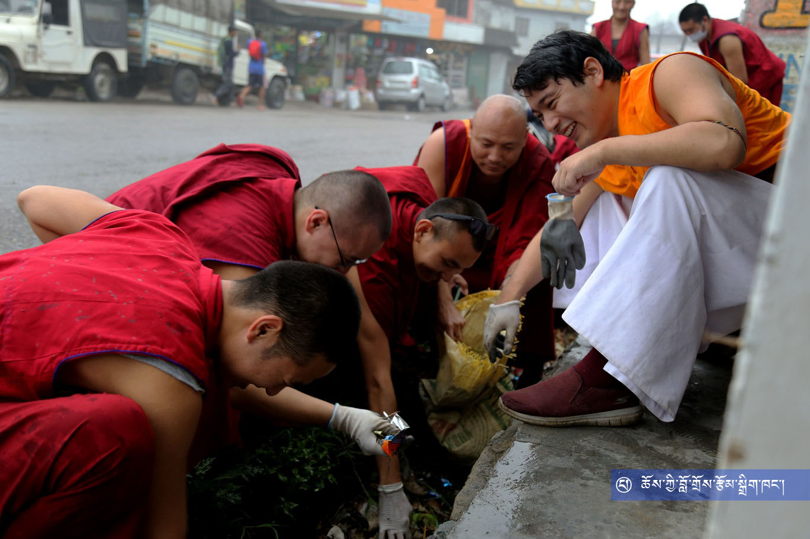
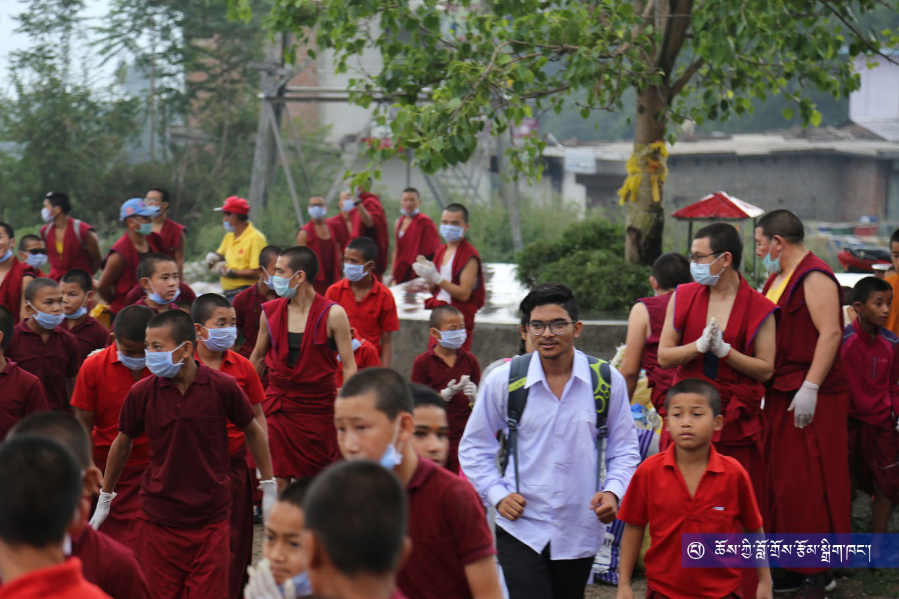
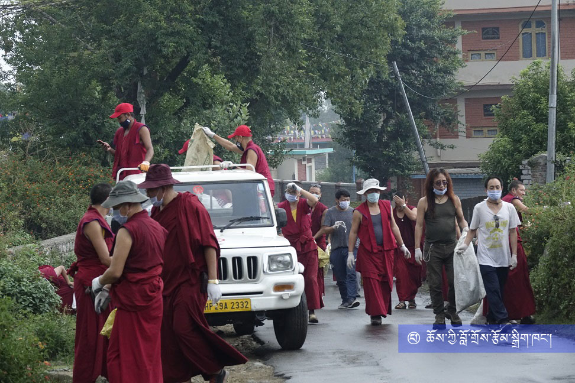
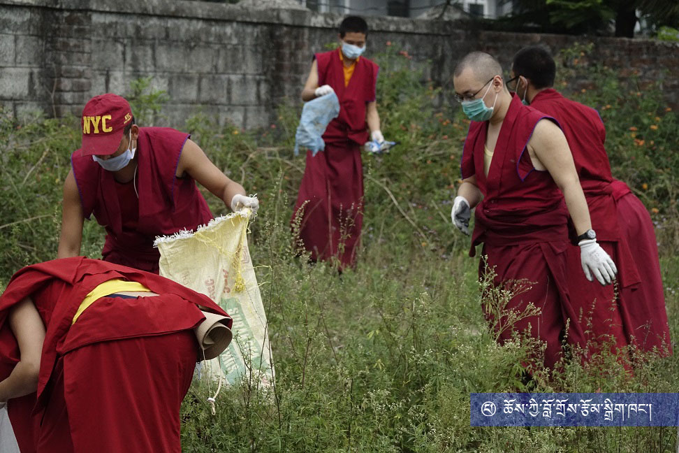
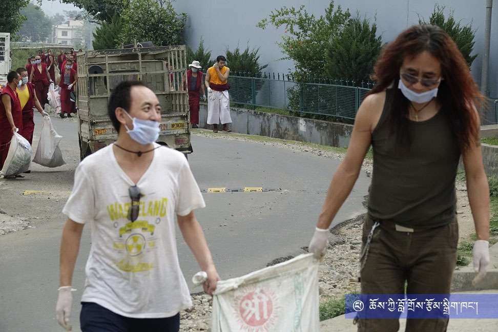
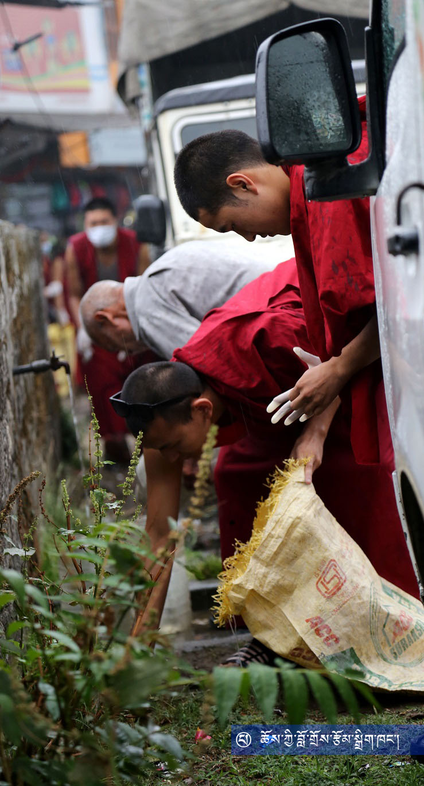
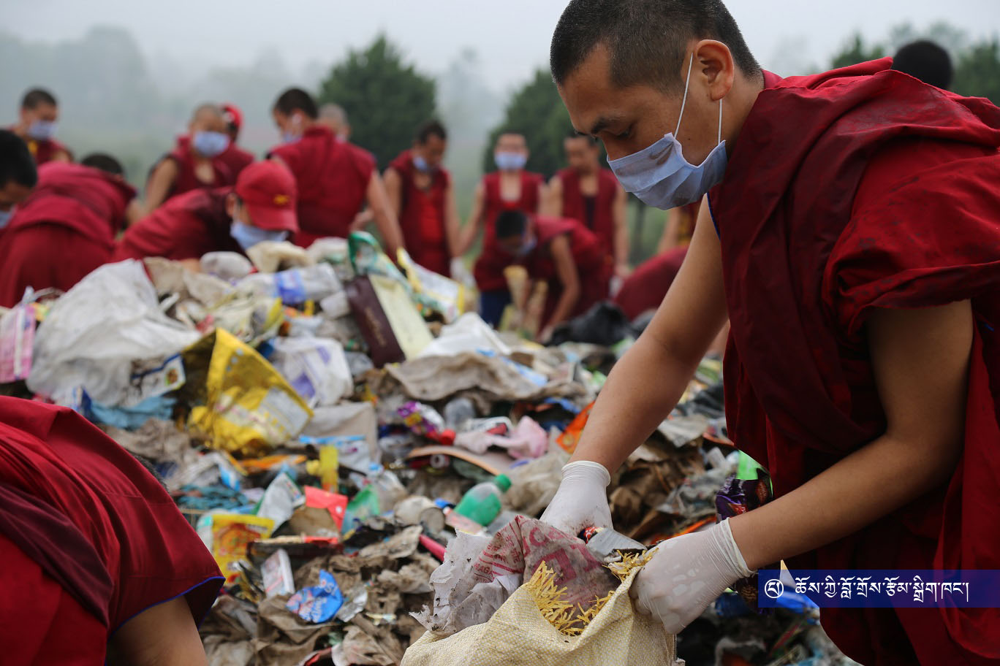

དེ་རིང་སྟེ་སྤྱི་ལོ་ ༢༠༡༨ ཟླ་བ་ ༠༦ ཚེས་ ༠༥ འཛམ་གླིང་ཁོར་ཡུག་ཉིན་མོར། འཕགས་ཡུལ་རྫོང་སར་བཤད་གྲྭ་ཆོས་ཀྱི་བློ་གྲོས་ཀྱིས་ “ཁོར་ཡུག་གཙང་མ་བཟོ། ཧི་མ་ཅལ་གཙང་མ་བཟོ།” ཞེས་པའི་འབོད་ཚིག་གི་འོག་ཏུ་བཤད་གྲྭ་ཆགས་ཡུལ་ས་གནས་ཅཱོན་ཏ་རའི་ཁོར་ཡུག་ཡོངས་ལ་གཙང་བཟོའི་ལས་འགུལ་སྤེལ་ཏེ་འཛམ་གླིང་ཁོར་ཡུག་ཉིན་མོ་སྲུང་བརྩི་ཞུས་ཡོད་པ་རེད།

བཤད་གྲྭའི་སྒོ་ཆེན་འགྲམ་དུ་འདུ་འཛོམས།

ཞོགས་པའི་ཆུ་ཚོད་བདུན་དང་ཕྱེད་ཐོག་༸སྐྱབས་རྗེ་གདུང་སྲས་ཨ་བི་ཀྲྀ་ཏ་བཛྲ་རིན་པོ་ཆེ་མཆོག་དང། ༸སྐྱབས་རྗེ་གདུང་སྲས་ཨ་བྷཱ་ཡ་རིན་པོ་ཆེ་མཆོག བཤད་གྲྭའི་ལས་ཐོག་མཁན་རིན་པོ་ཆེ་བསམ་འགྲུབ་མཆོག་གིས་དབུས་པའི་བཤད་གྲྭའི་མཁན་པོ་དགེ་རྒན་སློབ་གཉེར་བ་ཡོངས་རྫོགས་དང། རྫོང་སར་བཤད་གྲྭའི་སློབ་གྲྭ་ཀནིཥྐའི་དགེ་སློབ་ཚང་མ། དེ་བཞིན་རྫོང་སར་བཤད་གྲྭའི་མཐོ་རིམ་རིག་གནས་འཛིན་གྲྭའི་དགེ་སློབ་ཡོངས་རྫོགས་བཅས་མཉམ་ཞུགས་ཀྱིས་བཤད་གྲྭའི་སྒོ་ཆེན་ནས་འགོ་བཙུགས་ཏེ། ཅཱོན་ཏ་ར་སྡེ་དགེ་བོད་མིའི་གཞིས་ཆགས་དང་ནང་ཆེན་གཞིས་ཆགས་ཀྱི་གཡས་གཡོན་ཉེ་འཁོར་ཐམས་ཅད་དང། ཅཱོན་ཏ་ར་བོད་ཁྱིམ་སློབ་གྲྭའི་གཡས་གཡོན། ས་གནས་ཀྱི་དབྱར་དུས་ཁྲོམ་ར་འཚུགས་ས། ཅཱོན་ཏ་ར་རྒྱ་གར་ཡུལ་མིའི་ཁྲོམ་གཞུང་གཡས་གཡོན་བཅས་ནས་གད་སྙིགས་བསྒྲུགས་ཏེ་ཁོར་ཡུག་གཙང་བཟོ་བྱས།

དེ་རིང་གི་ཁོར་ཡུག་གཙང་བཟོའི་ལས་ཀར་ས་གནས་ཅཱོན་ཏ་རའི་གྲོང་སྡེའི་དཔོན་པོ་པིའར་ཅན་དྷི་ཀཱོ་ལི་(Piarchand Kohli)གཙོས་པའི་ས་གནས་ཡུལ་མི་ཁག་ཅིག་དང། ས་གནས་བོད་མིའི་གཞིས་ཆགས་ཀྱི་གཞིས་མི་ཁག་ཅིག་ཀྱང་མཉམ་ཞུགས་བྱས་འདུག

འཕགས་ཡུལ་རྫོང་སར་བཤད་གྲྭ་ནས་འཛམ་གླིང་ཁོར་ཡུག་ཉིན་མོར་ཆོས་མཚམས་བཞག་སྟེ་ཁོར་ཡུག་གཙང་བཟོའི་ལས་འགུལ་འདི་སྤྱི་ལོ་ ༢༠༡༦ ལོར་འགོ་བཙུགས་ཏེ་ད་བར་ལོ་ལྟར་སྲུང་བརྩི་བྱེད་བཞིན་པ་དང། འཁོར་ཡུག་གཙང་བཟོའི་ལས་འགུལ་འདི་བཞིན་༸སྐྱབས་རྗེ་མཁྱེན་བརྩེ་རིན་པོ་ཆེས་ཁོར་ཡུག་ལ་སྲུང་སྐྱོབ་དང་གཅེས་སྤྲད། རང་བྱུང་ཐོན་ཁུངས་ལ་བག་མེད་ལོངས་སྤྱོད་བྱ་མི་རུང་བའི་བཀའ་སློབ་སྔ་ཕྱི་དང། ཁྱད་པར་ “ཆུད་ཟོས་ཀླད་ཀོར་དང། བསྐྱར་གསུམ་ལས་འགུལ་(Zero Waste and 3R Project)” གྱི་ཆ་ཤས་སུ་རྒྱུན་དུ་བཤད་གྲྭའི་ཁོར་ཡུག་ཚོགས་ཆུང་གི་སྣེ་ཁྲིད་དེ་བཤད་གྲྭའི་ཕྱི་ནང་ཁོར་ཡུག་ལ་གཙང་སྦྲ་དང། མི་རེ་ངོ་རེ་ནས་ཁོར་ཡུག་ལ་གནོད་པའི་ཅ་དངོས་བེད་སྤྱོད་གང་ཉུང་བྱེད་པ་སོགས་ཀྱི་ལས་འགུལ་སྤེལ་དང་སྤེལ་མུས་དང། ལོ་རེ་བཞིན་འཛམ་གླིང་ཁོར་ཡུག་ཉིན་མོར་བཤད་གྲྭའི་འདུས་མང་ཡོངས་རྫོགས་གིས་ཁོར་ཡུག་གཙང་མ་བཟོས་ཏེ་ཁོར་ཡུག་ལ་གཅེས་པའི་སེམས་པ་མཚོན་པ་དང། ས་གནས་ཡུལ་མི་དང་བོད་པ་རྣམས་ལ་ཡང་ཁོར་ཡུག་ལ་གཅེས་སྤྲད་དང་བག་གཙོག་མི་བཟོ་བའི་གོ་རྟོགས་འཕེལ་ཐབས་བྱེད་བཞིན་ཡོད་པ་རེད།

འཛམ་གླིང་ཁོར་ཡུག་ཉིན་མོ་སྲུང་བརྩི་ཞུས་པ་འདིའི་སྐོར་ས་གནས་མངའ་སྡེའི་གསར་ཁང་ནས་ཐོན་པ།

**འཛམ་གླིང་ཁོར་ཡུག་ཉིན་མོ་སྲུང་བརྩི་ཞུས་པའི་པར་རིས་ཁག་ཅིག**

ལས་ཐོག་མཁན་པོ། གདུང་སྲས་རིན་པོ་ཆེ། ས་གནས་གྲོང་དཔོན།

བཤད་གྲྭའི་མདུན་ཐང་དུ།

བོད་པའི་གཞིས་ཆགས་འགྲམ་དུ།

བཤད་གྲྭའི་མདུན་ཐང་དུ།

ས་གནས་ཡུལ་མིའི་ཁྲོམ་གཞུང་དུ།

ས་གནས་ཡུལ་མིའི་ཁྲོམ་གཞུང་དུ།

བོད་པའི་གཞིས་ཆགས་སུ།

བོད་པའི་གཞིས་ཆགས་འགྲམ་དུ།

བོད་པའི་གཞིས་ཆགས་སུ།

ས་གནས་ཡུལ་མིའི་ཁྲོམ་གཞུང་དུ།

ས་གནས་ཡུལ་མིའི་གྲོང་དུ།

བསྒྲུགས་པའི་གད་སྙིགས།
