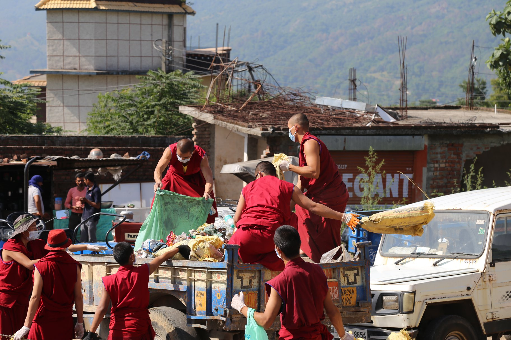
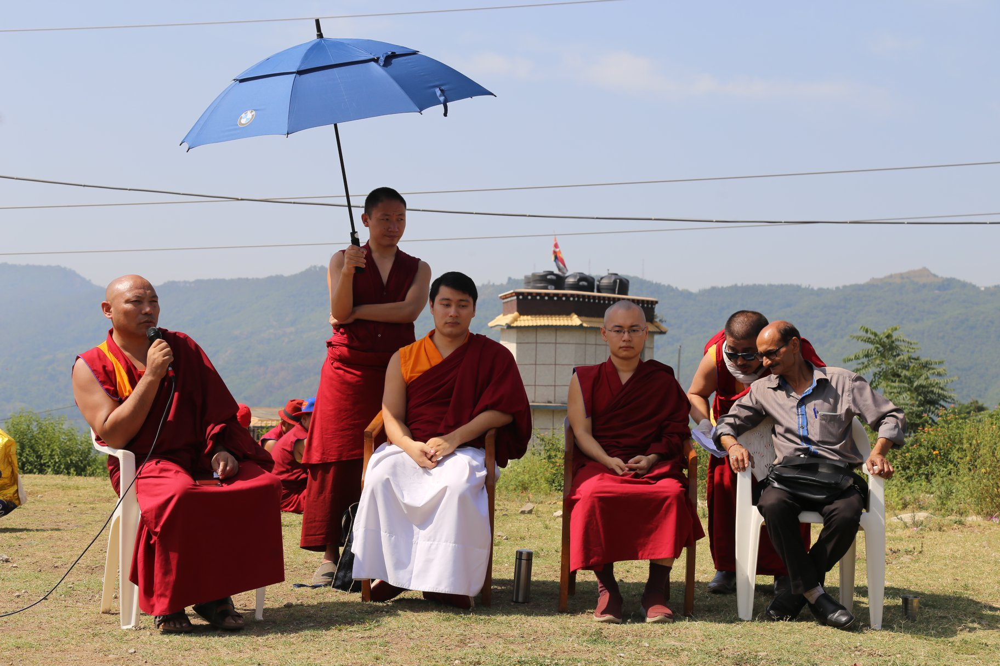
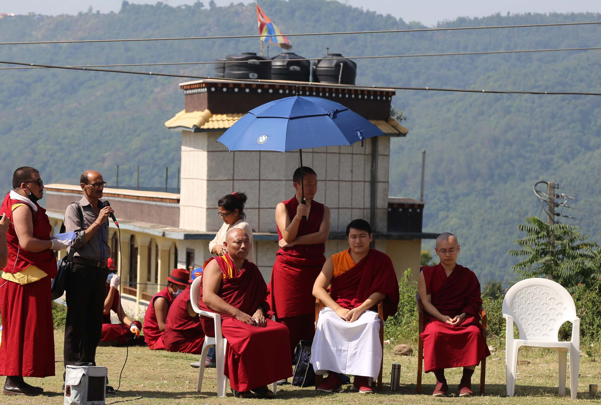
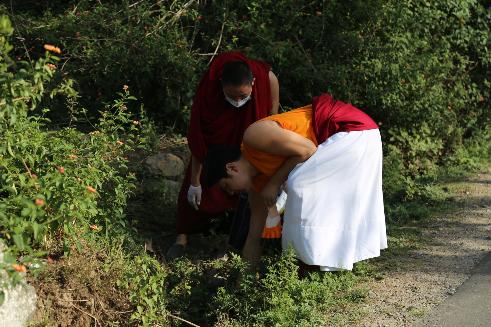
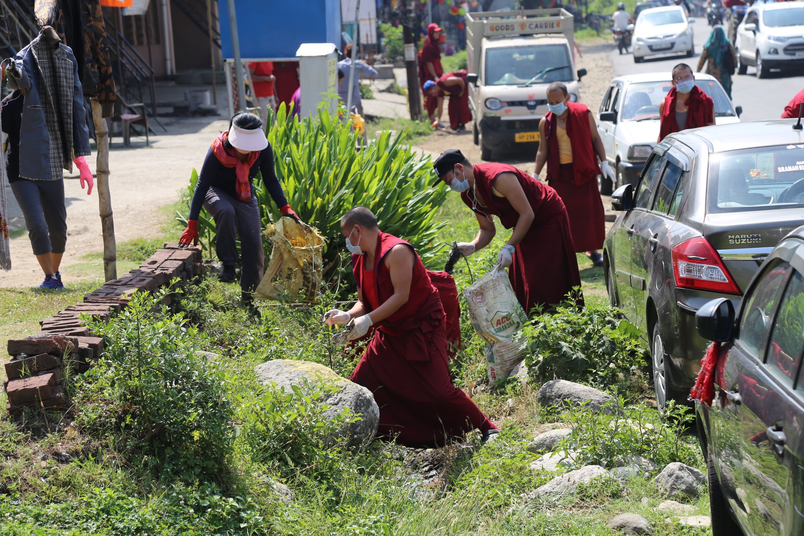
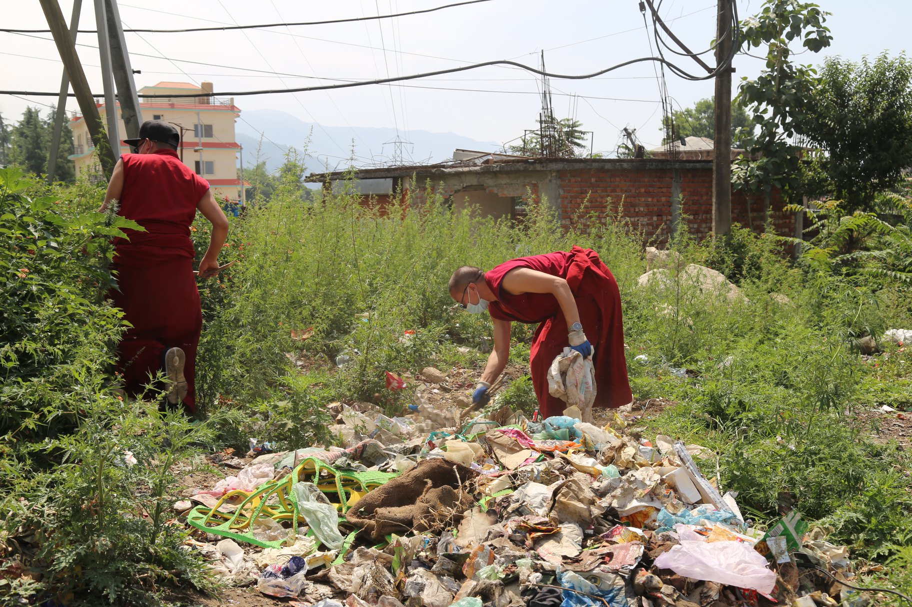

རྒྱལ་སྒོར་འདུ་འཛོམས་གནང་སྟེ་ལས་འགུལ་ལ་ཞུགས་འགོ་བརྩམས།

སྤྱི་ལོ་ ༢༠༡༩ ཟླ་བ་ ༠༦ ཚེས་ ༠༥ འཛམ་གླིང་ཁོར་ཡུག་ཉིན་མོར། འཕགས་ཡུལ་རྫོང་སར་བཤད་གྲྭ་ཆོས་ཀྱི་བློ་གྲོས་ཀྱིས་ “དྭངས་གཙང་གི་ཁོར་ཡུག དྭངས་གཙང་གི་ཧི་མ་ཅལ” ཞེས་པའི་འབོད་ཚིག་གི་འོག་ཏུ་བཤད་གྲྭ་ཆགས་ཡུལ་ས་གནས་ཅཱོན་ཏ་རའི་ཁོར་ཡུག་ཡོངས་ལ་གཙང་བཟོའི་ལས་འགུལ་སྤེལ་ཏེ་འཛམ་གླིང་ཁོར་ཡུག་ཉིན་མོ་སྲུང་བརྩི་ཞུས་ཡོད།

ཞོགས་པའི་ཆུ་ཚོད་བདུན་པའི་ཐོག་༸སྐྱབས་རྗེ་གདུང་སྲས་ཨ་བི་ཀྲྀ་ཏ་བཛྲ་རིན་པོ་ཆེ་མཆོག་དང། ༸སྐྱབས་རྗེ་གདུང་སྲས་ཨ་བྷཱ་ཡ་རིན་པོ་ཆེ་མཆོག བཤད་གྲྭའི་ལས་ཐོག་མཁན་རིན་པོ་ཆེ་བསམ་འགྲུབ་མཆོག་གིས་དབུས་པའི་བཤད་གྲྭའི་མཁན་པོ་དགེ་རྒན་སློབ་གཉེར་བ་ཡོངས་རྫོགས་དང། རྫོང་སར་བཤད་གྲྭའི་སློབ་གྲྭ་ཀནིཥྐའི་དགེ་སློབ་ཚང་མ། དེ་བཞིན་རྫོང་སར་བཤད་གྲྭའི་མཐོ་རིམ་རིག་གནས་འཛིན་གྲྭའི་དགེ་སློབ་ཡོངས་རྫོགས་བཅས་མཉམ་ཞུགས་ཀྱིས་བཤད་གྲྭའི་སྒོ་ཆེན་ནས་འགོ་བཙུགས་ཏེ། ཅཱོན་ཏ་ར་སྡེ་དགེ་བོད་མིའི་གཞིས་ཆགས་དང་ནང་ཆེན་གཞིས་ཆགས་ཀྱི་གཡས་གཡོན་ཉེ་འཁོར་ཐམས་ཅད་དང། ཅཱོན་ཏ་ར་བོད་ཁྱིམ་སློབ་གྲྭའི་གཡས་གཡོན། ཅཱོན་ཏ་ར་རྒྱ་གར་ཡུལ་མིའི་ཁྲོམ་གཞུང་གཡས་གཡོན་བཅས་ནས་གད་སྙིགས་བསྒྲུགས་ཏེ་ཁོར་ཡུག་གཙང་བཟོ་བྱས།

བཤད་གྲྭའི་ལས་ཐོག་མཁན་པོ་བསམ་གྲུབ་མཆོག་གིས་གསུང་བཤད་གནང་བཞིན་པ།

དེ་རིང་གི་ཁོར་ཡུག་གཙང་བཟོའི་ལས་འགུལ་གྱི་མཇུག་མཐར་ས་གནས་ཅཱོན་ཏ་རའི་གྲོང་སྡེའི་དཔོན་པོ་པིའར་ཅན་དྷི་ཀཱོ་ལི་(Piarchand Kohli) མཆོག་ཕེབས་ཏེ་ཁོང་གིས་ཁོར་ཡུག་གཙང་བཟོའི་དགོས་གལ་དང་དེ་བཞིན་རྫོང་སར་བཤད་གྲྭས་ལོ་ལྟར་ཁོར་ཡུག་གཙང་བཟོ་བྱེད་བཞིན་པ་ལ་ཡིད་རང་། གད་སྙིགས་ཀྱི་རིགས་ལ་སྲིད་གཞུང་གི་ངོས་ནས་གཏང་འཛིན་ཡག་པོ་མ་ཐུབ་པ་དང་ཁོར་ཡུག་སྲུང་སྐྱོབ་ལ་གྲུབ་འབྲས་དམིགས་བསལ་ད་དུང་ཡང་ཐོན་མེད་པ་ལ་བློ་ཕམ་ཡོད་ཚུལ་སོགས་ཀྱིས་བཀའ་སློབ་སྙིང་བསྡུས་ཤིག་གསུང་སོང་། བཤད་གྲྭའི་སློབ་སྤྱི་མཁན་ཆེན་བསམ་གྲུབ་མཆོག་ནས་ཀྱང་ལས་འགུལ་འདི་ལྟ་བུ་ནི་ཆབ་སྲིད་ལྟ་བུར་བསམ་མི་རུང་བར་དངོས་ཡོད་ཀྱི་དགོས་མཁོ་ཅན་ཞིག་དང་། སྐྱབས་རྗེ་གདུང་སྲས་ཨ་བྷཱ་ཡ་རིན་པོ་ཆེ་དགོངས་འཆར་བཞིན་བསྔོ་བ་དགོས་ཀྱང་དགོས་ལ་རུང་ཡང་རུང་བ་ཡིན་པའི་བྱ་བ་རླབས་ཆེན་ཞིག་ཡིན་ཚུལ་གསུངས་ཏེ་མཇུག་བསྡུས་ཡོད།

ས་གནས་ཅཱོན་ཏ་རའི་གྲོང་སྡེའི་དཔོན་པོ་པིའར་ཅན་དྷི་ཀཱོ་ལི་(Piarchand Kohli) མཆོག་གིས་གསུང་བཤད་གནང་བ།

འཕགས་ཡུལ་རྫོང་སར་བཤད་གྲྭ་ནས་འཛམ་གླིང་ཁོར་ཡུག་ཉིན་མོར་ཆོས་མཚམས་བཞག་སྟེ་ཁོར་ཡུག་གཙང་བཟོའི་ལས་འགུལ་འདི་སྤྱི་ལོ་ ༢༠༡༦ ལོར་འགོ་བཙུགས་ཏེ་ད་བར་ལོ་ལྟར་སྲུང་བརྩི་བྱེད་བཞིན་པ་དང། ཁོར་ཡུག་གཙང་བཟོའི་ལས་འགུལ་འདི་བཞིན་༸སྐྱབས་རྗེ་མཁྱེན་བརྩེ་རིན་པོ་ཆེས་ཁོར་ཡུག་ལ་སྲུང་སྐྱོབ་དང་གཅེས་སྤྲད། རང་བྱུང་ཐོན་ཁུངས་ལ་བག་མེད་ལོངས་སྤྱོད་བྱ་མི་རུང་བའི་བཀའ་སློབ་སྔ་ཕྱི་དང། ཁྱད་པར་ “ཆུད་ཟོས་ཀླད་ཀོར་དང། R3གྱི་ལས་འགུལ (Zero Waste and 3R Project)” གྱི་ཆ་ཤས་སུ་རྒྱུན་དུ་བཤད་གྲྭའི་ཁོར་ཡུག་ཚོགས་ཆུང་གི་སྣེ་ཁྲིད་དེ་བཤད་གྲྭའི་ཕྱི་ནང་ཁོར་ཡུག་ལ་གཙང་སྦྲ་དང། མི་རེ་ངོ་རེ་ནས་ཁོར་ཡུག་ལ་གནོད་པའི་ཅ་དངོས་བེད་སྤྱོད་གང་ཉུང་བྱེད་པ་སོགས་ཀྱི་ལས་འགུལ་སྤེལ་དང་སྤེལ་མུས་དང། ལོ་རེ་བཞིན་འཛམ་གླིང་ཁོར་ཡུག་ཉིན་མོར་བཤད་གྲྭའི་འདུས་མང་ཡོངས་རྫོགས་གིས་ཁོར་ཡུག་གཙང་མ་བཟོས་ཏེ་ཁོར་ཡུག་ལ་གཅེས་པའི་སེམས་པ་མཚོན་པ་དང། ས་གནས་ཡུལ་མི་དང་བོད་པ་རྣམས་ལ་ཡང་ཁོར་ཡུག་ལ་གཅེས་སྤྲད་དང་བག་གཙོག་མི་བཟོ་བའི་གོ་རྟོགས་འཕེལ་ཐབས་བྱེད་བཞིན་ཡོད་པ་རེད།

༈ རྫོང་སར་བཤད་གྲྭས་འཛམ་གླིང་ཁོར་ཡུག་ཉིན་མོ་སྲུང་བརྩི་ཞུས་པའི་སྐོར་ས་གནས་ཀྱི་གསར་ཁང་ཁག་ནས་ཐོན་པའི་གནས་ཚུལ།

ཧི་མ་ཅལ་མངའ་སྡེའི་གསར་ཁང་ནས་སྤེལ་བའི་གནས་ཚུལ།

[ETV BHARAT ཀྱིས་སྤེལ་བའི་གསར་འགྱུར་འདི་ནས་གཟིགས།](https://www.etvbharat.com/hindi/himachal-pradesh/state/mandi/buddhist-monk-celebrated-environment-day-in-mandi/hp20190605161256050)

[PUNJAB KESARI ཡིས་སྤེལ་བའི་གནས་ཚུལ་འདི་ནས་གཟིགས།](https://himachal.punjabkesari.in/himachal-pradesh/news/cleanliness-campaign-1005981?fbclid=IwAR1Hn96G-NG2Rhgbx7KteTL0TADVoskRNnN-iuR4xrGBTosaSAr6FVICw_Y)

ཁོར་ཡུག་གཙང་བཟོ་དང་འབྲེལ་བའི་པར་རིས་ཁག

༸སྐྱབས་རྗེ་གདུང་སྲས་ཨ་བི་ཀྲྀ་ཏ་བཛྲ་རིན་པོ་ཆེ་མཆོག་ནས་ཁྲོམ་གཞུང་དུ་གཙང་མ་གནང་བཞིན་པ།

༸སྐྱབས་རྗེ་གདུང་སྲས་ཨ་བྷཱ་ཡ་རིན་པོ་ཆེ་མཆོག་ནས་ཁྲོམ་གཞུང་དུ་གད་སྙིགས་གཙང་སེལ་གནང་བཞིན་པ།

རྒྱ་གར་ས་གནས་ཀྱི་ཁྲོམ་གཞུང་དུ།

གད་སྙིགས་ཐོ་ལའི་ནང་དབོར་འདྲེན་བྱེད་བཞིན་པ།

ལམ་ཟུར་གྱི་གད་སྙིགས་སྒྲུག་བཞིན་པ།

ཁྲོམ་ཟུར་གྱི་སྙིགས་རོ་རྣམས་གཙང་སེལ་བྱེད་བཞིན་པ།

ཡུར་བའི་གད་སྙིགས་སྒྲུག་བཞིན་པ།
