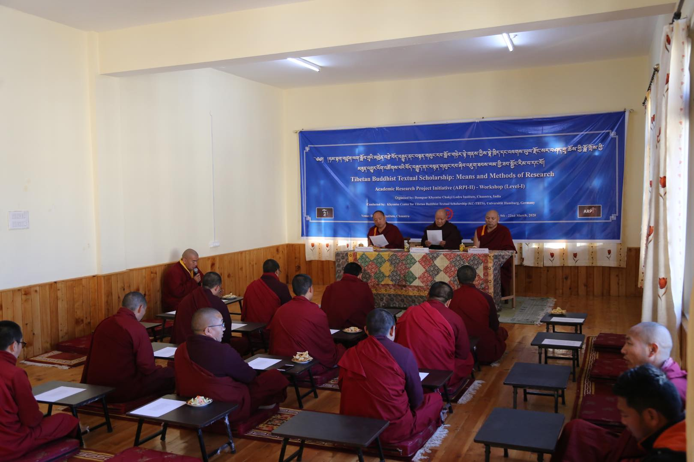
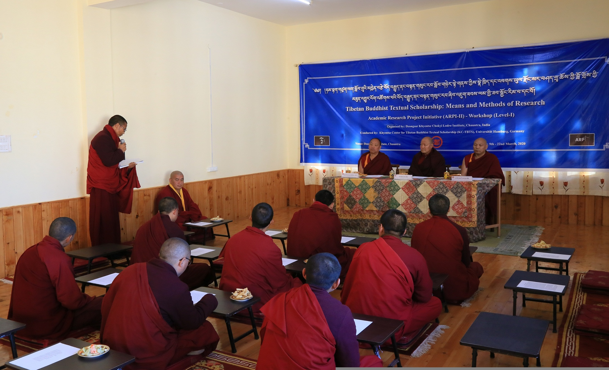
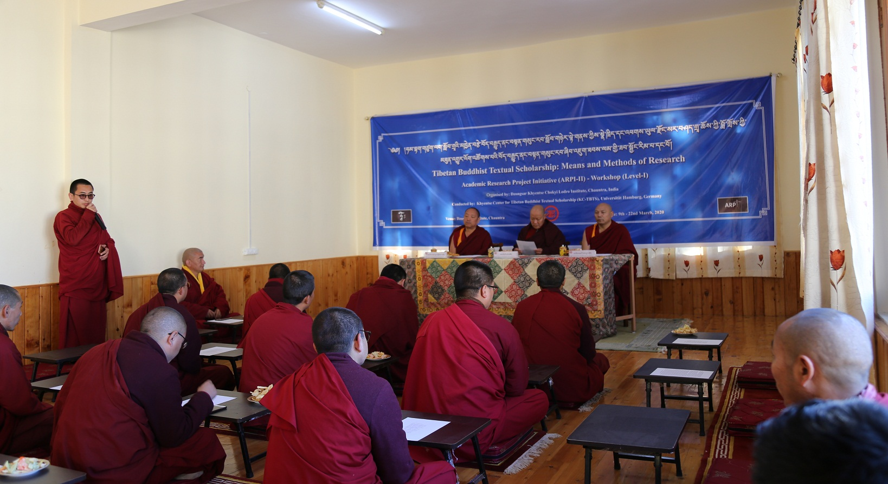
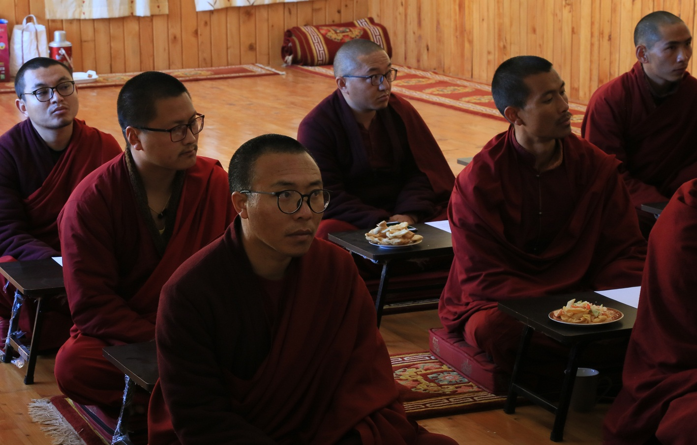

མཁན་ཆེན་རྣམ་པ་གསུམ་དང་ཞིབ་འཇུག་སློབ་མ་རྣམས་ཀྱི་མཉམ་སྒྲོན་འདྲ་པར།

དེ་རིང་སྟེ་སྤྱི་ལོ་ ༢༠༢༠ ཟླ་བ་ ༣ ཚེས་ ༩ བོད་ཟླ་དང་པོའི་ཚེས་བཅོ་ལྔ་ཆོ་འཕྲུལ་དུས་ཆེན་ཉིན་འཕགས་ཡུལ་རྫོང་སར་བཤད་གྲྭ་ཆོས་ཀྱི་བློ་གྲོས་ཀྱི་རྫོང་སར་ནང་བསྟན་ཞིབ་འཇུག་ལྟེ་གནས་ཁང་གི་སྐབས་གཉིས་པའི་ཞིབ་འཇུག་སློབ་མའི་སློབ་དུས་དབུ་འཛུགས་དང་ཟབ་སྦྱོང་རིམ་པ་དང་པོ་དབུ་འཛུགས་ཀྱི་མཛད་སྒོ་བཤད་གྲྭའི་དཔེ་མཛོད་བཀྲ་ཤིས་སྒོ་མང་གི་ནང་དུ་འཚོགས་ཡོད་པ་རེད།

དེ་ཡང་མཛད་སྒོའི་ཐོག་ཏུ་བཤད་གྲྭའི་མཁན་ཆེན་རིན་ཆེན་མཆོག་དང། མཁན་ཆེན་འཇམ་དབྱངས་བློ་གསལ་མཆོག བཤད་གྲྭའི་ལས་ཐོག་མཁན་ཆེན་བསམ་གྲུབ་མཆོག་བཅས་མཛད་སྒོའི་དབུ་བཞུགས་སུ་ཕེབས་པ་དང། རྫོང་སར་ནང་བསྟན་ཞིབ་འཇུག་ལྟེ་གནས་ཁང་གི་ཞིབ་འཇུག་སློབ་མ་གསར་རྙིང་རྣམས་པ་བཅས་ཚང་འཛོམས་ཀྱིས་ཐོག་མར་དཀོན་མཆོག་རྗེས་དང་བཀྲ་ཤིས་པའི་ཚིགས་སུ་བཅད་པ་གསུང་གྲུབ་མཚམས། རྫོང་སར་ནང་བསྟན་ཞིབ་འཇུག་ལྟེ་གནས་ཁང་གི་འགན་འཛིན་ཚེ་རིང་བསམ་འགྲུབ་ནས། ཧམ་བྷག་གཙུག་ལག་སློབ་གྲྭའི་མཁྱེན་བརྩེ་བོད་བརྒྱུད་ནང་བསྟན་གསུང་རབ་ཞིབ་འཇུག་ལྟེ་གནས་ཀྱི་ངེས་སྟོན་པ། གཙུག་ལག་སློབ་དཔོན་ཆེན་མོ་མཁས་དབང་རྡོ་རྗེ་དབང་ཕྱུག་ལགས་དང། མཁས་དབང་ལྕམ་སྐུ་ཨོར་ན་ལགས་རྣམ་གཉིས་ཀྱིས་སྣེ་ཁྲིད་གནང་བའི་ཞིབ་འཇུག་སློབ་མའི་ལས་གཞི་(ARPI)དང་འབྲེལ། རྫོང་སར་ནང་བསྟན་ཞིབ་འཇུག་ལྟེ་གནས་ཁང་གི་འགྲོ་བཞིན་པའི་ལས་རིམ་བཅས་ཀྱི་སྐོར་ནས་ངོ་སྤྲོད་གནང་བ་ལས་ཐོག་མར་ལས་རིམ་འདིའི་བྱུང་རིམ་ཀྱི་སྐོར་ནས་ངོ་སྤྲོད་གནང་གསལ།

ལས་ཐོག་མཁན་ཆེན་བསམ་གྲུབ་མཆོག་གིས་བཀའ་སློབ་གནང་བཞིན་པ།

“དང་པོ། ང་ཚོའི་ལས་གཞི་འདིའམ་ཞིབ་འཇུག་གི་སློབ་སྦྱོང་གནང་སའི་ས་མིག་འདི། འཇར་མན་ནང་གི་ཧམ་བྷག་གཙུག་ལག་སློབ་ཆེན་དུ་༸སྐྱབས་རྗེ་མཁྱེན་བརྩེ་རིན་པོ་ཆེས་འགྲོ་གྲོན་བསྩལ་ཏེ། བཙུགས་གནང་བའི་མཁྱེན་བརྩེ་ལྟེ་བའམ། དབྱིན་སྐད་དུ། Khyentse Center ཞུ་བ་འདི་དང་འབྲེལ་ཏེ། ལས་གཞི་འདིའི་ངོ་སྤྲོད་ཅུང་ཟད་ཞུས་ན། མཁྱེན་བརྩེ་ལྟེ་བ་ཞུ་བ་འདི། དམིགས་ཡུལ་གཙོ་བོ་ནང་པའི་གསུང་རབ་ལ་སློབ་གཉེར་དང་ཞིབ་འཇུག་གནང་སའི་ས་མིག་བཙུགས་གནང་བ་ཞིག་རེད། སྡེ་ཚན་འདིའི་གསར་དུ་འཛུགས་མཁན་དང་དབུ་ཁྲིད་དེ། ཧམ་བྷག་གཙུག་ལག་སློབ་ཆེན་གྱི་གཙུག་ལག་སློབ་དཔོན། ད་ལྟ་ང་ཚོ་ཞིབ་འཇུག་སློབ་མ་གསར་རྙིང་ཚང་མའི་ཞིབ་འཇུག་སློབ་སྟོན་པ་མཁས་དབང་རྡོ་རྗེ་དབང་ཕྱུག་ལགས་ཁོང་རེད། ཁོང་དང་ཁོང་གི་ཕྱག་རོགས་མཁས་དབང་ཨོར་ན་ (Dr. Orna Almogi) ལགས་རྣམ་གཉིས་ཀྱིས། ལོ་མང་པོ་ཞིག་ལ་བོད་བརྒྱུད་ནང་བསྟན་ལ་སོ་སོས་ཞིབ་འཇུག་གནང་བ་དང་། གཞན་ལ་ཞིབ་འཇུག་སློབ་སྟོན་གནང་བ། དེ་ག་ནང་བཞིན་རྒྱལ་ཁབ་འདྲ་མིན་མང་པོའི་ཞིབ་འཇུག་ཆེད་མཁས་པ་དང་མཉམ་དུ་ཐུག་འཕྲད་གནང་ཡ་དང་། བགྲོ་གླེང་ཚོགས་འདུ་ཚོགས་པའི་ཉམས་མྱོང་མང་པོ་ཞིག་ལ་བརྟེན་ནས། ཁོང་གཉིས་ཀྱི་དགོངས་ཚུལ་ལ། སྤྱིར་བཏང་དེང་སང་འཛམ་གླིང་ཡུལ་གྲུ་གང་ས་ལ་ནང་བསྟན་ལ་ཞིབ་འཇུག་དང་སློབ་གཉེར་གནང་མཁན་མང་པོ་ཞིག་ཡོད་ན་ཡང་། དམིགས་བསལ་བོད་བརྒྱུད་ནང་བསྟན་གྱི་ཆོས་གྲྭ་ཁག་ཏུ་ནང་ཆོས་ལ་སློབ་གཉེར་ཚད་ལྡན་གནང་མཁན་མང་པོ་ཞིག་ཡོད་ཙང་། བོད་བརྒྱུད་ནང་བསྟན་གྱི་ཞིབ་འཇུག་ལས་གཞི་འདི་ཚགས་ཚུད་པོ་ཞིག་ཡོང་བ་ལ། སོ་སོའི་ཆོས་གྲྭ་ཁག་གི་སྲོལ་རྒྱུན་གྱི་སློབ་གཉེར་རིམ་པ་གྲུབ་པའི་སྟེང་དུ་ཞིབ་འཇུག་གི་ཐབས་ལམ་ཚད་ལྡན་ཤེས་པ་མང་པོ་ཞིག་ང་ཚོས་ཆོས་གྲྭ་སོ་སོར་གསོ་སྐྱོང་དང་ཉར་ཚགས་ཐུབ་པ་ཡིན་ན། གཅིག་ནས་འཛམ་གླིང་གང་ས་ནས་བོད་བརྒྱུད་ནང་བསྟན་གྱི་གསུང་རབ་ལ་མ་རྟོགས་ལོག་རྟོགས་དང་སྒྲོ་འདོགས་སྐུ་འདེབས་ཉུང་དུ་འགྲོ་བ་དང་། ལྷག་པར་དུ་བོད་བརྒྱུད་ནང་བསྟན་གྱི་གསུང་རབ་ལ་རྒྱལ་སྤྱིའི་འགྲོས་དང་མཐུན་པའི་སྒོ་ནས་ཞིབ་འཇུག་ཚད་ལྡན་ཞིག་ཡོང་བ་ལ་དམིགས་བསལ་ཕན་ནུས་ཆེན་པོ་ཞིག་ཡོང་ས་རེད་དགོངས་ནས། སྤྱི་ལོ་ ༢༠༡༤ ཟླ་ ༣ པའི་ནང་ལ་རྒྱ་གར་ལྷོ་ཕྱོགས་རྣམ་གྲོལ་གླིང་དུ་ཞིབ་འཇུག་ལས་གཞི་འདི་ཐོག་མར་བཙུགས་ནས། རྗེས་སུ་ལས་གཞི་འདིའི་སྐོར་ལ་མཁྱེན་བརྩེ་རིན་པོ་ཆེར་སྙན་སེང་རིམ་པ་ཕུལ་ཏེ། དེ་རེས་ཀྱི་ཞིབ་འཇུག་སློབ་མ་བསྡུ་ཐེངས་འདི་བརྩིས་པ་ཡིན་ན། ཁྱོན་བསྡོམས་ཞིབ་འཇུག་སློབ་མ་བསྡུ་ཐེངས་གསུམ་ཆགས་ཀྱི་ཡོད་རེད།” ཅེས་དང།

མཛད་སྒོའི་ཡུལ་དངོས།

ཞིབ་འཇུག་ལས་རིམ་སྒྲུབ་སྟངས་དང་ཞིབ་འཇུག་སློབ་ཡུན། དེ་བཞིན་བསླབ་གནས་འདོགས་སྟངས་བཅས་ཀྱི་སྐོར་ནས་ངོ་སྤྲོད་གནང་གསལ། “ཞིབ་འཇུག་ལས་གཞི་འདིའི་འགྲོ་སྟངས་དེ། བཤད་གྲྭ་སོ་སོས་ཞིབ་འཇུག་སྡེ་ཚན་རེ་བཙུགས་ཏེ། དེ་ལ་བཤད་གྲྭའི་ལས་དོན་རིགས་ཀྱི་འགན་ཁྱེར་མི་དགོས་པར་ཞིབ་འཇུག་ཁོ་ནའི་ལས་དོན་བསྒྲུབ་རྒྱུ་དང་། ཟླ་བ་དྲུག་རེའི་མཚམས་སུ་བཤད་གྲྭ་ཁག་ཏུ་རེས་མོས་ཀྱི་སྒོ་ནས་ཞིབ་འཇུག་སློབ་སྟོན་པ་རྣམ་གཉིས་དང་ཞིབ་འཇུག་སློབ་མ་རྣམས་མཉམ་དུ་འཛོམས་ཏེ་ཟབ་སྦྱོང་ཐེངས་རེ་འཚོག སློབ་མ་རྣམས་ཀྱིས་སོ་སོའི་ཟླ་དྲུག་རེའི་ཞིབ་འཇུག་གི་གྲུབ་འབྲས་རྣམས་རྒན་ལགས་གཉིས་ལ་བརྩིས་སྤྲོད་གནང་བ་དང་། རྒན་ལགས་རྣམ་གཉིས་ཀྱིས་དེ་ལ་སློབ་སྟོན་གནང་གི་ཡོད་རེད། ད་དུང་ལོ་གཉིས་རེའི་མཚམས་སུ་ཤར་ནུབ་ཀྱི་གཙུག་ལག་སློབ་ཆེན་ཁག་ནས་ཆོས་ལུགས་དང་ལོ་རྒྱུས་སྐོར་གྱི་ཞིབ་འཇུག་ཆེད་མཁས་པ་དང་གཙུག་ལག་སློབ་དཔོན་ཁག་གདན་ཞུའི་སྒོ་ནས་བགྲོ་གླེང་ཚོགས་འདུ་འཚོག་འདུ་ (Conference) ཐེངས་རེ་འཚོག་གི་ཡོད་རེད། འདི་ལ་འགྲོ་གྲོན་མང་པོ་ཞིག་འགྲོ་གི་ཡོད་ཙང་། མཁྱེན་བརྩེ་ཐེབས་རྩའི་ངོས་ནས་འགྲོ་གྲོན་གནང་བ་དང་། ཟབ་སྦྱོང་གི་གོ་སྒྲིག་དེ་རེས་མོས་ཀྱི་སྒོ་ནས་བཤད་གྲྭ་ཁག་ནས་གནང་གི་ཡོད་རེད།

ཞིབ་འཇུག་དུས་ཡུན་དེ་ལོ་བཞི་ཆགས་ཀྱི་ཡོད་རེད་ལ། ཞིབ་འཇུག་སློབ་ཐོན་གྱི་ལས་དོན་གྲུབ་རྗེས་ཧམ་བྷག་གཙུག་ལག་སློབ་ཆེན་གྱི་གཙུག་ལག་སློབ་དཔོན་མཁས་དབང་རྡོ་རྗེ་དབང་ཕྱུག་དང་ཕྱག་རོགས་མཁས་དབང་ཨོར་ན་ལགས་རྣམ་གཉིས་དང་། བཤད་གྲྭ་སོ་སོའི་དབུ་འཛིན་ཟུང་སྦྲེལ་གྱིས་བཤད་གྲྭ་སོ་སོ་ནས་ངོས་ལེན་ཚད་ལྡན་ཐོབ་པའི་སྲོལ་རྒྱུན་ལུགས་ཀྱི་ནང་བསྟན་སློབ་གཉེར་ཆ་ཚང་གྲུབ་པའི་སྟེང་དུ་ཡང་བསྐྱར་རྒྱལ་སྤྱིའི་འགྲོས་ཀྱི་ཞིབ་འཇུག་སློབ་སྦྱོང་ཚད་ལྡན་གནང་གྲུབ་པའི་དཔང་རྟགས་སུ། དེ་ལུགས་ཀྱི་འབུམ་རམས་པའམ་རིགས་གཅིག་རྐང་འཛིན་གྱི་མཚན་གནས་གནང་བའི་འཆར་གཞི་ཡོད་རེད།” ཅེས་དང།

རྫོང་སར་ནང་བསྟན་ཞིབ་འཇུག་ལྟེ་གནས་ཁང་གི་འགན་འཛིན་ཚེ་རིང་བསམ་འགྲུབ་ལགས་ཀྱིས་ཞིབ་འཇུག་ལས་རིམ་ངོ་སྤྲོད་གནང་བཞིན་པ།

ཞིབ་འཇུག་སློབ་སྦྱོང་གི་ལས་རིམ་འདིའི་ནང་གི་སྤྱི་ཡོངས་ཞིབ་འཇུག་སློབ་མའི་གྲངས་འབོར་དང་ཞིབ་འཇུག་ལས་རིམ་ཀྱི་གྲུབ་དོན་བཅས་ཀྱི་སྐོར་ནས་ངོ་སྤྲོད་གནས་གསལ། “ད་བར་ཞིབ་འཇུག་སློབ་མ་ཁྱོན་སྡོམ་པ་ཡིན་ན་ཉི་ཤུ་རྩ་བདུན་ཙམ་ཆགས་ཡོད་རེད་ལ། ཞིབ་འཇུག་སློབ་མ་རིམ་པ་དང་པོ་དེ་རྣམ་གྲོལ་གླིང་དུ་ ༢༠༡༧ ལོར་སློབ་ཐོན་གནང་ཡོད་རེད། ཁོང་ཚོའི་གྲས་སུ་ཞིབ་འཇུག་སློབ་མ་བཞི་ཡོད་རེད། ཁོང་རྣམ་པས་ཐུན་མོང་གི་བརྗོད་གཞི་རོང་ཟོམ་པས་མཛད་གནང་བའི་«སྣང་བ་ལྷ་སྒྲུབ་»ཀྱི་སྟེང་དུ་ཞིབ་འཇུག་གནང་ཡོད་རེད་ལ་དེའི་སྐོར་གྱི་ཞིབ་འཇུག་ཆེད་དེབ་ ༢༠༡༨ ནང་དུ་སྤར་སྐྲུན་གནང་ཚར་རེད། ད་ལོ་ ༢༠༢༠ ལ་ཁོང་ཚོ་སྒེར་སོ་སོའི་ཞིབ་འཇུག་ཆེད་དེབ་བཞི་བཏོན་རྒྱུའི་འཆར་གཞི་ཡོད་རེད། རིམ་པ་གཉིས་པ་དེ་ད་ལོ་ ༢༠༢༠ ཟླ་ ༨ པ་ཙམ་ལ་རྒྱུགས་སྤྲད་ཀྱི་ཡོད་རེད། རིམ་པ་གཉིས་པའི་གྲས་སུ་སློབ་མ་བརྒྱད་ཙམ་ཡོད་རེད། དེ་ལ་ཞིབ་འཇུག་ཆེད་དེབ་བཅུ་ཙམ་ཞིག་ཆགས་ཀྱི་ཡོད་རེད་ལ། དེ་ཚོ་ལོ་རྗེས་མ་ ༢༠༢༡ ལ་འདོན་རྒྱུའི་འཆར་གཞི་ཡོད་རེད། རིམ་པ་གསུམ་པ་འདི་ད་ལྟ་བཤད་གྲྭ་ཁག་སོ་སོར་ཁ་སང་དེ་རིང་འགོ་འཛུགས་བཞིན་པ་རེད། དངོས་གནས་བྱས་ན་ནམ་རྒྱུན་གྱི་ཞིབ་འཇུག་ལས་རིམ་ནང་བཞིན་ད་ལོའི་ཟླ་བ་གཉིས་པ་དང་གསུམ་པའི་བར་དུ་བལ་ཡུལ་དུ་བརྟེན་གཞི་གནང་བའི་ཞེ་ཆེན་བཤད་གྲྭར་ཚང་མ་འཛོམས་ཏེ་ཞིབ་འཇུག་གི་ཟབ་སྦྱོང་གཟའ་འཁོར་གསུམ་ཙམ་ལ་འཚོག་རྒྱུའི་འཆར་གཞི་ཡོད་རེད་དེ། ད་རེས་ཀྱི་ཟབ་སྦྱོང་འདི་འཚོག་པའི་དུས་ཚོད་དེ་དེང་སང་གི་ནད་ཡམས་འདི་ཁྱབ་པའི་ཁ་ཐུག་དང་ཁེལ་ནས། གནས་སྐབས་བཤད་གྲྭ་སོ་སོར་ཚོགས་ནས་ད་ལོའི་དབྱར་ཁར་རྒྱ་གར་ལྷོ་ཕྱོགས་སུ་དམིགས་བསལ་ཟླ་བ་གཅིག་ལྷག་ཙམ་འཚོག་རྒྱུའི་འཆར་གཞི་བཞག་དགོས་ཐུག་པ་རེད།” ཅེས་དང།

བཤད་གྲྭའི་ཞིབ་འཇུག་སྡེ་ཚན་རྫོང་སར་ནང་བསྟན་ཞིབ་འཇུག་ལྟེ་གནས་ཁང་གི་སྔ་ཕྱིའི་ལས་རིམ་ཀྱི་སྐོར་ནས་ངོ་སྤྲོད་གནང་གསལ། “གཉིས་པ། ང་ཚོ་རྫོང་སར་བཤད་གྲྭའི་ཞིབ་འཇུག་སྡེ་ཚན་རྫོང་སར་ནང་བསྟན་ཞིབ་འཇུག་ལྟེ་གནས་ཁང་གི་ལས་རིམ་ངོ་སྤྲོད་ཅུང་ཟད་ཞུས་ན། ད་ལོའི་བར་དུ་ང་ཚོ་ལ་ཞིབ་འཇུག་སློབ་མ་ཞེ་དྲག་བྱུང་ཡོད་མ་རེད། དེ་ཡིན་དུས་ལོ་རྗེས་མར་ཡང་ཀུན་མཁྱེན་ཆེན་པོའི་«ལྟ་བའི་ཤན་འབྱེད་»སྐོར་གྱི་ཞིབ་འཇུག་ཆེད་དེབ་ཅིག་དོན་རྒྱུའི་འཆར་གཞི་ཡོད་རེད། དེ་མ་གཏོགས་གནས་སྐབས་བྱུང་མ་ཐུབ་པ་རེད། ཡིན་ན་ཡང། ད་རེས་ཀྱི་ཞིབ་འཇུག་སློབ་མ་བསྡུ་ཐེངས་འདིའི་ནང་དུ་ཞིབ་འཇུག་སློབ་མ་འཛུལ་མཁན་མང་ཤོས་དེ་ང་ཚོའི་བཤད་གྲྭ་ཆགས་ཡོད་རེད་ལ། ད་ལྟ་ཁོང་རྣམ་པའི་ཞིབ་འཇུག་བརྗོད་གཞི་ཚོ་ཡང་ཧ་ལམ་གཏན་འབེབས་གནང་ཚར་ཡོད།

མཛད་སྒོའི་ཡུལ་དངོས།

ཁོང་རྣམས་ཀྱི་ཐུན་མོང་གི་བརྗོད་གཞི་ལ་ཆ་བཞག་པ་ཡིན་ན། སྤྱིར་བཏང་ནམ་རྒྱུན་སྡེ་ཚན་གཞན་དག་ལ་ཐུན་མོང་གི་བརྗོད་གཞི་རེ་རེ་ལས་ཡོད་མ་རེད་དེ། ད་རེས་ང་ཚོའི་སྡེ་ཚན་ལ་ཞིབ་འཇུག་སློབ་མ་ཏོག་ཙམ་མང་པོ་ཡོད་དུས། རྒན་ལགས་རྣམ་གཉིས་ཀྱིས་བརྗོད་གཞི་གཉིས་བདམ་རྒྱུའི་དགོངས་འཆར་གནང་ཡོད་རེད། དེ་ཡིན་དུས། ཁོང་རྣམ་པའི་ཐུན་མོང་གི་བརྗོད་གཞི་དེ་གཅིག་རྗེ་བཙུན་བསོད་ནམས་རྩེ་མོའི་«རྒྱུད་སྡེ་སྤྱི་རྣམ་»དང། གཉིས་པ་དེ་ལ་ཆོས་རྗེ་ས་པཎ་གྱི་«སྡོམ་གསུམ་རབ་དབྱེ་»དང་ཀུན་མཁྱེན་ཆེན་པོའི་«ལྟ་བ་ངན་སེལ་»གང་རུང་ཞིག་བདམ་རྒྱུའི་འཆར་གཞི་འཇོག་བཞིན་པ་ཡིན།

ཁོང་རྣམ་པའི་སྒེར་གྱི་བརྗོད་གཞི་རྦད་དེ་ཐག་ཆོད་ཚར་ཡོད་མ་རེད་དེ་འཆར་གཞིའི་ནང་། མཉམ་མེད་རེད་མདའ་བའི་«དྲིས་ལན་»དང། ཀུན་མཁྱེན་ཆེན་པོའི་«སྡོམ་གསུམ་སྤྱི་དོན་»དང་«འཁོར་འདས་རབ་གསལ་» «སྙོམས་འཇུག་རབ་གསལ་» རོང་སྟོན་ཤེས་བྱ་ཀུན་རིག་གི་«རིགས་ཚོགས་དྲུག་གི་དཀའ་གནད་» པཎ་ཆེན་ཤཱཀ་མཆོག་གི་«སྟོང་ཉིད་བདུད་བརྩིའི་ལམ་པོ་ཆེ་»ལ་སོགས་པ་བདམ་རྒྱུ་ལ་ད་ལྟའི་ཞིབ་འཇུག་སློབ་མ་རྣམས་ཀྱིས་ཞིབ་འཇུག་སློབ་སྟོན་པ་མཁས་དབང་རྡོ་རྗེ་དབང་ཕྱུག་དང་མཁས་དབང་ཨོར་ན་ལགས་རྣམ་གཉིས་ཀྱི་ལྷན་དུ་གྲོས་སྡུར་ཞུ་བཞིན་པ་རེད།” ཅེས་ངོ་སྤྲོད་གནང།

དེའི་རྗེས་སུ་བཤད་གྲྭའི་ལས་ཐོག་མཁན་རིན་པོ་ཆེ་བསམ་གྲུབ་མཆོག་གིས་མཁན་ཆེན་རྣམ་གཉིས་དང་ཞིབ་འཇུག་སློབ་མ་རྣམས་ལ་འཚམས་འདྲི་དང་འབྲེལ་ཞིབ་འཇུག་ལས་རིམ་འདིའི་གལ་ཆེའི་རང་བཞིན་སྐོར་ནས། དེང་སང་གི་ནུབ་ཕྱོགས་མཁས་པ་རྣམས་ཀྱི་མཐོང་སྣང་ལ་ང་རང་ཚོའི་སྲོལ་རྒྱུན་གྱི་གཞུང་ཆེན་སློབ་གཉེར་བྱེད་སྟངས་དེར་གཞུང་ལུགས་ཀྱི་སྔ་ཕྱིའི་བྱུང་རིམ་དང་འགྱུར་བ་སོགས་ཀྱི་སྐོར་ནས་ཞིབ་ཆ་ཐོན་གྱི་མེད་པ་དང། གཞུང་དེའི་རྩོམ་པ་པོ་སོགས་གཞུང་དེ་དང་འབྲེལ་བའི་གནས་ཚུལ་ཆ་ཚང་བ་མ་ཤེས་ན་གཞུང་དེ་ཡང་དག་པ་ཞིག་ཤེས་ཐུབ་ཀྱི་མེད་པའི་སྣང་ཚུལ་ཞིག་ཡོད་པ་དང། དེང་སྐབས་འཛམ་གླིང་འབྲེལ་འདྲིས་ཀྱི་དབང་གིས་ཤར་ནུབ་མཉམ་རུབ་ཀྱི་ལས་ཀ་ལས་པ་དང་གཞུང་ལུགས་ཀྱི་བགྲོ་གླེང་ཞིག་བྱེད་དགོས་པ་ཡིན་ན་ཡང་དེང་དུས་སྤྱི་ཚོགས་ཀྱི་འགྲོ་སྟངས་དང་མཐུན་པའི་ཉམས་ཞིབ་བྱེད་སྟངས་དེ་ཚོ་མ་ཤེས་པ་ཡིན་ན་ཡོང་ཡ་མེད་པ་ཞིག་དང། དེ་བཞིན་སྲོལ་རྒྱུན་གྱི་སློབ་གཉེར་བྱེད་སྟངས་དེ་ལ་དེང་དུས་ཉམས་ཞིབ་ཐབས་ལམ་དེ་ཚོས་ཁུངས་ཕེར་སྤུས་དག་ཡོང་བ་ལ་ཕན་ཐོགས་ཡོད་པས་ཞིབ་འཇུག་གི་ལས་རིམ་འདི་གལ་ཆེན་པོ་ཡིན་པའི་སྐོར།

མཛད་སྒོའི་ཡུལ་དངོས། སྐབས་གཉིས་པའི་ཞིབ་འཇུག་སློབ་མ།

དེ་བཞིན་མཁྱེན་བརྩེ་ལྟེ་གནས་ཀྱི་སྣེ་ཁྲིད་འོག་ལ་རྫོང་སར་བཤད་གྲྭའི་ཞིབ་འཇུག་ལས་རིམ་དབུ་འཛུགས་བྱུང་ཚུལ་དང། སྔ་ཕྱིའི་ཟབ་སྦྱོང་ཁག་དང་སྐབས་དང་པོའི་ཞིབ་འཇུག་སློབ་མ་རྣམ་པའི་འབད་བརྩོན་གྱི་དབང་གིས་ཞིབ་འཇུག་ལས་རིམ་ལ་དང་བ་ཡོད་མཁན་མང་པོ་བྱུང་སྟེ་ད་ཐེངས་སྐབས་གཉིས་པའི་སློབ་མའི་ཁོངས་སུ་འཛུལ་མཁན་མང་དྲག་ནས་མཐར་རྒྱན་འཕེན་དགོས་བྱུང་བའི་གནས་ཚུལ་བྱུང་བ་དེས་ཁོང་སྒེར་གྱི་ངོས་ནས་ཡིན་ན་ཡང་སྤོབས་པ་སྐྱེ་གཞི་ཞིག་བྱུང་བ། ཞིབ་འཇུག་སློབ་མར་འཛུལ་མཁན་རྣམས་ལ་བཤད་གྲྭའི་ངོས་ནས་གང་ཐུབ་ཀྱིས་མཐུན་རྐྱེན་སྦྱར་རྒྱུ་ཡིན་པ་དང། སློབ་མ་རྣམ་པའི་ངོས་ནས་ཡིན་ན་ཡང་འབུམ་རམས་པའི་མིང་ཞིག་རག་ཐབས་ཙམ་མ་ཡིན་པར་སོ་སོ་རང་ལ་ཡང་དོན་དམ་པའི་སློབ་སྦྱོང་ཞིག་རག་པ་དང། རང་གི་ཞིབ་འཇུག་གི་གྲུབ་དོན་དེས་འབྲེལ་ཡོད་སློབ་གཉེར་གྱི་སྤྱི་ཚོགས་ནང་ལ་ཡང་ཕན་རླབས་ཆེན་པོ་ཡོང་བ་ཞིག་ཡོང་གལ་ཆེན་པོ་ཡིན་པའི་སྐོར་དང། སྤྱིར་བཏང་དེའི་སྐོར་དེ་སྔོན་ཞིབ་འཇུག་སློབ་སྟོན་པ་རྣམ་གཉིས་དང་ཞིབ་འཇུག་སློབ་མ་རྣམས་ལ་ཡང་ཞུ་རྒྱུ་བྱུང་བ་བཞིན་ད་ཐེངས་ཀྱི་ཞིབ་འཇུག་སློབ་མ་རྣམས་ཀྱི་ཞིབ་འཇུག་བྱ་ས་ཕལ་ཆེ་བ་བཤད་གྲྭའི་སློབ་ཚན་དང་འབྲེལ་བ་ཡོད་པ་ཆགས་ཡོད་པར་ཐུགས་རྗེ་ཆེ་ཞེས་ཀྱང་གསུངས།

ཞིབ་འཇུག་སློབ་གཉེར་ཚགས་ཚུད་ཡོང་ཕྱིར་སྒྲིག་གཞི་ཞིག་བཟོ་ཐུབ་ན་ཡག་པོ་ཡོད་པ་ལས་དེ་མིན་སྒྲིག་གཞི་འདྲ་དེ་འདྲ་གང་ཡང་མེད་པར་སོ་སོ་རང་འགུལ་གྱིས་ཞིབ་འཇུག་གི་སློབ་གཉེར་བྱ་དགོས་ན་མཚམས་རེ་ལྷོད་ཡངས་ཤོར་འགྲོ་བ་དེ་འདྲ་ཡོང་གི་ཡོད་སྟབས་སློབ་གཉེར་གྱི་མཐུན་གྲོགས་སུ་འགྲོ་ཐུབ་པའི་སྒྲིག་གཞི་ཞིག་ཀྱང་བཟོ་གལ་ཆེ་བ་དང། སྐབས་དང་པོའི་ཞིབ་འཇུག་སློབ་གཉེར་བ་ཚེ་རིང་དཔལ་ལྡན་ལགས་སྙུང་གཞིའི་རྐྱེན་གྱིས་ལས་རིམ་དང་པོའི་རྗེས་ཟིན་མེད་ཀྱང་ལས་རིམ་གཉིས་པ་དང་ལྷན་དུ་མུ་མཐུད་ནས་རང་གི་ཞིབ་འཇུག་སློབ་གཉེར་ལེགས་གྲུབ་ཡོང་ཐུབ་པའི་ཐུགས་རེ་ཡོད་པ་སོགས་ཀྱི་སྐོར་ནས་བཀའ་སློབ་ལམ་སྟོན་རྒྱས་པར་གནང།

མཁན་ཆེན་མཆོག་གི་བཀའ་སློབ་གྲུབ་པ་དང་སྟག་ཕྲུག་རྒྱལ་མཚན་དར་རྒྱས་ཀྱིས་མཛད་སྒོར་ཕེབས་པའི་མཁན་ཆེན་རྣམ་པ་གསུམ་དང་ཞིབ་འཇུག་སློབ་མ་ཡོངས་ལ་ཐུགས་རྗེ་ཆེ་ཞུས་ཏེ་སྐབས་གཉིས་པའི་སློབ་གཉེར་དབུ་འཛུགས་ཀྱི་མཛད་སྒོ་གྲོལ་ཡོད་པ་དང། དེ་རིང་ནས་ཉིན་བཅུ་བཞིའི་རིང་ལ་རྫོང་སར་ནང་བསྟན་ཞིབ་འཇུག་ལྟེ་གནས་ཁང་གི་འགན་འཛིན་ཚེ་རིང་བསམ་གྲུབ་ལགས་ཀྱིས་སྐབས་གཉིས་པའི་ཞིབ་འཇུག་སློབ་མ་རྣམས་ལ་ཟབ་ཁྲིད་གནང་རྒྱུ་དང། དེ་ནས་ཞིབ་འཇུག་སློབ་མ་རྣམས་ཀྱིས་ཞིབ་འཇུག་སློབ་གཉེར་འགོ་འཛུགས་རྒྱུ་ཡིན་པ་རེད།

ཆོས་ཀྱི་བློ་གྲོས་རྩོམ་སྒྲིག་ཁང།
