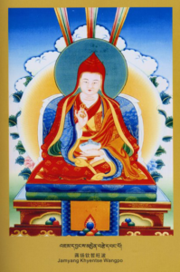
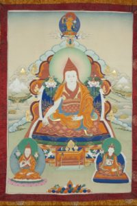

**The 1st Dzongsar Khyentse, Jamyang Khyentse Wangpo Pema Woser Dongag Lingpa**

Jamyang Khyentse Wangpo

**Early life and receiving vows.**

The great Jamyang Khyentse Wangpo alias Pema Dongag Lingpa, as prophesied in many Treasure teachings like those of Nyangrol Nyima Yoezer, Rinchen Lingpa, Dorje Lingpa, Ngari Panchen Dudul Dorje etc, was born in the Nyo clan as a son of Rinchen Wangyel and Sonam Tsho on the fifth day of sixth month of fourteenth sexagenarian cycle. He was born in Terlhung Dilgo village of Derge district in Kham and it was said that his was a birth accompanied by many wonderful signs. At the age of nine he joined Dzongsar monastery as a monk. He was recognized as the embodiment of Thartse Khenchen Jampa Namkha Chimmi by Khenchen Jampa Kunga Tenzin and was given the name Jamyang Khyentse Wangpo Kunga Tenpei Gyeltshen Pel Zangpo. After this the title of Thartse Trulku or Zhabdrung was attached to him. He took the highest monastic vow from Khenchen Rigzin Zangpo of Mindroling monastery. And from the Sakyapa master Dorje Rinchen he took up the precepts of Bodhisatva of both the lineages; lineage of profound view and vast conduct. Jamyang Khyentse Wangpo received the empowerments of Chakrasamvara and HeyVajra from Thartse Khenchen.  The initiations of Yangdak in So tradition and Rigzin Thukthik from Minling throne holder. From Zhechen Jurme Thuthop Namgyel he received the initiations of wrathful and peaceful deities, thus receiving the Secret Mantric vows too.

**Study.**

With disregards to the name or lofty position of Trulku, he journeyed twice to the central Tibet and with the utmost diligence studied traditional sciences like technology, medicine, grammar, logic etc and Buddhist subjects like Vinaya, Abhidharma, Madhyamika and Prajnaparamita with more than one

Jamyang Khyentse Wangpo

hundred and fifty teachers, in all of which he excelled. From these great masters, he received the ripening initiations and liberating instructions of Kama and Terma of Nyingma, new and old Kadam traditions, Sakyapa, various branches of Kagyupa, and Bodong and Zhalu. These empowerments were supplemented by the expository lineages of  Essence of Secret, Kalachakra, Chakrasamvara, Hey Vajra, gatherings of secrets etc. He also received the reading transmissions of Kagyur, The Nyingma Tantra etc adding up to seven hundred volumes. In summary, for thirteen years he went on seeking and receiving teachings and instruction from all available lineages and traditions. Khyentse Wangpo has this uncommon ability to remember both the words and its meaning just by glancing, yet  in order to exhibit the preciousness of Dharma will engaged in studying them, resulting in incomparable ability of discriminating wisdom that know the unique tenets of different traditions. To this end, Jamgon Kongtrul Lodoe Thaye in his biographical accounts of Khyentse’s life made this remarked- no one can compare with his unique abilities of knowing the differences between various traditions. All of the teachings that he received were practice at least once resulting in experiences and realizations.

**His enlightened activities and students.**

Khyentse Wangpo founded a school in Ngor monastery where Tibetan literary sciences were expounded, which resulted in Tsang Penchen Lama giving him the title of Thartse Mahapandita. Except for the Kagyur, he taught every teaching lineage that he received to disciples ranging from lineage holders to mendicants according to their wishes and dispositions. 

Because of the stability in practice of two types of Bodhicitta and of his openness and devotions all lineages and schools, many great lamas became his students. They were Sakya throne holder Tashi Rinchen, all Khenpos of Ngor monastery, Zhalu trulku, Nalendra trulku, Ngawang Lekdrup, Loter Wangpo etc of Sakyapa schools. His Kagyupa students were the fourteenth and fifteenth Karmapa, tenth and eleventh Situ trulku, Jamgon Kongtrul, Taklung and Riwoche trulku. Jora Lama and Samdhing Vajrayogini were his students following Bodong lineages. Chagzam Nyima Chophel of Jonang school. Gelukpa masters like Konchok Tenpa Rabgey, Dondup Gyeltshen, Drayab Lama, Lithang Khenchen and Hor Khangsar Gyelwa were his students. His students in the Nyingma lineages includes Chokgyur Lingpa, Mipham Rinpoche, Do Drupchen, Adzom Drukpa and all the lama of great Nyingmapa’s monastery like Kathog, Zhechen and Payul. His students includes great spiritual master of his time, mountain dwelling retreaters, humble practitioner and lineage holders of Bon religion. For the continued existence of the Dharma he collected the Compendium of Sadhana and also wrote the content of Treasury of precious revealed teachings and Treasury of pith instructions of Jamgon Kongtrul Rinpoche and bestowed most of the empowerments collected in those collections.

**His unique biography.**

Jamyang Khyentse Wangpo was unique in that he studied with many master of all traditions and lineages of Tibetan Buddhism and spread them. Especially he studied and received every important transmission from ‘Eight chariots of practice lineages’. These are;

1. The Kama, Terma and pure vision teachings of Nyingma tradition transmitted by the kindness of Guru Padmasambhava, Abbot Shantarakshita and King Trisong Duetsen.
2. The divine teachings of Kadampa founded by glorious and incomparable Atisha.
3. The precious instructions of Path with its fruit, the heart essence of Mahasiddha Virupa, which came down through Sakyapa lineage.
4. The four streams of teachings within Kagyu traditions that came from Marpa, Mila and Gampopa.
5. The golden doctrine of Shangpa Kagyu, which came down from learned and accomplished master Khyungpo Neljor.
6. The six limbs completion practices of King of Tantra, the glorious kalachakra, passed on by Kunpangpa Thukje Tsondru.
7. The teaching of Pacifying of suffering coming from Padampa Sangey and teachings on the objects of severance, which were passed on by Machik Labdron.
8. The approach and accomplishment of the Three Vajras, teachings bestowed on Drupchen Orgyenpa Ribchen Pal by Vajrayogini herself.

Khyentse Wanpo was never lax in his studies and gatherings of these teachings.  He reflected on them and attained a high level of realizations through meditations resulting in his getting prophecy and visions of Indian and Tibetan masters and deities of various Tantric cycles and Dakinis. In essence his inner biography is actualizations of the teachings of exemplified by eight practice lineages and his abilities to teach them without any distortions.

Jamyang Khyentse Wangpo

**His secret biography.**

As prophesied  by Thangtong Gyelpo in one of his Treasure, Khyentse Wangpo not only possessed great learning, but also attained unsurpassable realizations and qualities. He received the seven special transmissions in the following way and his famed spread throughout the Tibet and the name Pema Osel Dongag Lingpa the holder of seven lines of transmission was heard everywhere. These transmissions are;

1. Inspired by the blessing of Guru Tshokyi Dorje and through the bestowal of symbolic empowerment, he received authority to teach and give empowerments of Sutras and Tantras of both new and old schools of Tibetan Buddhism.
2. He received the transmission of earth treasure by revealing caskets in places like Drakmar Drinzang and Terlung Pema Shelri.
3. He received transmission of rediscovered treasuries by deciphering the secret code which appeared itself in the expanse of his wisdom mind; he was granted all the empowerments and instructions in their entirety all at once by Guru Rinpoche in the form of various treasure revealers.
4. Through the blessing of seeing various deities, Vajra words no different from those of Tantras came to him spontaneously and he received the transmission of profound mind treasuries.
5. He received the transmission of recollected teachings.
6. He also received the transmission of Pure Visions.
7. And he was also the holder of aural lineages. He wrote more than thirty volumes for the benefits of future generations and Dharma.

Jamyang Khyentse Wangpo at the age of seventy three, on the twenty first day of first month of water male dragon year of the fifteenth sexagenarian cycle, passed away after completing his enlightened activities. His wisdom mind entered in to Acharya Vimalamitra’s mind at Wu Taishan and again from there reappeared five emanations bringing forth the enlightened activities for Dharma and beings.
