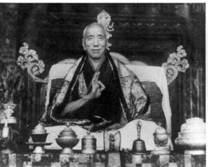

**The 2nd Dzongsar Khyentse — the non-sectarian (Rimé) master Jamyang Khyentse Chökyi Lodrö**

*Vajradhara Chökyi Lodrö*

### Birth

The Vajradhara master Jamyang Chökyi Lodrö was born in the autumn of the Water-Snake year (1893), the fifteenth sexagenary cycle, in a place called Rekhe Ajam in Dokham (eastern Tibet). His father was Gyurme Tsewang Gyatso, a descendant of the great tertön Nüden Dorje; his mother was Tsültrim Tso, of a family lineage of accomplished practitioners.

### Ordination

Shortly after his birth, his father named him Jamyang Chökyi Lodrö. He was later recognised by the first Jamgön Kongtrul Lodrö Thaye as the activity emanation of Jamyang Khyentse Wangpo. At the age of six, Situ Chökyi Gyaltsen invited him to Katok Monastery, one of the principal seats of the Nyingma tradition. At the age of ten he received the novice (śrāmaṇera) vows from Kunzig Dharma Sara and other masters. At fifteen his feet were placed upon the throne of the unbiased Buddhist teaching at Tashi Chime Drubpé Gatsel — the master's residence at Dzongsar Tashi Lhatse. At twenty-six he received the full bhikṣu ordination at Rudam Orgyen Samten Ling from Khenchen Jigme Pema Losal and others.

*Vajradhara Chökyi Lodrö*

### Studies

When he first entered Katok, Situ Rinpoche requested his own scripture-teacher, Khenchen Thupten Rigzin Gyatso, to become the master's teacher. In just over a year the master memorised the ten ceremonial pecha (texts) required for Katok's ritual programme and recited them flawlessly before Situ Rinpoche. From the age of ten he relied on the same teacher together with Lama Sherab of Palyul, the great scholar Tashi Chöphel, the Dalai Lama's personal physician Atsang, and Khenchen Kunpal — among others — for instruction in the common sciences: grammar and prosody, poetry and astrology, medicine and logic (pramāṇa). For Sutra-side studies he relied on Lama Tenzang of Katok, Khen Aka Rinpoche, Khen Kalzang Wangchuk, the lord of secret-mantra Loter, Nesar Trakpel, and Önto Khen Rinpoche Khyenrab — memorising root texts and outlines, examining commentaries, presenting his understanding in oral examinations and debate.

He further received teachings from Situ Rinpoche Chökyi Gyatso, Loter Wangpo Rinpoche, Thartse Shabdrung Jampa Kunzang Tenpé Nyima, his own father Gyurme Tsewang Gyatso, Khenchen Samten Lodrö of the main monastery, Dodrupchen Tenpé Nyima, Shechen Gyaltsap Pema Namgyal, Gatön Ngawang Lekpa, Tarlam Ngawang Tenpa, and many others. In his own words:

> In short, I relied on more than eighty masters and from them received vast teachings.
> Towards the eight great chariots (lineages) of the Land of Snows
> I cultivated only pure vision —
> unstained by the obscuration of wrong views,
> turning away from sectarian bias and partiality.
> May all empowerments, transmissions and pith instructions,
> all continuing streams of teaching,
> become objects of diligent listening and reception.

So it was that, without sectarian preference or contentment, ceaselessly and tirelessly, he reached the far shore of the ocean of learning. Every teaching he received he took to heart, abiding constantly in non-conceptual samādhi; the visions of pure realms appeared to him merely by aspiration. He repeatedly beheld and received blessings from yidam deities including Mañjuśrī, Cakrasaṃvara, and Hevajra. The Dharma-protectors — Mahākāla, Gurgyi Gönpo and others — accomplished whatever activities he entrusted to them. He further received in pure visions, as near-lineage transmissions, inconceivable profound Sutra and Tantra teachings from countless Indian and Tibetan masters of all lineages.

### Service to the Teaching

In service to the Buddhadharma, taking care never to misuse offerings of faith, he commissioned wood-block prints of: more than thirteen volumes of the Collected Works of the previous Jamyang Khyentse Wangpo, the commentary on the *Tathāgatagarbha-sūtra*, the *Guhyagarbha-tantra* commentary, two volumes of the writings of Mipham Rinpoche, and the root texts of the great philosophical treatises — twenty-five volumes in all. He newly built the Rikzhi (Three-Family Lords) temple at Khamje Monastery from the foundation, and within it had a five-storey-high gilt-copper Maitreya statue cast, together with many other representations of the Three Jewels. He founded a new shedra (Buddhist college), constructing dormitories and supporting buildings, and established a permanent stipend foundation for fifty-three khenpos and students — an act whose beneficial effects have spread inside and outside Tibet, continuing to the present day.

After Situ Rinpoche's parinirvāṇa he took charge of the inner and outer affairs of Katok — the source-monastery of the Nyingma teachings — for fifteen years. During this time he revived the tantric college whose continuity had been broken; he reconstituted it from the foundation up and provided stipends for forty-five khenpos and monks. He completed the unfinished work on the three-dimensional maṇḍala of the Copper-Coloured Mountain (Zangdok Palri). He bore the principal expense of newly constructing the Great Śākyamuni temple, complete with its inner contents, including a three-storey gilt-copper Śākyamuni statue.

He re-founded the Tragang retreat centre — formerly endowed by the Dergé king but later fallen into decline — building new retreat houses and providing a permanent foundation for its support; in his time it supported fifty retreatants. This centre principally practises the Sakya Lamdré "Path-and-Fruit" oral lineage in four-year retreats. He also founded the new Rongmé Karmo Taktsang retreat centre — focused on the profound termas of the three great masters Khyentse Wangpo, Jamgön Kongtrul, and Chokgyur Lingpa, and on the eight great practice-lineages — with five-year retreats; he established a foundation for nine retreatants and their attendants, and renovated the existing halls. He extended the old residence and built a new four-storey master's quarter adjoining the central temple. According to the wishes of his predecessor, he replaced the entire inner contents — all the Three Jewel representations — of the central temple at great expense, and built a new Sang ritual hall complete with contents.

In the matter of scriptural representations alone, he commissioned more than 2,500 volumes of newly written texts, of which over 200 were inscribed in gold. He further extended his kindness to numerous newly established shedras throughout Dokham by sending khenpos to them, providing foundations, advice, and oversight.

*Vajradhara Chökyi Lodrö*

### Teaching

From the age of nine, when he gave an impromptu oral commentary on the *Praise of Mañjuśrī* to the ruler and ministers of Lingkar, he gave countless teachings on Sutra and Tantra at Katok, Dzongsar and elsewhere. When teaching Tantra texts he would never give verbose, speculative explanations devoid of the profound pith-instructions, nor would he piece together fragmentary recollections; rather, he would distill the essential meaning of the extensive treatises and, for the abbreviated texts, explain in fine detail. He gave teachings perfectly suited to the capacity of each disciple — sharp or dull — so that the meaning of whichever Sutra or Tantra was being taught would arise clearly in their continuum. He drew on the various Nyingma and Sarma teaching lineages and textual aids to elucidate every author's intent fully; he never engaged in sectarian refutation or proof of others' positions. To disciples of the highest capacity he gave wonderful, extensive ancillary teachings drawn from the depths of his realisation.

In the later part of his life he travelled and taught at Lhasa, Dorje Drak, Mindrolling, the Nawo-chok of Lhodrak, Kharchu, Lhalung, Yardrok Taklung, Tsang Lingbu Monastery, Sakya Gong, the Sikkimese royal seat, Pema Yangtse, Darjeeling, and elsewhere. Before becoming a mantra-yogin he conferred the foundation of the teachings — the pratimokṣa novice and bhikṣu vows — to many. He also bestowed the bodhisattva vow according to both Sarma and Nyingma textual traditions, many times.

The Vajrayāna teachings he transmitted include: the *Damngak Dzö* twice, the *Drubthab Kuntü* four times, the *Lamdré Lobshé* three times, the *Lamdré Tsogshé* twice, the great empowerment of the seven maṇḍalas of the Ngor tradition four times, the Nyingma Kama three times, the *Rinchen Terdzö* (with empowerments, reading transmissions and teaching) once, the *Terdzö Kagya* three times, the *Nyingthik Yabzhi* five times, the reading transmission of the *Dzö Dün* (Seven Treasuries of Longchenpa) twice, the *Jangter* cycles complete once, the six volumes of *Jatsön Pöd-druk* once, the Twenty-Five Royal-Sealed (Nga-pé Gyachen) cycle four times, the complete *Min-ling Ter* four times, the *Drubthab Döjo Bumzang* thrice, the cycles of Düdül Dorje and Longsel Nyingpo twice each, the complete Khyentse termas with Collected Works twice, the complete Chokling termas three times. The *Gyüde Kuntü* was not given in a single sequence but he said it had been transmitted across earlier and later occasions. The Sakya Five Patriarchs and Ngorchen's Collected Works he gave once; the *Nyingma Gyübum* reading transmission once. Detailed accounts of his transmissions appear in the great extended biographies.

In his later years he also gave to many qualified disciples the ripening empowerments and instructions of *Khordé Yermé*, Mahāmudrā and Dzogchen. On these occasions, ordinary general empowerments such as the Madhyamaka bodhicitta ceremony, the common Avalokiteśvara permission empowerment, the Phowa transmission, obstacle-clearing permission empowerments, long-life empowerments, and so on, he would give openly to all who were suitable. But he never bestowed the strict secret-mantra teachings as public spectacles. For lay men and women he gave the meditation-recitation of the six-syllable mantra together with the three roots of the Mahāyāna path (bodhicitta, non-referential view, and dedication), guiding them in accumulating merit and purifying obscurations. For those — novices, monks, lay practitioners — who sought profound instructions according to their own aspiration, he gave Sarma and Nyingma teachings, Old and New Treasure-teachings, yidam practices, and so forth, each according to need, sometimes once, sometimes up to ten times.

*Vajradhara Chökyi Lodrö*

### Pilgrimage

At sixty-three (Wood-Sheep year) he travelled with a small retinue through Ü, Lhokha, Yardrok, Nartang, Sakya, and then Sikkim, Darjeeling and India, reaching Nepal. He returned along the same route. He made pilgrimage to all the sacred sites, made vast offerings and gaṇacakras, performed dharma activities and prayers. Wherever he went, the people of the place obtained the blessing of seeing him and hearing his voice, and through his all-pervading wisdom-mind every connection became meaningful.

### Disciples

His principal disciples included, among the Nyingma masters: the two khenpos of Mindrolling, the sixth Yidzhin Norbu of Dzogchen Monastery and the Dzogchen Khyentse, the sixth Shechen Rabjam, Dilgo Khyentse Rinpoche, the Situ Rinpoche of Katok and the majority of Katok's khenpos and tulkus. Among Sakya masters: the throne-holders of the Sakya palaces, the khenchen and shabdrung of the Ngor Ewam tradition, the Zhabdrung of Nalendra, the Eighteenth Throne-holder of Sakya, and others. Among Kagyu masters: Situ Pema Wangchen and his sons, Jamgön Tsodzu, Drukchen Rinpoche, and others. Among Geluk masters: the great scholar Geshé Jampel Rölpe Lodrö, the Künling Tatsak Jé-drung, Mi-nyak Lhé-kyabgön, Trehor Geda Tulku, Gojo Drodren Tulku, and others — an enumeration that exceeds counting. He also gave teachings to nearly all the high officials of the Tibetan government (Kalön, Depön, Tsipön), the Dergé king, the Lingtsang king, the Nangchen royal house, the king of Sikkim, and other nobility of Tibet and Greater Tibet — and to ordinary people of faith, beggars and the poor; he embraced all without sectarian discrimination, in numbers beyond reckoning.

### Consort

At fifty-six, in order to remove obstacles to his body, he returned his monastic vows and accepted a ḍākinī consort.

### Writings

His collected writings are being gathered and edited by his heart-son Pewar Rinpoche; about fifteen volumes have been compiled to date, with the collection still ongoing.

### Parinirvāṇa

Having displayed his inconceivable common and uncommon activities, in his sixty-seventh year — the sixteenth sexagenary cycle Earth-Pig year, the sixth day of the fifth month (1959) — at the Royal Monastery of Sikkim, India, he merged once again into the heart-essence of Vimalamitra accompanied by signs of light and earthquake, displaying parinirvāṇa. His outer relics are enshrined at Tashiding in Sikkim; his inner relics were first preserved at the Royal Monastery in Sikkim and were later invited to the Khyentse Labrang in Bir.

### Sources

This biography was composed in abbreviated form based on the master's own autobiographical verses, his brief auto-biographical addition to the *Lineage of Tangtong Gyalpo's Aural Transmission*, the *Great Biography* compiled by Dilgo Khyentse Rinpoche, the *Secret Biography*, *Jataka* and detailed/abbreviated supplication prayers compiled by Khen Rinpoche Kunga Wangchuk, the biography composed by Lodrö Phuntsok, and other sources.

*(Compiled by the Chökyi Lodrö Editorial Department.)*
