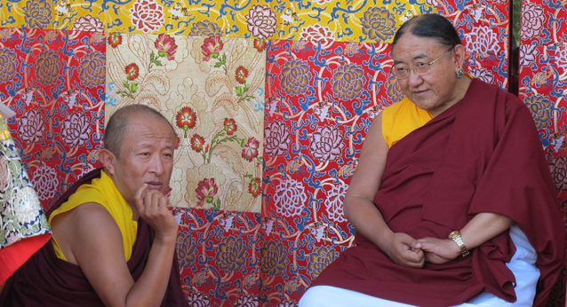
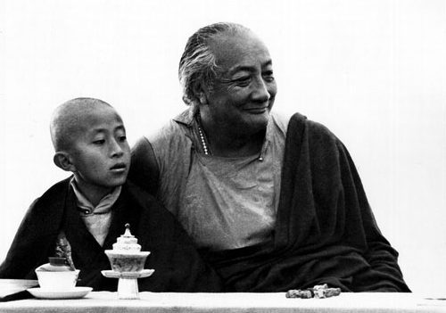

**The non-sectarian master Dzongsar Jamyang Khyentse Thupten Chökyi Gyatso**

*Kyabjé Khyentse Rinpoche*

Dzongsar Jamyang Khyentse Rinpoche was born in 1961 in Kurtoe, Bhutan, the son of his father Thinley Norbu (heir of an esteemed lineage) and his mother Jamyang Chödrön. He was recognised as the reincarnation of Dzongsar Khyentse Chökyi Lodrö by His Holiness Sakya Gongma Rinpoche. He relied on Kyabjé Dilgo Khyentse Rinpoche, Sakya Gongma Rinpoche, the Sixteenth Karmapa Rangjung Rigpe Dorje, Khenchen Apé Rinpoche, and many other accomplished masters of the four major Tibetan Buddhist traditions, undertaking thorough training in the sutra and tantra textual traditions. He pursued modern studies in the East of London, in the United Kingdom, and in Africa.

*With Kyabjé Dilgo Khyentse Rinpoche*

He has established, at various times, the two Dzongsar shedras in India and Tibet, the Dewathang Shedra in Bhutan, the Siddhārtha's Intent organisation, the Deer Park Institute, the Lotus Outreach foundation, the Khyentse Foundation, and the 84000: Translating the Words of the Buddha translation initiative. His film works include *The Cup*, *Travellers and Magicians*, and *Vara: A Blessing*, and his books include *What Makes You Not a Buddhist*, *Not for Happiness*, *The Guru Drinks Bourbon?*, *Living is Dying*, *The Best Companion: Tara Vol. 1 & 2*, commentary on the *Madhyamakāvatāra*, commentary on the *Uttaratantra-śāstra*, *The Parting from the Four Attachments*, among others.

*With His Holiness Sakya Gongma Trichen Rinpoche*
