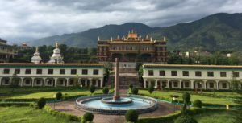
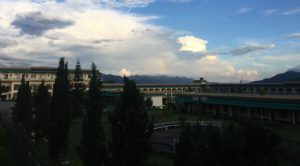

## Dzongsar

### Dzongsar Shedra in India

The Temple of Dzongsar Institute, India

The immediate disciple of Jamyang Khyentse Chokyi Lodoe and former student at Khamje Shedra, Khenchen Kunga Wangchuk, in accordance with the enlightened wishes of third Jamyang Khyentse Thupten Chokyi Gyatso who wishes to establish the continuation of vision of Khamje Shedra, came to in India in 1982.  
On the fifteenth day of the first Tibetan lunar month, in 1983, Khenchen began to teach ‘Ways of Bodhisatva’ and Sapan’s ‘Three vows’ to four students at Nenang retreat in Sikkim, thus formally starting the Khamje Shedra’s teaching lineage in India.  
The Shedra was shifted to Bir, in Himachal Pradesh, in 1985, and the annual and daily events of Khamje Shedra are followed and observed accordingly. The daily classes, self study and reviews, assembly and dedication respectively every morning and evening, the fortnightly monastic confession, etc are reestablished.  
Students who wishes to join the Shedra has to be of at least years 15 old and ordained, and upon the completion of study are encouraged to return back to their own monastery and teach and serve there in accordance with their own capabilities.  
After thirteen years of teaching at Bir, mainly due to the logistics, with the generous assistance of Taiwanese disciples, land was bought to build new Shedra at Chauntra in 1999. In the March of 2000, construction works were started and by the end of 2004, the Shedra was shifted from Bir to Chauntra. The opening ceremony was graced by HH the Dalai Lama. Again in 2008, The Sakya Trizin consecrated the Shedra and gave Path and Fruit teachings.  
Kyabje Khyentse Rinpoche frequently bestows empowerments, transmissions and instructions at the Shedra and the daily teaching of great treatises are still continuously carried on.

The view of Dzongsar Institute, India
