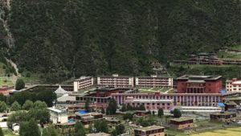
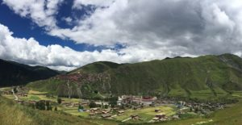

## 

## Dzongsar Shedra.

### History of Khamje Dzongsar Shedra in Tibet.

Dzongsar Institute, Tibet

The great Jamyang Khyentse Wangpo Kunga Tanpei Gyeltshen (1820-1892), through his foresight, built a monastery in the Monshoed area of Kham province, in Tibet, and named it ‘Rigsum Trul Pai Tsugla Khang Shedrup Dargey Ling’. The history behind the site choice is traced to another great master. In accordance with the instructions of Jamyang KhyentseWangpo, Jamgon Kongtrul Rinpoche Lodoe Thaye(1813-1899) embarked on a mission to look for a spot to build the monastery and decided the site at Khamje was the best. The geography of the place resembled a pig, a rooster and a snake—symbols for ignorance, attachment and anger. When Kongtrul first arrived at the site, his entourage saw three monkeys coming and dancing. The three monkeys, which were never seen before or after, were thought to be emanations of Manjushri, Vajrapani and Avaloketshesvara.

The great Jamyang Khyentse Wangpo, based on these observations, built statues of the three Bodhisatvas from casting mold. Later the statues, which were housed in the monastery, gave its name:‘Emanation of Three Families Monastery; Site of Propagation of Teachings and Realizations’. Khyentse Wangpo appointed a caretaker for the newly built monastery and provided all necessities. Every year, just before the summer retreat, Dzongsar monastery organized a seven-day intense Three Families Sadhana practice, based on a sand Mandala, and it concluded with a Four Activities Fire Puja and mass empowerments. Until the Shedra was instituted in a newly built monastery, a group of nearby families sponsored the annual practice of ‘Eight Pairs of Fasting’, inviting eight monks from Dzongsar monastery and as many local devotees will join the practice.

The Shedra was started by second Jamyang Khyentse Chokyi Lodoe in 1917, corresponding to earth horse year of sixteenth sexagenarian cycle, when he was twenty six. The new school or Shedra was open to everybody from all religious background without any sectarian affiliations and the contents of the teaching were mainly Indian Buddhist classics supplemented by Tibetan writings. The texts studied were thirteen treatises related with Madhyamika, Prajnaparamita, Vinaya and Abhidharma. Buddhist logical and epistemological treatise like Compendium of valid cognitions and Great exposition of valid cognitions were added. Two works by Sakya Pandita, Treasury of valid cognitions and Differentiation of three vows, were too added. Works on Sanskrit and Tibetan grammar and poetry were included and cultural sciences like Elegant sayings was also part of the curriculum.

### **The genealogy of Khamje Shedra and some students of Khenchen Zhenga Rinpoche.**

**The genealogy of Khamje Shedra;**

The physical structure of Dzongsar Khamje Shedra was built during the later part of the great Jamyang Khyentse Wangpo’s life, at a place call Jemathang.  The second Khyentse, Vajradhara Chokyi Lodoe, after arrival at Dzongsar at the age of fifteen, and sometime in 1908 he started to teach and expound texts like ‘Ways of Bodhisattva,’ ‘Three vows,’ ‘The concise sutra,’ ‘Continuum of higher principle,’ ‘King of aspirations,’ etc to more than twenty students, in order to preserve the Buddha dharma thus starting the teaching seminary.

When Chokyi Lodoe was in his early twenties, he invited khenchen Zhenga Rinpoche to teach at the Dzongsar monastery for more than fifty students. Chokyi Lodoe at the age of 26, after completion of gathering every necessary conditions, the Shedra from Dzongsar monastery was shifted to the current site, Kham Jemathang. Khenzhen Zhenga Rinpoche taught at Khamje for about two years. The Shedra produced large number of great scholars and students during its fifty years of existence (Before the political turmoil).

**Some of the famous students of Khenchen Zhenga Rinpoche;**

Dezhung Trulku Kunga Gyeltshen, Khangsar Khenchen Dampa, Bodpa Trulku, Khunu Rinpoche Tenzin Gyeltshen, Tsangsar Trulku, Gojothang Kya monastery’s Khenpo, Tritsho Khenpo Yeshe Lekdrup, Dung Khenpo Palden Tshultrim, Khenpo Lodoe Sengye, Dezhung Chophel, Dezhung Ajam, Dege Lama Chodak Gyatsho, Dzongsar Palden Phuntshok, Dzongsar Tshultrim Dakpa, Zingpa Chime, Palyul Karma, Zing Karma Dorje, Dayab Choedhar, Dayab Padam, Serjong Kheseng, Serjong Apey, Gapa Tshegyel, Thritsho Rinchen, Yena Chopjel Rabgay, Rabten Thupten Phelgye, Nangchen Padam, Nangchen Namzang, Dam Thupten, Wara Sangay Yeshe, Sakya Ngagchoe, Pewar Trulku, Dongthog trulku, Pogon Dongyel, Detrul Lungrig Nyima, etc. Each and every one of these great scholars and practitioners lead a great monastic centers, where they established and continued the traditions of fortnightly confession, monsoon retreats, liturgical practices, spreading the transmissions and empowerments of teaching among the monks and nuns and building new Dharma centers. In the lay communities, they initiated the traditions of accumulating billions of six syllable mantra and Mantra of Guru Rinpoche, etc and bestowing the refuge vows and spreading the practice of religious fast.

Many new Shedra, the centre of Buddhist learning, sprang up due to the direct inspiration of Dzongsar Khamje Shedra; Onten Lhuenpotse, Kegu Dendupling, Khridukelzang, Lhagyal monastery, Serjong monastery, Gojothang monastery, Dosib monastery, Dungdo monastery, Wara shedra, Minyak shedra, Dege Shedra, Nangchen shedra, Kyabje shedra, Khampa Shedra, Khromdo shedra, etc are few examples. All of these centers of learning greatly energized the Buddhist learning until the eventual fall of Tibet due to the political crisis.
