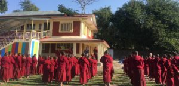
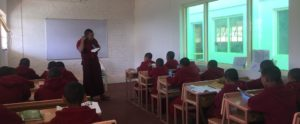
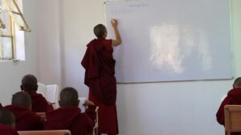
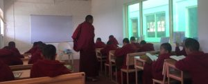
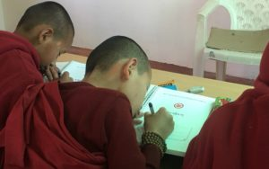

## The Kanishka School of Dzongsar Khyentse Chokyi Lodro Institute, India

In accordance with the farsighted vision and guidance of Kyabje Khyetse Rinpoche, a new schools is founded as a part of the Shedra.

Morning Assembly

The vision that guides the new school is to inspire and to place a seed of Dharma in the minds of young children mainly from Bhutan, India and Nepal, who will be the future generations. This is to generate immediately love and compassion, mindfulness and wisdom that can counter acts many ills, like theft, adulteries, war and crimes, distractions, suppression, killings, mental imbalances, etc and to eventually bring forth the path that non erringly leads to liberation, the path of Buddha dharma.

The school also envisions teaching Buddha Dharma, Tibetan, English, Science, and Mathematics etc so as to establish a firm foundation for the future existence of Buddha Dharma, to provide a good guidance for the lives of students and to make them independent.

Morning Assembly

Currently there are around ninety students and they are provided with same facilities as the Shedra goers. The students are happy under the guidance of appointed teachers, leaders and health assistance.

After five years course at the Shedra, the students can return back to their own home or can join other institutes, or could continue to study at the Shedra joining from first class and continue studying degree course in Tibetan literary science. Currently the schools is under the Shedra’s administration, therefore we are recruiting only male students.

Any parents wishing to send their kids to our primary school can contact us at the address given on our website on week days, from 9am till 11 am and from 1pm till 5pm.

Students are going to classes after assembly

A Tibetan Language Class

A Tibetan Language Class

A Tibetan Language Class

A English Language Class

A Tibetan Language Class

A English Language Class

Writing his name on the new text book
