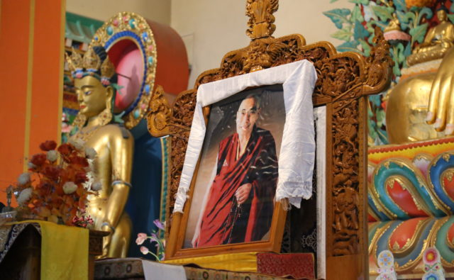

## The 11th Parinirvana of Khenchen Kunga Wangchuk

Yesterday on 23rd May 2019, corresponding with the 20th day of the third Tibetan month, as it was the day of the 11th parinirvana of Khenchen Kunga Wangchuk, the offerings and ritual for the parinirvana

