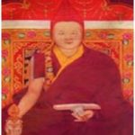
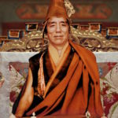
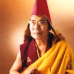
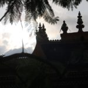
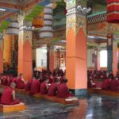
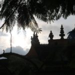
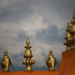
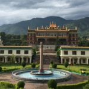
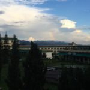
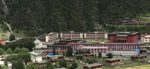

-   
  Jamyang Khyentse Wangpo

    
  Jamyang Khyetse Chokyi Lodro

    
  Khenchen Kunga Wangchuk

    
  In an evening

    
  Tara Puja in Shrine Room

    
  View of Dzongsar Chokyi Lodro’s Roof
-   
  The golden roof

    
  The roof of the main temple

    
  Lunch Break

    
  Lunch Break

    
  The Temple of Dzongsar Institute, India

    
  The view of Dzongsar Institute, India
-   
  Dzongsar Institute, Tibet
