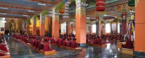

### Puja and offerings

Following are the numerous Pujas/liturgical services conducted yearly at Dzongsar Shedra. These prayers aim for the propagation and transmission of the Buddha Dharma throughout the world, the long life of all Dharma holders, the clearance of all obstacles and rise in merit of Dharma patrons, and

Tara Puja in the Shrine Room

the pacifying of diseases, famine and wars in the world.

– Resounding of the whole collection of Buddha’s Sutras in Tibetan. All students, once a year.

– Accumulating the recitation of ‘21 Praises to Tara’ and Dharmapala supplication. A group of five monks perform Tara puja and Dharmapala ritual, daily.

– Recitation of prayers related to Guru Rinpoche and Tara, plus dedications and aspirations. All students, mornings and afternoons daily.

– Fortnightly confession, on the new moon and full moon.

– Dharmapala ritual. All monks, on the twenty ninth day of every Tibetan month.

– On the Wednesday evening of every week liturgies of Long life and Medicine Buddha are alternatively performed.

–  In the beginning of new year, at the end of the year and just before the monsoon retreat three days of exorcism base on Tara is conducted.

– For the deceased at the end of monsoon retreat a liturgical practice of Sarvasid Vairochana is performed.
