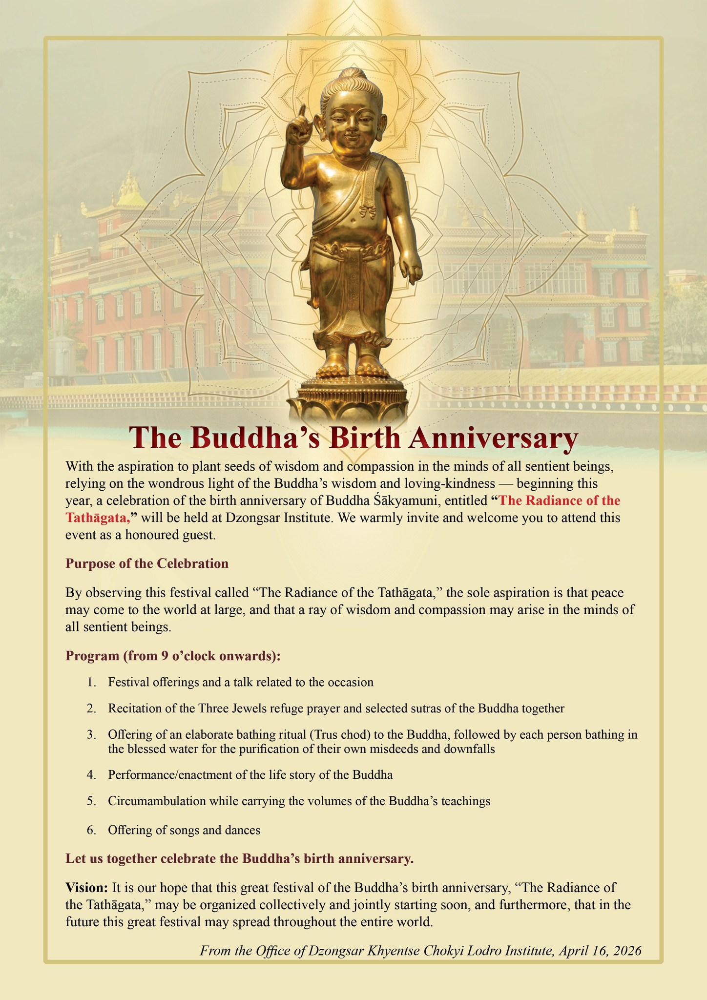

With the aspiration to plant seeds of wisdom and compassion in the minds of all sentient beings, relying on the wondrous light of the Buddha's wisdom and loving-kindness — beginning this year, a celebration of the first anniversary of Buddha Śākyamuni, entitled **"The Radiance of the Tathāgata,"** will be held at Dzongsar Institute. We warmly invite and welcome you to attend this event as an honoured guest.

## Purpose of the Celebration

By observing this festival called "The Radiance of the Tathāgata," the sole aspiration is that peace may come to the world at large, and that a ray of wisdom and compassion may arise in the minds of all sentient beings.

## Program (from 9 o'clock onwards)

1. Festival offerings and a talk related to the occasion
2. Recitation of the Three Jewels refuge prayer and selected sutras of the Buddha together
3. Offering of an elaborate bathing ritual (Trus chod) to the Buddha, followed by each person bathing in the blessed water for the purification of their own misdeeds and downfalls
4. Performance / enactment of the life story of the Buddha
5. Circumambulation while carrying the volumes of the Buddha's teachings
6. Offering of songs and dances

Let us together celebrate the Buddha's birth anniversary.

## Vision

It is our hope that this great festival of the Buddha's birth anniversary, "The Radiance of the Tathāgata," may be organized collectively and jointly starting soon, and furthermore, that in the future this great festival may spread throughout the entire world.

*From the Office of Dzongsar Khyentse Chökyi Lodrö Institute, 16 April 2026.*
