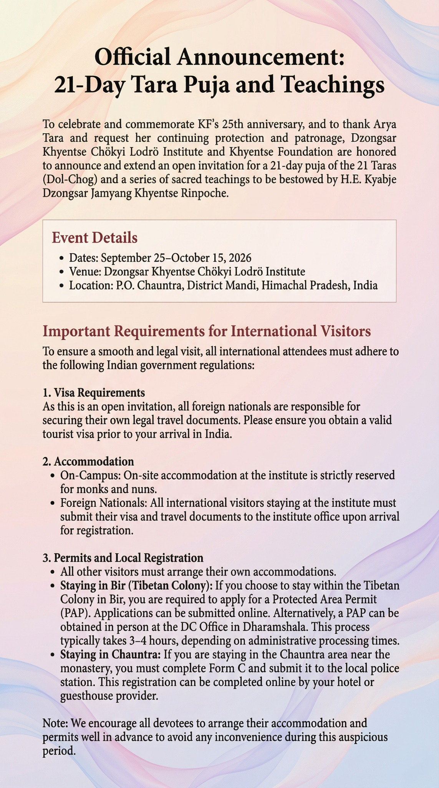

To celebrate and commemorate KF's 25th anniversary, and to thank Arya Tara and request her continuing protection and patronage, Dzongsar Khyentse Chökyi Lodrö Institute and Khyentse Foundation are honored to announce and extend an open invitation for a 21-day puja of the 21 Taras (Dol-Chog) and a series of sacred teachings to be bestowed by H.E. Kyabje Dzongsar Jamyang Khyentse Rinpoche.

## Event Details

- **Dates:** September 25 – October 15, 2026
- **Venue:** Dzongsar Khyentse Chökyi Lodrö Institute
- **Location:** P.O. Chauntra, District Mandi, Himachal Pradesh, India

## Important Requirements for International Visitors

To ensure a smooth and legal visit, all international attendees must adhere to the following Indian government regulations:

### 1. Visa Requirements

As this is an open invitation, all foreign nationals are responsible for securing their own legal travel documents. Please ensure you obtain a valid tourist visa prior to your arrival in India.

### 2. Accommodation

- **On-Campus:** On-site accommodation at the institute is strictly reserved for monks and nuns.
- **Foreign Nationals:** All international attendees staying at the institute must submit their visa and travel documents to the institute office upon arrival for registration.

### 3. Permits and Local Registration

All other visitors must arrange their own accommodations.

- **Staying in Bir (Tibetan Colony):** If you choose to stay within the Tibetan Colony in Bir, you are required to apply for a Protected Area Permit (PAP). Applications can be submitted online. Alternatively, a PAP can be obtained in person at the DC Office in Dharamshala. This process typically takes 3–4 hours, depending on administrative processing time.
- **Staying in Chauntra:** If you are staying in the Chauntra area near the monastery, you must complete Form C and submit it to the local police station. This registration can be completed online by your hotel or guesthouse provider.

*Note: We encourage all devotees to arrange their accommodation and permits well in advance to avoid any inconvenience during this auspicious period.*
