格桑確吉炯內殿（賢劫法源殿）

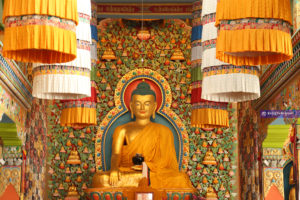

釋迦牟尼佛像

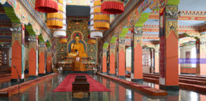

幽靜的大殿

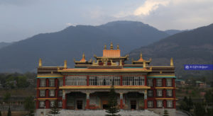

格桑確吉炯內殿外觀

研習顯經、密續和文學的課室

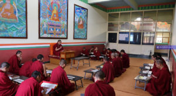

晨間主課

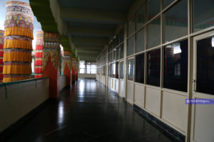

課室外的走廊

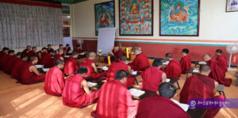

午間複講課

學生們住宿的地方

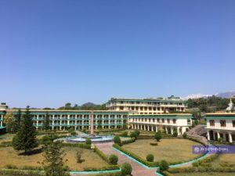

僧舍

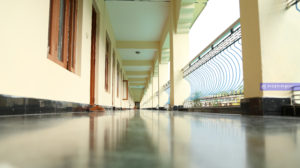

走廊

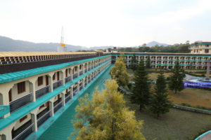

僧舍

景色優美宜人的花園草地

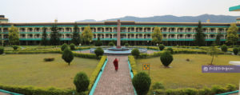

僧舍中央的草地

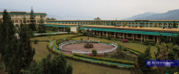

花園

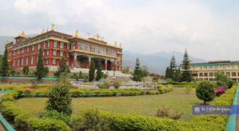

花園

空閒時可進行休閒運動的場地

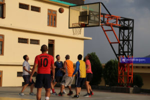

打籃球

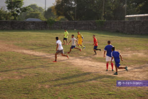

踢足球

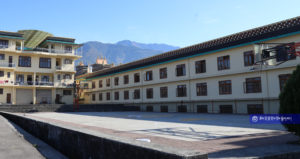

籃球場

照顧師生們健康的診所

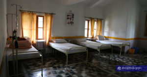

病床

藥櫃

烹飪僧眾飲食的廚房

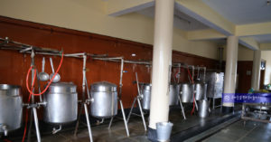

廚房

僧眾聚集用餐的齋堂

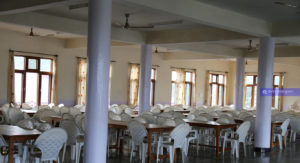

齋堂

佛學院四周美景

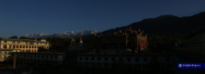

朝陽灑在佛學院的建築上

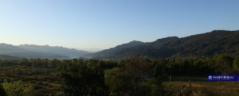

佛學院後方茂密的山林

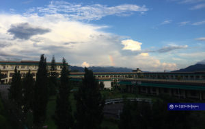

藍天白雲隱藏著那一抹彩虹
