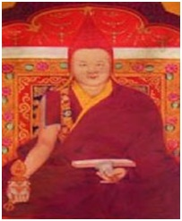
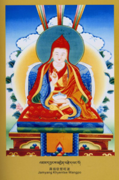

### 第一世蔣揚欽哲—不分教派利美上师蔣揚欽哲旺波

蔣揚欽哲旺波

誕生篇

蔣揚欽哲旺波，亦名貝瑪唯色多那林巴，如同那達年仁波切、仁千林巴、多傑林巴、阿利班禪頓都多傑等上師於許多珍貴文集中明確地授記般，尊者隨著種種吉祥殊勝的徵兆，誕生於藏曆第十四甲子庚辰年（西元1820年）六月初五，多康德格地區德龍山谷，頂果村的「琼欽扎」附近（今甘孜地區白玉縣登龍鄉）。父親是德格王宮的管家仁千旺嘉，來自諾部族。母親則是具有蒙古血統的索南措。

學法篇

九歲時進入宗薩寺學習，住在祖輩留下來的僧舍中。十二歲時被塔澤堪千強巴貢噶丹增，認證為耶旺塔澤堪千強巴南卡企美的轉世化身，並且賜名「蔣揚欽哲旺波貢噶滇貝蔣稱吧桑波」。此後，便被稱為「塔澤祖古」或「塔澤夏仲」。二十一歲於鄔金敏卓林寺，在堪布仁增桑波跟前受了具足戒。同年，亦於薩迦派多傑仁千等上師處，領受了龍樹傳承和無著傳承的發心儀軌；於塔澤仁波切兄弟處，獲得了勝樂金剛和喜金剛的灌頂；於敏林赤千久美桑傑貢噶處，獲得了《持明心滴》以及索派的清淨教法；於雪謙久美圖都南嘉處，獲得了文武百尊的灌頂；如此領受了諸多密乘灌頂，從而奠定了金剛誓言的根本。尊者完全摒棄了轉世祖古的身段和貴族子弟的傲氣，給自身進行了許多艱辛的磨練，比如曾經兩次徒步地前往衛藏（前藏、後藏）朝聖。

蔣揚欽哲旺波

尊者亦以極大的毅力和精進，於康藏（衛藏和康區）各地，依止眾多金剛持上師、善知識以及精通五明的學者等等之一百五十位大德，精通了工巧明、醫方明、聲明和因明等大小五明，以及律儀、俱舍、中觀、現觀為主的許多法相經論；獲得了寧瑪派、新舊噶當派、薩迦三派（薩迦巴、哦巴、察巴）、崗倉噶舉、直貢噶舉、達龍噶舉、竹巴噶舉、覺囊派、夏魯派以及珀東派等大小教派，法脈傳承不曾間斷的全部灌頂教法；聞思了《續部幻化經》、時輪金剛、勝樂金剛、喜金剛與密集金剛等根本續和註解的教授；獲得了《甘珠爾》、《寧瑪十萬續》以及《丹珠爾》的口傳傳承；如是聽聞研習了藏地各大教派的經論多達七百餘函。總括來說，尊者用了十三年的時間一心求法，聽聞筆錄了藏傳佛學十大支柱的學習傳統。蔣貢羅卓泰耶曾經這樣描述尊者：“這位大德只需略觀經卷便能完全通曉其深層含義，更有過目不忘的本領。縱然如此，他從不輕視任一法門、不像聽聞傳記故事般聞而置之不理，而是更為努力去聞思修並且精通了各宗派的見行和主張，毫不混淆地了解各大傳統之法與非法處。如此的法眼，至今不管是高僧還是凡夫，仍無人能及。”

如此，尊者僅以聞思修度日，修行和證悟的境界與日俱增。

弘法篇

蔣揚欽哲旺波尊者於哦派主寺，創建了一所以教授文學為主的文學院。後藏班禪遍知滇貝尼瑪，稱尊者為「塔澤瑪哈班智達」。尊者盡心竭力地多次如法傳授他所聞習過的顯經密續的教學和灌頂，比如曾經三次傳授了他新編纂的《成就法總集》。除了《甘珠爾》，其他教法至少都傳授了一次或以上。他不為得到錢財供養，只為法施利益眾生，滿足了上至高僧大德下至貧民乞丐，所有求法者的願望，從而培養了眾多的弟子。他們除了具有穩固的世俗和勝義二菩提心以外，更是對各大教派持有清靜心和恭敬心，遠離分別偏見和邪見。

弟子篇

其中主要的弟子，在薩迦三派有：薩迦赤千扎西仁千和其家眷、哦耶旺寺大多數堪布、夏魯措祖、那爛陀辛爾、新龍翁仁波切、薩迦噶丹洛本、洛本雅旺磊珠、秘密主洛迭旺波、更慶寺東院和西院的大德等等；在噶舉派有：第十四和十五世噶瑪巴、第十和十一世大司徒仁波切、蔣貢羅卓泰耶、達龍瑪仁波切、類烏齊寺三祖古（吉仲、帕確、夏仲）等等；在珀東派有：覺拉探傑欽巴、桑頂多傑帕姆等等；在覺囊派有：扎桑尼瑪確佩等等；在格魯派有：更措殿巴繞傑、拉尊頓珠蔣稱、拓雅諾門罕千摩、理塘堪千強巴彭措、霍康薩嘉瓦等等；在寧瑪派有：多傑扎寺、敏卓林寺、巴日寺、扎桑寺、噶陀寺、白玉寺、雪謙寺、佐欽寺等等的眾多寺僧、以及大伏藏師措林、米滂仁波切、多竹滇貝尼瑪、啊贊竹巴等等。如此於尊者門下，出現了不計其數持有佛陀教法的著名大德、善知識、山林瑜伽士、與世無爭的修行者、甚至包括了苯波教徒等等之不分教派的弟子。尊者為了佛法長住而心懷偉大的抱負，編纂了《成就法總集》。在亦師亦徒的蔣貢羅卓泰耶編纂「五寶藏」之時，尊者為他提供了其中兩藏，即《大寶伏藏》和《竅訣藏》的目錄大綱，並且為他傳授了其中大部分的口傳和灌頂。

內傳篇

雪域西藏的持教大德們，絕大多數精通自家法門，示現不可思議的殊勝行誼，守護佛教利益眾生，是可敬信之對境。然而，能周全地聞思修各派顯密教法，毫無偏見地弘揚各派法門，慈悲眷顧所有信眾，則屬尊者獨特作風。

尊者奮不顧身，以極大的毅力、精進和淨信心尋覓良師，在他們跟前完整地聽聞了法門清淨、傳承不曾間斷，由印度傳入西藏的八大修行傳承的教法。八大即：承恩師尊三君而得以綻放的寧瑪派；師承阿底峽尊者，傳承「七出世法」的噶當派；傳承畢瓦巴尊者心髓教義，即道果法門的道果派/薩迦派；由瑪爾巴、密勒日巴、崗波巴傳承「四大語旨教授」，後分成四大八小支派的馬爾巴噶舉；傳承琼波南覺大師「尼估空行六法」的香巴噶舉；傳承時輪金剛圓滿次第金剛瑜伽六支加行的時輪派/六支派；傳承大成就者帕當巴桑傑教義，修行斷法的希傑派；傳承金剛瑜伽母親傳予大成就者鄔金巴「三金剛修持法」的鄔金近修派。

尊者在聽聞這些法門後，便以思斷除疑惑、以修去實踐。在聞思修的過程中，不論是在現實還是夢境，都顯現印藏聖賢、寂忿本尊、三界空行給予三密加持和近傳教訣等等，無時無刻都是清淨的觀現。然而，這些顯現也只是見驥一毛罷了。雖然尊者從不作上人法，說已親見本尊、擁有神通等等，但在下列的密傳中，是可以證明尊者確實曾親見本尊的。總之，尊者精通八大修行傳承的生圓二次第，講經、辯論、撰寫皆無礙，遠離失誤染垢，廣攝有緣弟子。此內傳所及僅是太倉一粟。

蔣揚欽哲旺波

密傳篇

大成就者唐東甲波如此授記：

“與我無二瑜伽士，具有五種法相者，

距此七百餘年間，多康地區辰年時，

諾姓種族噶之子，屬金擁有勇士相，

蓮花王者加持故，具七受命多那林，

毗瑪米扎加持故，光明化身金剛名，

文殊化身那達尊，加持賜稱法良師，

化現如幻士夫相。”

如是，因往昔殊勝發心和願力的種子，萌芽成熟之緣故，尊者成為七種教法的持有者，或者名為七種受命者。

蓮花生大師密意加持，給予言語的灌頂已，吐息化光融入，獲得顯密新舊教藏的如法灌頂傳承，這就是教藏傳承的受命。從聖地扎馬真桑、當雪寧仲、德龍白瑪協日等地迎請出了大量伏藏，這就是地伏藏的受命。往昔的伏藏文字與符號顯現於眼前，因淨觀故心中自然釐定為藏文，此時蓮師幻化相關伏藏師，完成相關伏藏的灌頂和教授的引導，這就是極密伏藏的受命。因親見種姓部主和本尊得到加持，在心中突然顯現與密續無二的金剛詞句，這就是密意伏藏的受命。因回想起宿世的記憶，而寫下相關教法，這就是隨念法藏的受命。另外，還有淨相的受命和耳傳的受命。

如此以七種受命，讓「貝瑪唯色多那林巴」這個名號震徹雪域，流傳了三十餘函的顯密著作度化有緣眾生。

圓寂篇

如是圓滿了種種殊勝事業，在七十三歲之際，於壬辰年（西元1892年）二月初六早晨，尊者一邊撒花一邊念誦許多吉祥偈後入定，將色身融入毗瑪拉扎密意法界中，示現了圓寂。圓寂後，如經中記載的一樣，從五台山頓時顯現五個殊勝的化身，繼續進行著不可思議弘法利益眾生的事業。

（本傳記由確吉羅卓編輯部編纂。）
