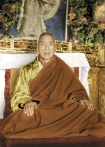
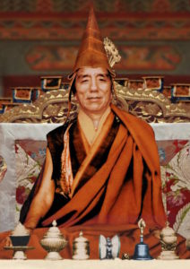
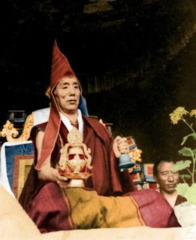

**第二世蔣揚欽哲—不分教派利美上師蔣揚欽哲確吉羅卓**

蔣揚欽哲確吉羅卓

誕生  
金剛持上師蔣揚確吉羅卓，於藏曆第十五甲子癸巳年（西元1893年）的秋天，誕生在多康的「熱科阿疆」。父親是大伏藏師努登多傑的後裔，名久美策旺嘉措。母親是大成就者的後裔，名慈誠措。

受戒  
誕生不久後，父親給他取名為「蔣揚確吉羅卓」。尊者後來被第一世蔣貢康楚羅卓泰耶認證為蔣揚欽哲旺波的事業化身。六歲的時候，被司徒確吉蔣稱迎請到寧瑪派主寺之一的噶陀寺。十歲時，在貢悉達瑪薩熱等眾比丘前領取了沙彌戒。十五歲的時候，尊者的蓮足踏入宗薩寺上師府—吉祥無死成就喜苑中，安住於教法毫無偏執的蔣揚欽哲旺波法座上。二十六歲的時候，於佐欽寺在堪千晉美貝瑪羅薩等比丘前領受了比丘戒。

蔣揚欽哲確吉羅卓

習法  
剛進入噶陀寺時，司徒仁波切便請求自己的經教師堪千圖登仁珍嘉措，成為尊者的經教師，指導學習。尊者僅用了一年多的時間，便把噶陀寺法會必備的十函經卷，滾瓜爛熟地背誦給司徒仁波切聽，通過了考試。十歲時，尊者依止相同的經教師、白玉喇嘛唯色、扎西確佩學者、達賴喇嘛私人醫生啊滄、堪千貢巴等大德們，學習了修辭學、辭藻學、韻律學、星象學、醫方明、因明等大小五明學科。依止噶陀堪布喇嘛滇桑、堪布阿嘎仁波切、堪布格桑旺秋、秘密主洛迭、聶薩扎佩、翁登堪仁波切欽繞等上師學習顯乘經典，把根本頌和科判熟記於心，並且在研習各註釋後通過其重點考試、辯經時更能立宗和辯駁。  
尊者亦依止司徒仁波切確吉嘉措、洛迭旺波仁波切、塔澤夏仲強巴貢桑滇貝尼瑪、自己的父親久美策旺嘉措、更慶寺堪布桑滇羅卓、多智滇貝尼瑪、雪謙嘉察貝瑪南佳、噶登雅旺磊巴、唐龍雅旺滇巴等大師聽聞了許多教法。尊者在自傳中說道：  
“總之有師八十餘，依彼獲得眾妙法，  
藏地法源八傳承，皆以淨相行觀持，  
不為邪見障所染，斷除毀謗與歧視。  
諸凡口傳與灌頂，教授竅訣恆精進，  
聞與未聞願得聞。”  
如是，凡是流傳在藏區的所有佛陀教法，與己派相關或無關，尊者都毫偏見分別、意猶未盡地，無時無刻以無倦怠的大精進，圓滿聽聞修學了各派的法門。  
尊者實修所有聽聞過的法門，心中時刻持以無分別智禪定，觀一切皆為清淨剎土的顯現。常常親見文殊菩薩、時輪金剛、勝樂金剛、喜金剛等本尊尊容，獲得加持。大黑天、寶帳怙主等護法亦常護持著尊者，使他所有的佛法事業得以成功。另外，尊者也在淨觀中親見無數印藏的聖賢，給予顯密甚深不可思議的教法，獲得了近教的傳承。

積福  
尊者以許多方法為佛教服務，他從來不虛費信財，雕刻了十三餘卷《欽哲旺波文集》、《大方等大集經須彌藏分註解》、《秘密藏續註解》、兩卷《米滂文集》、十三大論的根本頌等等共二十五卷的木刻版。尊者新建了康協寺的三怙主殿，塑造了許多三皈依的對境，比如五層樓高鍍金銅製的彌勒菩薩像。開辦了新的佛學院，並且為佛學院新建立了僧舍等設施。為五十三名堪布和學生設立薪酬公積基金，其成效至今仍正面影響著國內外。  
司徒仁波切圓寂後，尊者接管了噶陀寺內外事務長達十五年之久。期間，他復建了已經滅跡的密續大學，使其根基絕處逢生，並且資助四十五位堪布和僧眾。他接手了銅色吉祥山立體壇城的後期工程。尊者本身出資大部分的費用，新建了釋迦大殿能依、所依的設施，包括一座三層樓高的鍍金銅製釋迦牟尼像。  
他重建了舊時德格國王曾經資助後來沒落的扎崗閉關中心，建造了新僧舍，並且為其設立了永久性的基金會提供協助，在當時曾為五十位閉關的僧眾提供了資助。該閉關中心通常進行四年為一期的長期閉關，專修以道果法為主的薩迦派耳傳法門。尊者亦新建了戎美噶母達倉閉關中心，翻新了該地原有的大殿。這個閉關中心則主修欽哲旺波、蔣貢康楚、秋吉林巴三位大師的伏藏法門，副修八大修行傳統的教法，閉關通常五年為一期。尊者也為該閉關中心設立了基金會，為九位閉關者以及他們的侍者提供資助，翻新了舊僧舍。他為山頂上的三層佛殿加蓋一層上師們的寢室，也按照前世的遺願，不計成本地換新底層大殿中的所有三皈依的對境，為煙供殿新造佛像和設施。僅在印製新的經書方面，便多達兩千五百多函，其中有兩百多函是以金汁書寫的。另外，尊者還有為多康各地新建的佛學院派遣堪布，提供資金，規劃安排等各種恩重如山的善舉。

蔣揚欽哲確吉羅卓

弘法  
九歲時，為林嘎地區的君臣口頭講解《文殊讚》。在噶陀寺和宗薩寺等地方亦傳授了大量的顯密法門。傳法過程裡，講解到深奧的地方時，不會像愚者一樣冗長臆說、隨心所欲東湊西拼的胡說一通，而是以淺白的話語涵攝精要。遇到經中省略帶過的地方，則加以觀察分析後，做更進一步詳細的解釋。如此地講解顯經密續，不論是敏銳還是愚鈍的弟子們，都能生起確切的覺受。尊者也為新舊密乘的典籍提出新的見解，對於其他人的立場，不論是對與否、合法或非法，尊者都不作任何評論。對待那些上等根器的弟子，尊者會為他們傳授更加廣大、殊勝的甚深教法。  
暮年時期，尊者在拉薩、多傑扎寺、敏卓林寺、洛扎的吶沃玖、卡曲、拉隆、亞卓達隴、後藏林普寺、薩迦貢、錫金首府、貝瑪楊澤、大吉嶺等地傳授過一些法門。在還未成為密咒瑜伽士之前，也傳授了許多佛教的根基，即別解脫戒中之沙彌戒與比丘戒。尊者也前後多次傳授在新舊密續中，兩種不同傳承儀軌的菩薩戒。

尊者一生中所傳金剛乘之法，有：《竅訣藏》兩遍、《成就法總集》四遍、《道果教學釋》三遍、《道果會眾釋》兩遍、《哦吧七壇大灌頂》四遍、《寧瑪噶瑪》三遍、《大寶伏藏》全部的口傳和灌頂加上教學一遍、《伏藏秘籍》三遍、《四部心髓》五遍、《龍欽七藏》的口傳兩遍、完整的《北藏》一遍、六卷的《伏藏師嘉誠寧波集》一遍、《第五世達賴喇嘛二十五秘籍》四遍、全套《敏林伏藏法》四遍、《成就法如意寶瓶》三遍、伏藏大師敦都多傑和龍薩寧波的法門各兩遍、全套《欽哲旺波伏藏法》灌頂和《欽哲旺波文集》口傳各兩遍、全套《秋吉林巴伏藏法》三遍、《續部總集》前後累計一遍、《薩迦五祖文集》和《哦千貢噶桑波文集》口傳各一遍、《寧瑪十萬續》口傳一遍等等不勝枚舉。詳細可見尊者的《大傳記》。

晚年時期，尊者還為許多有根器的弟子傳授輪涅無二、大手印和大圓滿的灌頂教學。另外還傳授了許多可以公開普及的法門，比如：中觀派的發心；大悲觀世音菩薩的共同隨許灌頂、破瓦法口傳、除障隨許灌頂等等的小灌頂；長壽灌頂等等。對於那些嚴格的密法，尊者從不隨意傳授。他引導在家男女眾念誦六字大明咒，實修大乘道的根本三法（發心、觀無緣、迴向），以積福淨罪二法成就善業。為沙彌和比丘等追求甚深教誨者，傳授符合各自根器和願望的教派法門、本尊觀修等新舊密法。這些法門傳授的次數，少則一次，多則十來次。

蔣揚欽哲確吉羅卓

朝聖  
六十三歲時，即乙未年，帶著少許的隨從，經過前藏、山南、亞卓、納塘、薩迦等地，遊歷錫金、大吉嶺和印度後，抵達尼泊爾。之後，亦以相同的路徑返回。途中朝拜了當地所有的聖地，並且廣作供施、薈供、做佛事、祈願等。尊者所經之地，當地的民眾得以面見尊容聞其音聲，獲得慈悲攝授，種下善緣。

弟子  
所攝授的弟子，在寧瑪派有：敏卓林寺兩位大小堪布、佐欽寺第六代如意寶上師和佐欽欽哲、雪謙寺第六世冉江仁波切、頂果欽哲仁波切、噶陀寺的司徒仁波切和大多數的堪布祖古等等；在薩迦派有：薩迦各宮持座法王和法王子、哦耶旺寺的堪千和夏仲、那爛陀的辛爾、究給企千仁波切等等；在噶舉派有：司徒貝瑪旺千師徒、蔣貢措祖、竹千仁波切等等；在格魯派有：大學者蔣寶若貝羅卓格西、功德林寺達蒼傑仲、木雅的列怙主、哲霍格達措祖、貢覺卓天祖古等等；如此等眾多佛教大德數之不盡。另外，噶倫、代本、孜本三政府部門中多數的官員、德格國王、嶺蒼國王、囊謙君臣、錫金國王等等之藏地和大西藏的貴族高官，甚至平凡百姓、乞丐貧民，只要是有信心的，尊者都不分教派慈悲地攝授他們，其量多不勝數。

結伴  
五十六歲時，為了消除身體上的違緣，尊者歸還出家戒，攝授了空行母為明妃。

著作  
尊者的著作，正由其心子白雅仁波切尋覓收集，目前完成的大約有十五卷之多，然而收集編纂的工作還在持續中。

圓寂  
如是顯示了不可思議共與不共的事蹟後，尊者於六十七歲，即藏曆第十六甲子己亥年（西元1959年）五月初六夜晚，伴隨出現光明、大地震動等瑞相，在錫金皇家寺院中再度融入毗瑪米扎密意法界中，示現了圓寂。尊者的生前貼身物品目前正在錫金的扎西頂供奉著，其舍利則先前被供奉在錫金的皇家寺院，後來被迎請至比爾的蔣揚欽哲府邸供奉。

後記  
本傳記經由參考尊者本身所著的自傳偈頌、補漏《唐東甲波耳傳法上師傳承》時，自述的簡略傳記；頂果欽哲仁波切編撰的《大傳記》；堪仁波切貢噶旺秋編撰的《秘密傳記》、《本生傳記》和秘密傳記之詳略祈請文；羅卓彭措編撰的《欽哲傳記》等傳記後編纂成此簡略的版本。

（本傳記由確吉羅卓編輯部編纂。）
