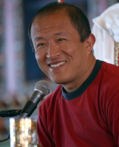

### 

### 第三世蔣揚欽哲—不分教派利美上师宗薩蔣揚欽哲圖登確吉嘉措

宗薩蔣揚欽哲圖登確吉嘉措

宗薩蔣揚欽哲仁波切，於1961年出生於不丹。父親名為聽列諾布，母親名為蔣揚曲卓。宗薩欽哲仁波切被第四十一任薩迦法王認證為宗薩蔣揚欽哲確吉羅卓的轉世。仁波切受教於頂果欽哲仁波切、第四十一任薩迦法王、第十六世大寶法王、大堪布阿貝仁波切等藏傳佛教四大教派的諸多大德高僧，學習顯密經典；之後前往倫敦大學亞非學院攻讀社會科學。

薩迦法王與欽哲仁波切

他在西藏重建了宗薩佛學院，也在印度及不丹設立了多所佛學院。此外，他先後創辦了悉達多本願會、比爾鹿野苑、蓮心基金會、欽哲基金會、「八萬四千佛典傳譯」等諸多方式來利益佛陀教法。他所拍攝的電影作品有《高山上的世界盃》、《旅行者與魔法師》、《舞孃禁戀》、《嘿瑪嘿瑪》。他所著的書有《佛教的見地與修道》、《不是為了快樂》、《正見》、《入中論釋》、《寶性論釋》、《遠離四種執著講記》等諸多關於佛法的著作

頂果欽哲法王與小時候的欽哲仁波切
