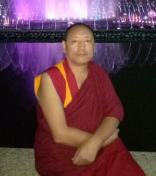
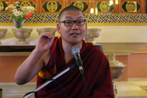

宗薩欽哲確吉羅卓佛學院的歷任校長。

### 第一任校長

**第一任校長 大圓滿堪布謝培確吉囊瓦**

宗薩佛學院的第一任校長，即大圓滿派大賢哲烏金滇津諾布之主要心子—大圓滿派學者賢嘎仁波切（又名謝培確吉囊瓦）。賢嘎仁波切於上師滇津諾布圓寂後，繼承了上師的法座。在很多年間，於上師之寺廟北（雅江）格芒寺培育了眾多弟子眷屬。此外新建了大圓滿師利僧格學校，於該校擔任堪布。在巴蚌東寺擔任了慈尊司徒仁波切白瑪旺秋甲波之教師，並在該寺及結古敦珠林建立了學習佛法的佛學院。在德格更慶寺（德格更慶寺•吉祥天成上經院）的色拉崗閉關處從密主洛德旺波座前接受了道果教學釋及密續總論等，並在那裡傳授了顯密諸多教法，對佛陀教法有很大的貢獻。賢嘎仁波切年少時尤其對薩迦派甚感興趣，也向烏金丹增諾布上師訴說過。上師對其言道：「這表明你的前世是位薩迦派的老僧。雖然沒有實入薩迦派，但生起好的發心，會成為一位對薩迦法教有貢獻的人。」正如大師所言，大堪布被認為哦塔澤大堪布強巴貢噶滇貝蔣稱之轉世。金剛持昂旺雷巴言道：「這位定是薩迦班智達的化身。」如是尕朵喇嘛將加仁波切對其說：「若能收集並印製遍知果然巴大師的文集，將會對薩迦法教極為有利。」在他的激勵下，他的學生蔣傑仁波切最終完成了果然巴文集的收集和編輯工作。賢嘎仁波切也在薩迦派培養了許多高僧與大德，例如：喇嘛蔣楊蔣稱、康薩大堪布昂旺羅卓賢遍寧波、大學者博登千饒、德松阿蔣祖古等。金剛持蔣揚確吉羅卓在創辦康協佛學院之前，迎請賢嘎仁波切至宗薩寺講授了多年佛法課。土馬年康協佛學院的依與所依（廟堂與佛像）落成時，蒞臨佛學院舉行開學典禮後，在佛學院講授了兩年左右的課。賢嘎仁波切所用過的床、木桌等常用傢具及用過的法器等，傳承師生們敬奉為極具加持的至寶。大堪布對薩迦派的法教有大恩似海般的貢獻。

### 第二任校長

**第二任校長 堪布翁登千繞確吉維瑟**

第二任校長堪布翁登千饒確吉維瑟，出生於翁波托，並在翁托寺出家。他從小就師從許多偉大上師學習各派教法。他的主要上師有洛德旺波、蔣揚欽哲確吉羅卓、噶昂旺雷巴、菊米滂南嘉、賢遍確吉囊瓦、司徒貝瑪旺秋甲嘉波、達格拉扎西仁波切等。  
由於堪布是賢嘎仁波切的最優秀的弟子之一，在賢嘎仁波切離開後，他被指派為宗薩康協佛學院的校長，並擔任了十年的校長職位。弟子有達嘉羅卓、康瑪仁千、多思圖登、英巴給促、德松阿蔣、德松確培等。  
後來，司徒仁波切邀請堪布前往八蚌寺教授了七年的時間。他在自己的倫波才寺建立了佛法學院，為35-50名學生提供了必需設施。1957年冬，堪布與許多學生被捕，後來在監獄中去世時，示現了成就的奇妙跡象。頂果欽哲仁波切說：「堪布被蔣揚欽哲確吉羅卓認證為昂旺雷珠的轉世。大堪布對佛陀的法教具有卓越貢獻。」

### 第三任校長

**第三任校長 格登上師蔣揚蔣稱**

康協佛學院的第三任校長，蔣揚蔣稱上師，是昂旺克珠的侄子，出生於噶陀區域。他年紀很小時就在嘎塔立寺出家，十七歲時離開康區前往衛藏，並從昂旺羅卓寧波處接受了三戒和道果法。他從許多偉大上師處接受過眾多教法，例如尼嘎仁波切、蔣揚欽哲旺波、羅德旺波、蔣揚確吉尼瑪、鄔金滇津諾布、賢嘎仁波切、蔣揚欽哲確吉羅卓等。  
蔣揚蔣稱上師是位偉大的學者和證悟者，在格芒閉關中心依止賢嘎仁波切學習了約五年。在上師賢嘎仁波切的鼓勵下，蔣揚蔣稱在整個青藏高原搜尋果然巴索南僧格（1429—1489）的著作，他最終編輯了十三冊的果然巴大師文集，在德格進行木板刻印，並且給予整個文集的口傳。他也協助刻印了許多其它珍貴手稿的木刻版，給予過大量的灌頂。  
蔣揚欽哲確吉羅卓邀請蔣揚蔣稱上師在翁登千饒之後擔任康協佛學院的校長，他就任兩年，弟子眾多，有確培拉傑、翁登千饒、耶謝克珠、納密上師、蔣揚格勒、確吉羅卓、多思圖登等。世間流傳蔣揚蔣稱上師是果然巴索南僧格大師的轉世，確吉羅卓則認為他是昂旺克珠的轉世。他對佛陀的法教有非常大的貢獻。

### 第四任校長

**第四任校長 德松確沛**

宗薩康協佛學院的第四任校長德松確培出生於理塘德松，在德松寺開始了他的僧侶生涯。他依止許多大德高僧，例如嘎朵昂旺雷巴、金剛持蔣揚確吉羅卓、堪千賢嘎仁波切、翁登千饒等諸多大師，成為聲名遠揚顯密兼通的大學者。尤其對薩迦派自宗有特殊的喜愛、講修事業廣大，對本派深具大恩。據說圓寂後法體荼毗時，頭蓋骨上自然顯現清晰的蓮花生大士法相。如金剛持確吉羅卓上師的意旨，在上師蔣揚蔣稱仁波切卸任後，擔任了五年的康協佛學院校長。堪布的人生大多數在精進念修、次第圓滿的修行及利益弟子眷屬、廣弘顯密法教中度過。尤其對弘揚自宗的見行修及儀軌貢獻卓越。他一生修行金剛乘無上瑜伽部最高密法，教導弟子，桃李滿天下。

### 第五任校長

**第五任校長 扎雅羅卓**

宗薩康協佛學院第五任校長堪布扎雅羅卓，出生於康區扎雅地區。他從小就因精進追尋佛法而出名。他是翁登千饒教法傳承的主要持有者，也師從蔣揚欽哲確吉羅卓、噶昂旺雷巴、蔣揚蔣稱仁波切。  
宗薩蔣揚欽哲確吉羅卓邀請他在德松確培之後擔任康協佛學院的校長，但由於健康因素，他僅能夠擔任三年。後來他被關進昌都監獄，並遭受拷打。  
獲得釋放後，他以所得的所有供養全數用於刻印掘藏法珍稀法本的木刻版、建造壇城、小型佛像唐卡等。他是一位偉大的苦行僧。

### 第六任校長

**第六任校長 康瑪仁千**

宗薩康協佛學院第六任校長堪布康瑪仁千，出生於德格的德隆地區，在當地一個寧瑪派小寺院出家。他從小就摒棄所有世俗之事，一心精進求學佛法。他是佛法修行人的典範，他的主要上師為翁登千饒、噶陀司徒和蔣揚欽哲確吉羅卓。由於他的博學，欽哲確吉羅卓邀請堪布康瑪仁千繼堪布扎雅羅卓之後擔任佛學院校長，在任四年。堪布由於將自己的一切物資用於佛典出版而聞名遐邇。

### 第七任校長

**第七任校長 多思圖登蔣稱**

大賢哲多思圖登蔣稱（1901-1971），是宗薩康協佛學院的第七任校長堪布。他出生於康區德格，跟隨他的叔父學習基礎藏文學，十歲時在多思寺出家。年輕的多思師從堪布賢嘎的學生堪布阿貝，在其座下聽聞過《入行論》、《中觀根本慧論》及《入中論》等，老師對他的聰明才智印象非常深刻。  
他從老堪布昂旺丹確處接受了薩迦五祖文集、哦千貢噶桑波文集、根秋倫珠文集的口傳，以及成就法總集和道果法的灌頂。年輕的多思在翁登千饒和蔣揚堅贊仁波切的教導下，在宗薩康協佛學院學習了八年，並擔任了兩年的複講師。他從蔣揚欽哲確吉羅卓處接受過兩次道果法，以及竅訣藏、成就法總集、欽哲文集等。  
二十八歲，多思堪布回到家鄉，在當地的寺廟擔任結夏安居時的戒和尚，同時繼續接受大藏經口傳與其它金剛乘修法等教法。  
三十五歲時，堪布開始擔任他自己的寺院堪布，不僅負責物資開銷，也負責教授住寺僧人。在該寺開始了結夏安居與每半個月的布薩誦戒儀式，並開辦了修持密法的密宗院。  
四十二歲時，在蔣揚欽哲確吉羅卓邀請下，他開始擔任康協佛學院的校長。他在任八年，繼承著賢嘎仁波切和翁登千饒仁波切的法教遺產，與此同時也將薩迦五祖文集、哦千文集和貢侖文集的口傳發揚光大。他獻給欽哲確吉羅卓大師密續集全部、哦千文集和果然巴文集的口傳。  
他有眾多傑出弟子，包括木雅丹確、扎雅堪森、昂旺秋扎、堪布阿貝、扎雅確達、圖登年扎、持措仁千、扎雅巴丹、白雅祖古、東托祖古、尼雅扎祖古、堪布貢噶旺秋等等。  
多思圖登蔣稱五十歲時回到自己的寺院，用了四年時間修習密法。1956年，由於政治因素，他前往印度，並跟隨欽哲確吉羅卓朝聖尼泊爾和印度的佛教聖地。  
1958年，他回到西藏，卻無法回到康區，而是留在拉薩地區。他於1971年藏曆6月6日圓寂，享年69。堪布被公認是涅多噶舉的嘉措上師的轉世，並且是上師蔣揚欽哲確吉羅卓和翁登千饒仁波切的心子。

### 第八任校長

**第八任校長 木雅當確**

宗薩康協佛學院第八任校長堪布是木雅丹確，來自康區木雅。他來自法王八思巴建立的塔公寺，是持守戒律的典範，因此聞名。年輕時便前往中藏地區的哦耶旺寺，朝聖許多地方。回到康區後他決定學習經論，並被康協佛學院錄取，在佛學院學習了八年，擔任了四年的複講師。他是堪布仁千和多思圖登的學生。  
從蔣揚欽哲確吉羅卓處，他接受了道果兩種傳承、竅訣藏、成就法總集等。在家鄉閉關數年後，1951年，他被確吉羅卓邀請成為佛學院校長。當確吉羅卓離開西藏時，他卸任校長職位，後來在政治風波中被監禁，在監獄中圓寂。

### 第九任校長

**第九任校長扎雅千繞色格**

康協佛學院第九任校長是扎雅千饒色格，來自扎雅地區，藏薩寺的僧人。他從小就出離於世俗生活，一心奉獻於佛法。在承事羅卓上師時，於昌都地區教導過幾年佛法。他在宗薩佛學院跟隨多思圖登學習了五年，之後做了幾年的複講師。  
在此之後，他在理塘德松地區跟隨阿姜仁波切和堪布確培學習金剛乘佛法。他從確吉羅卓處領受了道果兩種傳承、竅訣藏、成就法總集等。1956年，他成為康協佛學院的校長，雖然精通顯密，但由於政治因素，他僅僅在任兩年。從監獄釋被放後不久，回到自己家鄉，饒益了諸多眾生後，於1981年示現圓寂。

### 第十任校長

**印度宗薩佛學院第十任校長—堪千貢噶旺秋**

堪仁波切貢噶旺秋

尊貴的全知堪千昂旺貢噶旺秋，藏曆第十五甲子辛酉年（西元1921年）誕生於西藏康區德格江達縣（今隸屬昌都），同普鄉轄下的格亞村。父親是烏尤索登，母親是優薩阿亞。

藏曆第十六甲子己卯年（西元1932年），於堪布索巴磊協前受沙彌戒。西元1940年於哦巴耶旺法寺，在塔澤堪千仁波切蔣巴南卡貢桑滇貝蔣稱跟前，領受了具足戒和道果相關的甚深口訣。西元1943年，為了成為堪仁波切多思圖登蔣稱的侍者並研習佛理，而前往康協宗薩佛學院。隨後，晉見了一切種姓的怙主—金剛持蔣揚欽哲確吉羅卓，在他跟前領受了完整的金剛瑜伽母教學、瑪哈嘎啦等護法的法門、以及八大藏傳修行道統的甚深訣竅。

西元1942年至1950年間，形影不離地追隨堪仁波切圖登嘉措，完整地聞思了「十八部著名經論」原文和註釋的等等課程，以及耳聞、口說、實修的規範。西元1945年，被選為佛學院的複講師，於此擔任該職長達5年之久。曾於大學者翁堆欽絡、結古寺堪布聽列確佩以及德順阿蔣仁波切等賢者跟前聽聞《量理寶藏自釋》、《釋量論》和《集量論》等等相關因明學。

西元1950年，聽從堪仁波切圖登嘉措的指示前往主持多思寺並且於此擔任執教堪布有四年之久。西元1955年，謹遵金剛持確吉羅卓的旨意前往瓦拉寺任職堪布三年。西元1959年至1980年間因為時局的變遷，不可抗拒卻毫無怨言地在監獄中渡過了這段時期。於1982年下旬，前後數次接獲上師金剛持欽哲確吉羅卓的轉世—第三世蔣揚欽哲確吉嘉措的口信，要求其前往印度。

於是在1982年，以六十一歲高齡秘密地徒步逃往印度的錫金，見到了宗薩蔣揚欽哲圖登確吉嘉措仁波切。正如欽哲仁波切的意願，於藏曆第十六甲子癸亥年神變月十五日（西元1983年2月27日），宗薩佛學院於錫金正式復校。西元1985年，佛學院遷校至北印度喜馬偕爾邦境內，比爾小鎮的薩迦寺，並遵循欽哲仁波切的指示，堪仁波切一個人擔當起了管理佛學院和負責教導學生的責任。直至西元1994年間，把將近10年的時間都投入為學生講經授課之中。西元1994年，雖年事已高，但仍為了佛學院及學生，更為了利益眾生，前往臺灣等東方國家進行許多的弘法授課活動。西元1999年，炯達拉的佛學院新校區動土開工。西元2004年，仿效西方的禮俗，邀請達賴喇嘛和喜馬偕爾邦高級官員，主持佛學院新校舍開幕大典。西元2008年，佛學院的所有設施皆已完善，因此請求第四十一任薩迦法王為佛學院舉辦開光大典，並且為了更好的法緣而給予道果的灌頂和教學。正當道果教授即將圓滿之際，於西元2008年5月25日，堪仁波切壽滿天年示現圓寂，享年88歲。

堪仁波切抵達印度之後，曾在第十四世達賴喇嘛、第四十一任薩迦法王、哦祿頂堪千仁波切蔣揚殿貝尼瑪，以及宗薩蔣揚欽哲圖登確吉嘉措四位上師跟前，領受了「時輪金剛大灌頂」和《續部總集》等顯經續部的許多訣竅。並且作為受法的供養，他為第十四世達賴喇嘛和第四十一任薩迦法王傳授了自己本身的學術知識，因而成為一位偉大的經教師。在堪仁波切的門下出現了許多有能力利行眾生廣揚佛法的門生，至今仍於印度、尼泊爾和不丹，乃至世界各地，代替堪仁波切教導著學生。能有如此的善緣，皆是堪仁波切一人的功勞、苦勞，更是心血！為追憶恩師不忘其大恩，「堪仁波切貢噶旺秋文集校勘社」以及「宗薩確吉羅卓編輯部」收錄編輯出版了此14冊的堪仁波切文集叢書。

【以上全文引用自宗薩確吉羅卓佛學院堪布確映多傑，或筆名悉吉泰耶（無邊威光）為「堪仁波切貢噶旺秋文集」所撰寫的序言。】

### 第十一任校長

**印度宗薩佛學院第十一任校長—堪布仁千**

堪布仁千

堪布仁千於西元1962年在康區德格江達縣出生。父親是布達，母親是沃類。在18歲之前只學習了藏文的讀寫，年滿18歲的時候，方才在堪布阿扎的門下出家受了居士戒，入寺學習法事儀軌等相關規範，僅兩年就精通了。20歲的時候，在堪布阿西跟前領受了喜金剛、大威德金剛以及降伏部多金剛手菩薩等本尊的灌頂後，便進行了喜金剛和金剛手菩薩等本尊的閉關修行長達2年多。在將近年滿23歲的時候，於綠頂堪仁波切前領受了比丘戒，以及喜金剛、大威德金剛和十忿怒護法的灌頂。此後又進行了1年的閉關。24歲時，成為緹措寺的金剛上師。

25歲的時候前往印度，於菩提迦耶從第十四世達賴喇嘛處獲得了時輪金剛大灌頂和《入行論》的教授，也在第四十一任薩迦法王前領受了薩迦十三金法。26歲時進入印度宗薩佛學院，於8年間聞思了六門大經或十八部大論的完整課程。34歲至43歲此9年期間，擔任佛學院校長一職，代替堪仁波切貢噶旺秋管理佛學院。在這段時期，每天都為學生講經授課2次，幾乎把全部十三部大論都教了1遍。有時會趁放假的時間，至四十一任薩迦法王處領受《道果會眾釋》、《道果教學釋》、《續部總集》與《成就法總集》的灌頂和教學。

43歲的時候遠赴臺灣進行為期1年的弘法活動，期間講解了《入中論》、《入行論》、《牟尼密意顯明論》和《量理寶藏論》等諸多佛學經典。回到佛學院後，偶爾會給予阿闍黎班級關於續部的教學。之後，又進行了喜金剛、卡雀母和金剛手菩薩的閉關2年。隨後的日子裡也幾乎都在閉關修行，而且每天不間斷地進行早座和晚座的修法，幾乎每時每刻都在修行。目前正駐居於印度宗薩佛學院。

### 第十二任校長

**西藏宗薩佛學院第十二任校長—堪布策滇**

堪布策滇

西藏宗薩佛學院第十二任校長—堪布董蒼策滇蔣揚羅珠，出生於癸卯年（西元1963年），父親是格桑，母親是索南。1970年至1983年間，就學於公立學校至畢業。

1983年於綠頂堪千蔣揚殿貝尼瑪仁波切前受比丘戒。前前後後亦在這位上師面前領受了許多諸如「哦巴七壇城」和「大日如來十二淨壇」等等的口傳與灌頂。也曾於堪千貝瑪當確、宗薩欽哲仁波切、貝瓦措祖仁波切，格拉多傑羌千仁波切等大德跟前聽聞了道果等等甚深教學，以及許多口耳傳承的教法。

1990年，進入康協宗薩佛學院追隨堪千貝瑪當確和堪千彭措南嘉，聞思顯經、密續和學明直至畢業。曾於佛學院擔任2年的複講師。於1998年被升為佛學院的校長後，將佛學院的學級制度更改為11年，亦於此職位上服務了11年。隨後有3年的時間分別執教於木雅拉崗佛學院、古思佛學院、結古寺佛學院、扎琅琊佛學院以及北京佛學院。之後，他把屬於自己母寺的佛學院遷址至結聶塘地區後，便擔任起了該佛學院的院長，給予顯經密續和學明的講課，至今仍是如此。

著有《佛法與現代科學》和《識力的秘密》等書籍。另外，也開辦了「宗薩五明叢書系列」，編輯翻譯以薩迦派為主的文集，以及其他藏漢版佛典註解和科學類的書籍。有許多正在傳承佛法的堪布和大德都是他的及門弟子，比如宗薩堪千賢遍他耶等。

### 第十三任校長

**印度宗薩佛學院第十三任校長—堪布蔣稱確達**

堪布蔣稱確達

出生於西元1971年西藏多康嶺蒼扎局雅林鄉，7歲開始接受啟蒙教育，8歲學習日常課誦，17歲時於德格大寺的上師—葛仁波切跟前受了沙彌戒與些許灌頂教學。1991年前往印度求學，於宗薩佛學院堪仁波切貢噶旺秋座前學習12年間，猶如盛滿甘露的寶瓶般，圓滿地得到了堪仁波切所持有的十八部大論根本頌與註釋的口授傳承，並且領聽了堪仁波切本身所著的註解和著作，也領受了諸如《薩迦文集》、《修軌總集》、《噶當師弟問道錄》和《無著全集》等許多的教授和口傳。另外，也在尊者達賴喇嘛、第四十一任薩迦法王、達欽法王、綠頂堪仁波切以及究給仁波切等法王跟前，領受了以時輪金剛大灌頂和道果為主的各種教學及口訣。

1999年擔任佛學院的紀律師，2000年擔任複講師，2001年至2004年間擔任講師，2005年從尊者達賴喇嘛手中接受宗薩欽哲仁波切所授予的堪布證書，2006年被堪仁波切貢噶旺秋派駐台灣進行為期一年的弘法活動，2007至2009此3年間擔任佛學院校長。於佛學院20餘年間，錄音了堪仁波切的開示和教學，亦收集了堪仁波切的教學卡帶和文集並且保存著，不讓它們失傳。於2008年正式設立堪仁波切文集校勘社，2009年在瓦拉納西西藏研究中央大學的幫助下，把堪仁波切所有的錄音帶轉錄成光碟。

2010年，在得到宗薩欽哲仁波切的恩准後便前往於尼泊爾的母寺授課。於西藏宗薩噶古閉關中心的2年，以堪布蔣盛仁波切為主，堪布慈美策仁、堪布策佳、堪布旺千、卻佩達巴喇嘛、慈美南嘉喇嘛、究葛喇嘛和桑竹扎西喇嘛等為輔，堪布從他們處領受了許多密續的教法，然本身也回報了許多口傳和教學作為受法的供養。另外，也從堪布慈美策仁處領受了《大藏經》等的口傳；從格西洛桑能達處得到了宗喀巴大師的《密集金剛註解四合一》的教學和《四世班禪洛桑卻堅文集》的口傳；從格西洛桑處領受了一世達賴喇嘛根敦珠所著的《毗奈耶經廣因緣集》等口傳；從堪布貝瑪嘉稱座前聽聞了達隆噶舉大多數教法的口傳；在阿滇彭措活佛跟前獲得了八世噶瑪巴彌覺多傑所著《現觀莊嚴論註解》和《俱舍論註解》的口傳外，也獲得了《密勒傳-哲納瑪》等的口傳；從滇津卻道喇嘛處領受了他所持有的全部《十三世噶瑪巴敦都多傑文集》的口傳，也獲得《蔣貢康珠仁波切文集》和《覺囊達拉那他文集》等的口傳；對於如此眾多傳法上師，堪布也為他們傳授了許多口授，因而成為亦師亦徒的關係。此後，由於身體欠安的緣故長期於成都等地接受治療，期間不見起色。於西元2019年6月28日，在家鄉母寺—扎薩迦寺心識融入法界，示現了圓寂。

### 第十四任校長

**印度宗薩佛學院第十四任校長—堪布確映多傑**

堪布確映多傑

西元1972年出生，6歲開始接受啟蒙教育，16歲時於列達蔣秋多傑跟前領受了許多灌頂與教學。17歲時在善知識格拉仁波切（又名雅旺確佩桑波仁波切）座下出家。

於宗拓堪千耶喜桑波跟前領受《道果教學釋》和《修軌總集》後，為完成父親的遺願和兌現自己所許下的承諾，聽從堪千的教誨，於1992年入學印度宗薩佛學院，跟隨堪仁波切貢噶旺秋和宗薩欽哲仁波切研習十八部經論根本頌和註解。亦從尊者達賴喇嘛、第四十一任薩迦法王、綠頂堪千仁波切和宗薩欽哲仁波切等上師處，獲得了時輪金剛大灌頂以及道果法門等的諸多灌頂與口訣。

1999年擔任複講師，2001年擔任講師。2002年，於佛學院全體師生面前，堪仁波切貢噶旺秋為其舉辦了堪布的升座儀式，並且賜予「佛學院堪穹」的名號。2004年，從尊貴的達賴喇嘛手中得到由欽哲仁波切授予的堪布證書。2005年，由佛學院派任至馬來西亞宗薩學佛會，擔任該中心的堪布。2006年，前往新加坡學習英文。

2008年，遵循堪仁波切的教誨回到佛學院。2009年，達欽法王雅旺貢噶索南仁波切御書，指任堪布為圓滿宮法王子無變金剛仁波切的經教師，是年即承擔起此重任。2011年，由宗薩欽哲仁波切指派至美國加州大學柏克萊分校，以實習學者的身份進修並且輔導教學。2013年，受宗薩欽哲仁波切委任為佛學院校長職務三年，因此承擔起了此要職。2014年，受邀前往奧地利維也納大學，出席第十七屆國際佛教研究協會大會並且發表演說。

總而言之，自1999年以來大部分的時間堪布還是駐留佛學院給予教授，期間也前往各國傳法，給予西方人士一些成為現代佛學教師的講座，迄今仍是如此。

### 第十五任校長

**印度宗薩佛學院第十五任校長—堪布桑竹**

堪布桑竹

西元1975年出生，1986年出家，於寺院學習讀寫藏文與法事儀軌等相關知識之外，亦進行閉關修行。1993年於綠頂堪千仁波切座前領受道果教法。1994年入學印度宗薩佛學院，至2003年間完成了十三部大論與密續經典的聞思，期間常趁佛學院休假時，於第四十一任薩迦法王跟前領受了《續部總集》等許多教授與口傳。亦曾在達欽法王處接受過道果教學。

西元1999年至2001年擔任宗薩佛學院藏文正字學和文法的老師，2002、2003年擔任複講師，2004年至2017年間於宗薩佛學院擔任執教堪布不間斷。2008年有幸地從第四十一任薩迦法王手中獲得堪布學位的證書。2016年被宗薩欽哲仁波切委任為北印度宗薩佛學院校長迄至於今。

