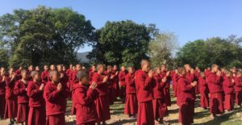
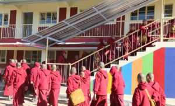
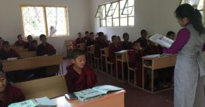
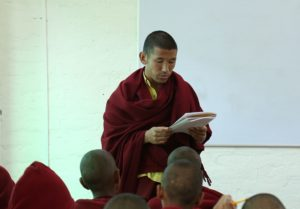
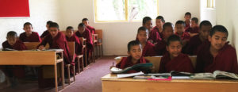

### 

### 宗薩佛學院的迦膩色伽小學

在尊貴的欽哲仁波切遠大願景的指導下，2017年，宗薩佛學院創辦了五年制的基礎教育學校。

早會

短期目標是為了培養慈悲、禪定與智慧以對治現在社會上很多負面現象，例如偷搶、邪淫、戰爭、懶散、壓迫等；長遠目標則是為了佛陀正法—解脫輪迴苦海、證得究竟利樂圓滿佛果的無誤之道長久住世。

孩童是未來執持佛法的主人翁，因此亟需要在孩子們的內心種下佛法的種子。所以我們以佛法、藏文、英文、中文、印度文、數學、科學、社會學等多種知識學科，教授來自印度、尼泊爾、不丹的孩子們，為未來佛陀法教的興盛奠定基礎，賦予孩子們一個正確而有意義的人生方向，使他們成長為獨立自主的人才。這是我們十分重視的。

早會

現已有九十多名小學生正在上課，他們的宿舍、生活資具皆與佛學院學生相同。佛學院還特別安排了學習和衛生方面的專人與輔導老師照顧他們。為期五年的學業結束後，學生們可以選擇回到各自的家鄉，或者前往其他的學院學習。若想繼續留在宗薩佛學院，也可從一年級《入菩薩行論》開始研習諸多佛法經典。完成佛學院必修的佛法課程後，可以繼續修學藏文文學學士課程，佛學院具足所有學習的環境和機會。小學現屬佛學院管理，因此暫時只招收男性學生。若有父母有意願將自己的孩子送往該小學學習，請於工作日上午9:00—11:00、下午1:00—5:00，透過網站上的聯繫方式聯繫我們。

早會結束後學生正前往課室途中

藏文老師正在教課中

藏文老師正在教課中

英文老師正在教課中

藏文老師正在教課中

上課中
