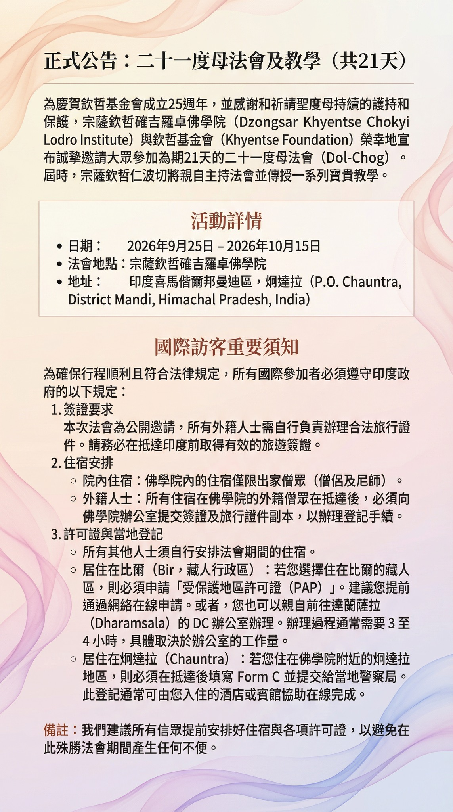

為慶賀欽哲基金會成立25週年，並感謝祈請聖度母持續的護持和保佑，宗薩欽哲確吉羅佐佛學院（Dzongsar Khyentse Chökyi Lodro Institute）與欽哲基金會（Khyentse Foundation）榮幸地宣布並誠摯邀請大眾參加為期21天的二十一度母法會（Dol-Chog）。屆時，宗薩欽哲確吉羅佐仁波切將為與會眾傳授一系列寶貴教學。

## 活動詳情

- **日期：** 2026年9月25日 – 2026年10月15日
- **法會地點：** 宗薩欽哲確吉羅佐佛學院
- **地址：** 印度喜瑪偕爾邦曼地縣（P.O. Chauntra, District Mandi, Himachal Pradesh, India）

## 國際訪客重要須知

為確保行程順利並符合法律規定，所有國際參會者必須遵守印度政府以下相關規定：

### 1. 簽證要求

本法會為公開邀請，所有外籍人士需自行負責辦理合法行程證件。敬請於抵達印度前辦妥有效的旅遊簽證。

### 2. 住宿安排

- **院內住宿：** 佛學院內的住宿僅保留給僧眾（僧侶及尼眾）。
- **外籍人士：** 所有住宿於佛學院內的外籍訪客，抵達後須將護照及旅行證件交至佛學院辦公室登記。

### 3. 許可證與當地登記

其餘訪客需自行安排住宿。

- **居住在 Bir（藏人行政區）：** 若您選擇住在 Bir 藏人區，必須申請受保護地區許可證（PAP）。申請可透過網路提交，或者您也可以親自前往達蘭薩拉（Dharamsala）DC 辦公室申請辦理。申辦時間通常為3至4小時，視當局處理速度而定。
- **居住在 Chauntra：** 若您住在佛學院附近的 Chauntra 地區，須完成 Form C 並送交當地警察局。登記亦可由您所住的酒店或客棧協助辦理。

*備註：我們希望所有參會者提前安排好住宿與許可證等各項手續，以避免在此殊勝法會期間出現任何不便。*
